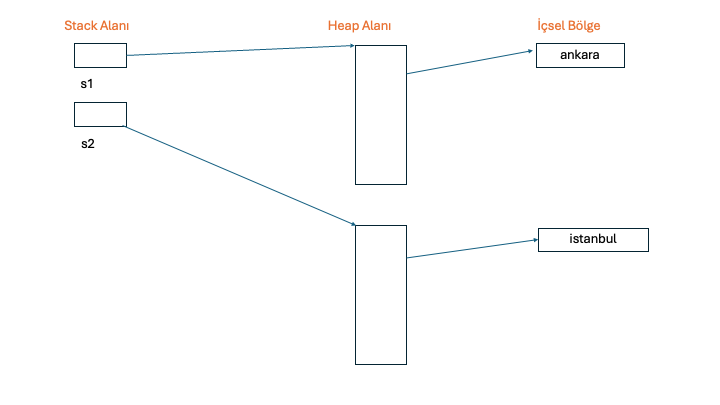

### Java ve C# Programcıları için ECMAScript (Javascript)
### Eğitmen: Oğuz KARAN

#### Düzenleyen: Bartu Çankaya


##### Ecmascript Programlama Dili

>Javascript ilk olarak Netscape firması tarafından geliştirilmiş ve ilk olarak “Livescript” ismi verilmiştir. 1997 yılında Ecma tarafından standartlaştırılmış ve **EcmaScript** ismini almıştır. Ecmascript, [Ecma-262](https://ecma-international.org/wp-content/uploads/ECMA-262_15th_edition_june_2024.pdf) dökümanı ile standartlaştırılmıştır. Ecmascript aslında bir programlama dilidir. En çok Web ortamında kullanıldığından birçok browser tarafından neredeyse standart kabul edilen teknolojiler eklenmiştir. Ecmascript (ES) yorumlayıcı (interpreter) ile çalışan bir dildir. Herhangi bir derleme işlemi olmadığından aşağı seviyeli bir kod üretilmez. Ancak bazı yorumlayıcılar hızlı çalışma açısından ara kodlar üretebilir. Ancak programcı için ES yorumlayıcı ile çalışan bir dildir. Bu durum programcının yaptığı hataların hemen görülememesine sebep olabilir. ES çıktığından beri en çok web ortamında ön yüzde kullanılmaktadır. Ancak son yıllarda geliştirilen teknolojilerle server tarafta çalışan uygulamalar da ecmascript kullanılarak geliştirilebilmektedir. Javascript ayrıca mobil geliştirmede de oldukça yoğun olarak kullanılmaktadır.

##### Türler

>ES'de temel türler (primitive/built-in/predefined types) şu şekildedir:
>
>- number
>- string
>- boolean
>- null
>- undefined
>- Symbol
>- function
>
> `number` türü `IEEE 754 double precision` formatına göre sayıların tutulduğu bir türdür. Tamsayı ya da gerçek sayı ayrımı yapılmamıştır. Tüm sayılar bu formatta tutulur.
> 
> `string` bir değer türü olarak alınmıştır. Tüm dillerde olduğu gibi yazı işlemlerinde kullanılmaktadır.
> 
> `boolean` türü klasik olarak mantıksal işlemler için (doğru veya yanlış) düşünülmüştür.
> 
> `null` türü özellikle referans türleri için düşünülmüştür ve hiç bir nesneyi göstermeyen adres değeridir.
> 
> `undefined` henüz değer almamış bir değişkenin türüdür. Bununla birlikte, bir değişkene undefined değeri de verilebilir.
> 
> `Symbol` türü ES6 ile eklenmiş ve sembol tanımlamakta kullanılan bir türdür.
> 
> `function` türü bir fonksiyonu temsil eden türdür. İçerisine fonksiyon adresi atanmış değişkenler function türündendir.
> 
> `number`, `string` ve `boolean` türlerini sarmalayan (wrapper) sırasıyla `Number`, `String` ve `Boolean` isimli nesneler (object) bulunmaktadır.

**Anahtar Notlar:** Yazılar da aslında bilgisayar belleğinde 2'lik sistemde sayılar biçiminde tutulmaktadır. Bir yazıyı oluşturan elemanlara **karakter (character)** denilmektedir. İşte bir yazıda her bir karakter 2'lik sistemde bir sayı ile ifade edilir. Böylece yazı  aslında ikilik sistemde bir sayı dizisi gibi tutulmaktadır. İşte bir karakter için hangi sayının karşı geldiğini belirten tablolara **karakter tabloları (character table)** denilmektedir. Karakter tablosundaki karakter şekillerine **glyph** denilmektedir. Her karaktere tabloda bir sıra numarası verilmiştir. Buna da **code point (code point)** denilmektedir. Dünyanın ilk standart karakter tablosu `ASCII` (American Standard Code Information Interchange) denilen tablodur. `ASCII` tablosu aslında 7 bit bir tablodur. Dolayısıyla tabloda 128 tane glyph için code point bulundurulmuştur. `ASCII` dışında `IBM EBCDIC` tablosunu geliştirmiştir. Wang firması `WISCII` tablosunu kullanmıştır. `ASCII` tablosu Amerikalılar tarafından yalnızca İngilizce karakterleri ifade etmek için oluşturulmuştur. Bilgisayarlar yaygınlaşmaya başladığında farklı karakterlere sahip olan Türkiye gibi, Yunanistan gibi, Almanya gibi ülkeler bu `ASCII` tablosunu 8 bite çıkartıp elde edilen 128'lik yeni alanı kendi karakterlerini ifade etmek için kullanmışlardır. `ASCII` tablosunun ilk yarısı (yani [0, 128] numaraları karakterleri) standarttır. Ancak ikinci yarısı **code page (code page)** adı altında farklı ülkeler tarafından farklı yerleşimler yapılarak kullanılmaktadır. DOS zamanlarında Türkçe karakterler için `OEM 857` denilen code page kullanılıyordu. Daha sonra Microsoft Windows sistemlerinde Türkçe karakterler için `1254 code page`'i düzenledi. ISO, bu code page'leri standart hale getirmiştir. Bugün Türkçe karakterler `ISO` tarafından `ASCII 8859-9` Code page'i ile düzenlenmiştir. `ASCII` tablosu ve onların code page'leri uzun süre kullanılmış ve hala kullanılmakta olsa da maalesef karışıklıklara yol açmaktadır. İşte ortalama 20 yıldır artık karakterleri 2 byte içerisinde ifade ederek dünyanın bütün dillerinin ve ortak sembollerinin tek bir tabloya yerleştirilmesi ile ismine `UNICODE` denilen bir tablo oluşturulmuştur.

[Unicode Homepage &#x1F517;](https://home.unicode.org)

`UNICODE` tablo ISO tarafından `10646` ismiyle de bazı farklılıklarla standardize edilmiştir. `UNICODE` tablonun ilk 128 karakteri standart ASCII karakterleri, ikinci 128 karakteri `ISO 8859-9` code page'indeki karakterlerdir. Bir karakter tablosundaki code point'lerin ikilik sistemde ifade edilme biçimine **encoding** denilmektedir. ASCII code page'lerinde encoding doğrudan code point'in 1 byte'lık sayı karşılığıdır. Ancak `UNICODE` tablonun değişik encoding'leri kullanılmaktadır. `UNICODE` tablonun klasik encoding'i `UTF-16`'dır. Burada code point doğrudan 16 bit bir sayı biçiminde ifade edilir. `UTF-32` encoding'inde ise code point 32 bitlik bir sayı biçiminde ifade edilmektedir. Ancak `UNICODE` tablonun en yaygın kullanılan encoding'i `UTF-8` encoding'idir. `UTF-8` kodlamasında standart ASCII karakterler 1 byte ile, diğer karakterler 2 byte, 3 byte, 4 byte ve 5 byte ile kodlanabilmekedir. Türkçe karakterler `UTF-8` encoding'inde 2 byte yer kaplamaktadr. `UTF-8` encoding'i `UNICODE` bir yazının adeta sıkıştırılmış bir hali gibi düşünülebilir. Bugün pek çok programlama editörü default durumda dosyayı `UNICODE UTF-8` encoding'ine göre saklamaktadır.

##### ECMAScript'de Değişkenler

> ECMAScript'de genel olarak 4(dört) yerde değişken bildirimi yapılabilir.
> 
> 1. Global olarak dosya içerisinde tüm nesne, sınıf ve fonksiyonların dışında herhangi bir yerde.
> 2. Yerel değişken olarak bloklar içerisinde
> 3. Fonksiyonların veya metotların parametre değişkenleri olarak
> 4. Nesnelerin ve sınıfların veri elemanları olarak
> 
> Global değişkenler içerisinde değer atanarak doğrudan isimleriyle bildirilebilirler. Bu durumda bildirildikleri yerden o dosyanın sonuna kadar görülebilir olurlar:

```javascript
a = 10

console.log(a)
```

> Doğrudan bildirilen değişkenlerin nerede bildirildiğinin önemi yoktur. Yani bir fonksiyon içerisinde bildirilseler bile global değişken olurlar. Global değişkenler var anahtar sözcüğü ile de bildirilebilir.
> 
> Global değişkenler içerisine değer atanmadan bildirilirse undefined değerini alırlar. Şüphesiz bu durumda değişkenin var ile bildirilmesi gerekir:

```javascript
var a

console.log(a)
```

**_Anahtar Notlar:_** ES6 ile birlikte `let` anahtar sözcüğü ile de değişken bildirimi yapılabilmektedir.

>ES'de değişkenlerin içerisinde tutulan değerlerin türleri değişebilir:

```javascript
a = "ankara" //string
a = 10 //number
``` 

**_Anahtar Notlar:_** Yukarıdaki tanım daha iyi açıklamak içindir. Aşağı seviyede bu şekilde olmaz. Bu durum ileride ele alınacaktır.

>Bir değişkenin yerel olması için kesinlikle `var` ya da `let` anahtar sözcükleri ile bildirilmesi gerekir:

```javascript
function main() {
    var a = "ankara";

    foo();
}

function foo() {
    console.log(a) // error
}

main()
```

>Bu cümlenin tersi her zaman doğru değildir. Yani her `var` veya `let` olarak bildirilen değişken yerel olmayabilir.
>
>Nesnenin ve sınıfın veri elemanları daha sonra ele alınacaktır.

##### `let` ve `var` Anahtar Sözcükleri Arasındaki Farklar

>`let` ile bildirilen yerel değişkenler ile `var` ile bildirilen yerel değişkenler arasındaki fark, `let` yerel değişkenler blok faaliyet alanına sahiptir, `var` değişkenler fonksiyon faaliyet alanına sahiptir. Yani `var` değişkenler bir fonksiyon içerisinde bildirilmişlerse içteki blokta bile olsalar bildirildiği yerden itibaren tüm fonksiyon boyunca görülebilirler. `let` değişkenler ise bildirildiği yerden bildirildiği bloğun sonuna kadar görülebilirler:

```javascript
function main() {
    foo();
}

function foo() {
    {
        let a = 10
    }

    console.log(a) //error
}

main()
```
 
```javascript
function main() {
    foo();
}

function foo() {
    {
        var a = 10
    }

    console.log(a)
}

main()
```

>`let` ve `var` değişkenlerin global olması durumunda faaliyet alanı bakımından farkları yoktur. ES’de mümkün olduğunca let kullanılmalıdır. Doğrudan bildirilen değişkenlerin ise hiç kullanılmaması tavsiye edilir.

>Aşağıdaki örneği inceleyiniz:

```javascript
function main() {  
    foo();  
}  
  
function foo() {  
    {  
        let a = 20  
        var a = 10 //error  
    }  
  
    console.log(a)  
}  
  
main()
```

>Yukarıdaki örnekte `let` yerine `var` kullanılsaydı bir error oluşmazdı:

```javascript
function main() {  
    foo();  
}  
  
function foo() {  
    {  
        var a = 20  
        var a = 10
    }  
  
    console.log(a)  
}  
  
main()
```

>Peki sizce bu kod ne kadar anlamlı?

##### Değişken İsimlendirme Kuralları

>ES’ de değişken isimlendirme kuralları Java programlama dili ile aynıdır. Ancak alttire karakterinin Java 9 ile birlikte tek başına değişken ismi olması yasaklanmıştır. Ancak ES'de bu geçerlidir. Bir programlama pratiği olarak değişken isimlendirmede özellikle İngilizce alfabe dışındaki karakterlerin kullanılmaması ve değişkene ilişkin kelimelerin de İngilizce kelimeler olarak seçilmesi tavsiye edilir. Ayrıca yine uluslararası bir convention olarak değişken isimlerinin kolay telaffuz edilebilir, yeterince uzunlukta ve anlamlı olması tavsiye edilir.

##### Global Fonksiyonlar

>Global fonksiyonlar dosya içerisinde hiç bir nesneye veya sınıfa ait olmayan ve yerel olarak bildirilmeyen fonksiyonlardır. Fonksiyon bildirimleri aynı zamanda tanımlamadır.
>
>Global fonksiyonlar `function` anahtar sözcüğü ile bildirilirler.

```javascript
function foo() {  
    console.log("foo")  
}  
  
function main() {  
    foo()  
}  
  
main()
```

>Fonksiyonlar parametrik yapıları nasıl olursa olsun istenildiği kadar argüman ile çağrılabilirler. Aşağıdaki demo örnekte fonksiyon içerisinde argümanlara ilişkin değerler kullanılmadığı için foo fonksiyonunun 3 çağrısınında birbirinden farkı yoktur

```javascript
function foo() {  
    console.log("foo")  
}  
  
function main() {  
    foo()  
    foo(10, 20, 30)  
    foo(10, 20)  
}  
  
main()
```

>ES'de fonksiyonun geri dönüş değeri bilgisi yazılmaz. Ancak fonksiyon içerisinde return deyimi kullanılarak fonksiyonun geri dönüş değeri olabilir. Bu durumda bir fonksiyonun geri dönüş değeri olması ya da olmaması tamamen fonksiyonun kodları ile ilgilidir. Örneğin fonksiyon içerisinde akışın her noktasında return deyimi ifade (expression) ile kullanıldında mantıksal olarak geri dönüş değeri vardır denebilir. Bu durumda fonksiyonu kullanacak programcının bu durumu bilmesi gerekir. Bu da fonksiyonun iyi yazılmış bir dokümantasyonu ile mümkün olabilir.

>Fonksiyonlar geri dönüş değeri olmasa da geri dönüş değeri varmış gibi kullanılabilir. Bu durumda geri dönüş değeri olarak `undefined` değeri elde edilecektir. Şüphesiz aşağıdaki çağrı şekli pratikte anlamsızdır

```javascript
function foo() {  
    console.log("foo")  
}  
  
let a = foo(20)  
  
console.log(a)
```

>Geri dönüş değeri için yine `return` deyimi kullanılır. Return deyiminin tek başına kullanılması durumunda fonksiyondan çıkılır ve değer döndürülmez (aslında `undefined` döndürülmüş olarak düşünülebilir):

```javascript
function foo(a) {  
    if (a > 0)  
        return  
  
    return a * a  
}  
  
let result = foo(-20)  
  
console.log(result)  
result = foo(10)  
console.log(result)
```

>Yukarıdaki demo örnek aşağıdaki gibi de yazılabilir

```javascript
function foo(a) {  
    if (a <= 0)  
        return a * a  
}  
  
let result = foo(-20)  
  
console.log(result)  
result = foo(10)  
console.log(result)
```

>Yukarıdaki örnekte fonksiyon akış durumuna göre `undefined` ya da argümanın karesine döner. ES kullanan programcının `her fonksiyonun zaten bir geri dönüş değeri var içeride yazılan koda göre geri dönüş değeri anlamlanacak` bakış açısıyla doğru şekilde düşünerek kodu yazması gerekir. Yani fonksiyonun geri dönüş değeri olacaksa akışın her noktasında geri dönülmesi anlamlıdır. Fonksiyonun geri dönüş değeri olmayacaksa hiç bir şekilde return, ifade ile döndürülmemelidir.
>
>ES'de bir fonksiyon parametre değişkeni alabilir. Bu durumda parametre değişkenlerinin yalnızca ismi yazılır:

```javascript
function square(a) {  
    return a * a  
}
  
let res = square(a)  
  
console.log(res)
```

> Fonksiyonlara bakıldığında parametrelerin türlerinin anlaşılması her zaman mümkün olmayabilir.  Bu durumda iki yaklaşım genel olarak kullanılabilir:
> 
> 1. Fonksiyonlar yazılırken parametreler için herhangi bir tür kontrolü yapılmaz. İyi bir dökümantasyonla kullanan programcıya bilgi verilir. Yanlış argüman geçilmesinden programcı sorumludur. Örneğin:
 
```javascript
function square(a) {  
    return a * a  
}  
  
let res = square("ankara")  
  
console.log(res)
```

> Yukarıdaki kodda `square` fonksiyonuna geçilen argüman string türünden olduğu için `NaN` değeri elde edilir. Bu da fonksiyonu çağıranın sorumluluğundadır.
> 
> 2. Fonksiyonların parametre değişkenlerinin türleri çağrılma sırasında kontrol edilebilir. Bu yaklaşım sürekli kontrol gerektirdiğinden çalışmayı yavaşlatabilir. Örneğin:

```javascript
function square(a) {  
    if (typeof(a) != "number")  
        throw new Error("Argument must be a number")  
  
    return a * a  
}  
  
let res = square("ankara")  
  
console.log(res)
```

> Yukarıdaki örnekte istenen türden argüman için de kontrol yapılır. Bu da iyi bir teknik olmayabilir.
> 
> Fonksiyon yazımında birinci yaklaşım çok daha fazla kullanılmaktadır.
> 
> ES'de function overloading kavramı yoktur. Aynı isimde iki tane fonksiyon yazılırsa yukarıdan aşağıya son yazılanı çağrılırken geçerli kabul eder:

```javascript
function foo() {  
    console.log("foo1")  
}  
  
foo()  
  
function foo() {  
    console.log("foo2")  
}  
  
foo()
```
 

>Fonksiyonlar parametre sayısı önemli olmaksızın istenildiği sayıda argümanla çağrılabilirler. Bu durumda programcı fonksiyon içerisinde isterse argümanları kontrol edebilir:

```javascript
function main() {  
    let result = sum(10, 20, 30)  
  
    console.log(result)  
    result = sum(10, 20)  
    console.log(result)  
}  
  
function sum() {  
    let result = 0;  
  
    for (let i in arguments)  
        result += arguments[i];  
  
    return result;  
}  
  
main()
```

>Yukarıda, her fonksiyon içerisine iliştirilmiş olan arguments dizisi kullanılmıştır. Bu konu ileride ele alınacaktır.

##### Sabitler

>Program içerisinde doğrudan yazılan değerlere **sabit** denilmektedir. Sabitler ES içerisinde çeşitli kategorilere ayrılmaktadır. Sabitler sayı biçimindeyse nokta içersin ya da içermesin `number` türündendir. Ayrıca `boolean` türden `true` ve `false` isimli sabitler de bulunmaktadır. Standartlara göre string atomları da sabit (string literal) olarak ele alınmaktadır. Sayısal sabitlerin çeşitli sayı sistemlerinde gösterilişi vardır:

```javascript
function main() {  
    let a = 0xA //hexadecimal  
  
    console.log(a)  
  
    a = 0o12 //octal  
  
    console.log(a)  
  
    a = 10 //decimal  
  
    console.log(a)  
  
    a = 0b1010 //binary  
  
    console.log(a)  
}  
  
main()
```

>ES programlama dilinde karakter sabiti yoktur. Tek tırnak içerisindeki atomlar da string türündendir. Ayrıca önceden tanımlanmış ters bölü sabitleri de (escape sequence) ES' de geçerlidir. Escape sequence karakterlerin listesi şu şekildedir:

|     |                 |
| --- | --------------- |
| \b  | Backspace       |
| \t  | Horizontal tab  |
| \n  | Line feed       |
| \v  | Vertical tab    |
| \f  | Form feed       |
| \r  | Carriage return |
| \”  | Double quote    |
| \’  | Single quote    |
| \\\ | Back slash      |
| \\` | Backtick        |

##### Temel Operatörler

>Belirli bir işleme yol açan ve bir değer üreten atomlara **operatör** denir. Operatörler sınıflandırılabilir:

###### Aritmetik Operatörler

>Aritmetik operatörler klasik 4(dört) işlem operatörleri ile işaret `+` ve `–` operatörleri ve `++` ve `--` operatörleridir. Bu operatörlerin kullanımı genel olarak Java ile aynıdır. Örneğin:

```javascript
function writeln(a) {  
    console.log(a)  
}  
  
function main() {  
    let a = 10  
    let b = a++  
    let c = ++a  
  
    writeln(a) //12  
    writeln(b) //10  
    writeln(c) //12  
}  
  
main()
```

>Anımsanacağı gibi `%` mod operatörünün birinci operandının negatif olması durumunda sonuç pozitif olması elde edilen değerin ters işaretlisi (negatifi) olarak elde edilir. İkinci operandının negatif olmasının bir önemi yoktur.

```javascript
function writeln(a) {  
    console.log(a)  
}  
  
function main() {  
    writeln(10 % 3)  
    writeln(10 % -3)  
    writeln(-10 % 3)  
    writeln(-10 % -3)  
}  
  
main()
```

>**Sınıf Çalışması:** Parametresi ile aldığı 3 basamaklı bir sayının basamakları toplamına geri dönen `getDigitsSum` fonksiyonunu yazınız.
>
>**Açıklamalar:** Fonksiyon sayının 3 basamaklı olup olmadığını kontrol etmeyecektir.

>**Çözüm:**

```javascript
function writeln(a) {  
    console.log(a)  
}  
  
function getDigitsSum(val) {  
    let a = parseInt(val / 100)  
    let b = parseInt(val % 100 / 10)  
    let c = val % 10  
  
    return Math.abs(a + b + c)  
}  
  
function main() {  
    writeln(getDigitsSum(123))  
    writeln(getDigitsSum(-123))  
}  
  
main()
```

**_Anahtar Notlar:_** ES’de tamsayı türü olmadığından yapılan her işlem de gerçek sayılara göre yapılır. Bazen bir gerçek sayının noktadan sonraki kısmının atılıp yalnızca tam kısmın elde edilmesi gerekebilir. Bu durumda ES’ de global bir fonksiyon olan parseInt kullanılabilir. Bu fonksiyonun detayları ileride ele alınacaktır.

**Karşılaştırma Operatörleri**

> Temel karşılaştırma operatörleri 8 tanedir: `==`, `!=`, `===`, `!==`, `>`, `<`, `>=`, `<=`
> 
> Burada eşitlik testi yapan operatörler bazı programlama dillerinden farklıdır.
> 
> `==` ve `!=` operatörleri **soyut karşılaştırma (abstract comparison)** yaparlar. `==` ve `!=` operatörleri kullanılırken işlem öncesi otomatik tür dönüştürme kuralları uygulanır. Bu kurallar ileride ele alınacaktır.

```javascript
function writeln(a) {  
    console.log(a)  
}  
  
function main() {  
    let a = "10"  
    let b = 10  
  
    writeln(a == b);  
}  
  
  
main()
```

>Bu operatörler kullanılırken dikkatli olunmalıdır. **Tam anlamıyla eşitlik karşılaştırması (strictly equal or strictly not equal)** `===` ve `!==` operatörleriyle yapılabilir. Bu operatörler karşılaştırılan türler birbirinden farklıysa, kesinlikle farklı değer değerler olarak sonuç üretirler

```javascript
function writeln(a) {  
    console.log(a)  
}  
  
function main() {  
    let a = "10"  
    let b = 10  
  
    writeln(a === b);  
}  
  
main()
```

>Programcı öncelikle bu operatörleri düşünmeli, soyut eşitlik karşılaştırma operatörleri gerektiğinde kullanılmalıdır. Soyut eşitlik karşılaştırma operatörleri özel bazı durumlarda gerekebilmektedir.

##### Mantıksal Operatörler

>Mantıksal operatörlerden and ve or operatörleri klasik `kısa devre davranışına (short circuit behavior)` sahiptir. Bu operatörler ifadenin değerini öncelik sırasıyla yapıldığında elde edilecek sonuca ulaşacak şekilde en kısa yoldan hesaplarlar. Örneğin:

```javascript
function writeln(a) {  
    console.log(a)  
}  
  
function main() {  
    let result = foo() || bar() && tar() //true  
  
    writeln(result)  
}  
  
function foo() {  
    writeln("foo")  
    return true  
}  
  
function bar() {  
    writeln("bar")  
    return false  
}  
  
function tar() {  
    writeln("tar")  
    return true  
}  
  
main()
```

Örneğin:

```javascript
function writeln(a) {  
    console.log(a)  
}  
  
function main() {  
    let result = bar() && foo() || tar()  
  
    writeln(result)  
}  
  
function foo() {  
    writeln("foo")  
    return true  
}  
  
function bar() {  
    writeln("bar")  
    return false  
}  
  
function tar() {  
    writeln("tar")  
    return true  
}  
  
main()
```

>Bitsel “and” ve “or” operatörleri boolean türü ile işleme sokulduğunda kısa devre özelliği olmayan “and“ ve “or” operatörleri gibi davranırlar:

```javascript
function writeln(a) {  
    console.log(a)  
}  
  
function main() {  
    let result = foo() | bar() & tar()  
  
    writeln(result)  
}  
  
function foo() {  
    writeln("foo")  
    return true;  
}  
  
function bar() {  
    writeln("bar")  
    return false;  
}  
  
  
function tar() {  
    writeln("tar")  
    return true  
}  
  
main()
```

> Burada elde edilen sonuç `number` türündendir.
> 
> Aslında bitsel operatörler numeric türler için bitsel işlemlerde kullanılır. Örneğin:

```javascript
function writeln(a) {  
    console.log(a)  
}  
  
function main() {  
    let a = 10 //0000 1010  
    let b = 11 //0000 1011  
    let c = a & b //0000 1010  
  
    writeln(`c = ${c}`)  
  
    c = a | b //0000 1011  
    writeln(`c = ${c}`)  
}  
  
main()
```

**Atama Operatörü**

>Atama operatörü iki operandlı bir operatördür.  Atama işleminde birinci operandın türü atanan ifadenin türüne göre değişebilmektedir:

```javascript
function writeln(a) {  
    console.log(a)  
}  
  
function main() {  
    let a = 10  
    let b = true  
  
    writeln(typeof(a))  
    writeln(typeof(b))  
  
    a = b  
  
    writeln(typeof(a))  
    writeln(typeof(b))  
}  
  
main()
```

>ES'de ismine işlemli atama denilen (compound/augmented assignment) bir grup operatör bulunmaktadır:

```javascript
function writeln(a) {  
    console.log(a)  
}  
  
function main() {  
    let a = 10  
    let s = "11"  
  
    a += s; // a = a + s  
    writeln(a)  
}  
  
main()
```

>İşlemli atama operatörleri kodun yazımını ve okunabililiğini basitleştirir. Örneğin:

```javascript
function writeln(a)
{
    console.log(a)
}

function main()
{
    let a = 10
    let b = 20
    let c = 2

    a *= b + c //a = a * (b + c)
    
    writeln(a)
}

main()
```

**Virgül Operatörü**

>Bu operatör iki operandlı (binary) araek (infix) durumunda bir operatördür. Virgül operatörüne ilişkin ifadede önce birinci operandına ilişkin ifade, sonra da ikinci operandına ilişkin ifade yapılır. Operatör öncelik tablosunun en sonunda olan operatördür. Ürettiği değer ikinci operandına ilişkin ifadenin değeridir:

```javascript
function writeln(a) {  
    console.log(a)  
}  
  
function foo() {  
    writeln("foo")  
  
    return 20  
}  
  
function bar() {  
    writeln("bar")  
    return 10  
}  
  
function main() {  
    let a = (foo(), bar())  
  
    writeln(a)  
}  
  
main()
```

>Virgül operatörü operatör öncelik tablosunun en alt seviyesinde olduğundan yukarıdaki işlemde atama işleminin en son yapılması için parantez zorunludur. Virgül operatörünün önce birinci operandının yapılacağı garanti altındadır. Örneğin:

```javascript
function writeln(a) {  
    console.log(a)  
}  
  
function foo() {  
    writeln("foo")  
  
    return 20  
}  
  
function bar() {  
    writeln("bar")  
    return 10  
}  
  
function tar() {  
    writeln("tar")  
    return 12  
}  
  
function main() {  
    let a = (foo(), bar(), tar())  
  
    writeln(a)  
}  
  
main()
```

**typeof Operatörü**

>Bu operatör operandı olan ifadenin türünü string olarak üretir. Parantezli veya parantezsiz kullanılabilir:

```javascript
function writeln(a) {  
    console.log(a)  
}  
  
function main() {  
    let a = 10  
  
    writeln(typeof a)  
    a = "ankara"  
    writeln(typeof(a))  
}  
  
main()
```

>Diğer operatörler ileride ele alınacaktır. 

##### Otomatik Tür dönüşümleri

>Otomatik tür dönüşümleri (implicit type conversions) ES'de genel olarak üç durumda karşımıza çıkar: **karşılaştırma işlemleri, aritmetik işlemler, boolean türünde dönüşüm olarak**. 

###### String, Number ve Boolean Dönüşümleri
> Bu dönüşümler özetle şu şekilde olabilir:

>- `+` operatörünün operandlarından biri String türündense diğer operanda ilişkin ifadenin değerinin yazı karşılığı elde edilir. Bu işlem aslında `string birleştirmesi (string concatenation)` işlemidir.

```javascript
function writeln(a) {  
    console.log(a)  
}  
  
function main() {  
    let a = 10  
    let s = "Sayı:"  
    let message = s + a  
  
    writeln(message)  
}  
  
main()
```

###### Number Türüne Dönüşüm

>Toplama işlemi hariç diğer aritmetik işlemlerde Number türüne dönüşüm yapılır. Başka bir deyişle iki operandlı bir operatörün (toplama operatörü hariç) operandlarından biri number türündense genel olarak diğer operand Number türüne dönüştürülür. Toplama işleminde operandlardan birinin String türünden olması bu kuralı değiştirmiş olur.


>Aşağıdaki demo örnekte `true` değeri number türünde `1`olarak işleme girecektir

```javascript
function writeln(a) {  
    console.log(a)  
}  
  
function main() {  
    let a = 10  
    let s = true  
    let message = a + s  
  
    writeln(message) //11  
}  
  
main()
```

>Aşağıdaki demo örnekte çarpma işlemi dolayısıyla a'nın değerine ilişkin yazı number türünden ifade edilecektir. İşlem number türünden yapılacaktır

```javascript
function writeln(a) {  
    console.log(a)  
}  
  
function main() {  
    let a = "10"  
    let s = 3  
    let message = a * s  
  
    writeln(message) //30  
}  
  
main()
```

>Aşağıdaki demo örnekte a'nın değeri olan `undefined` number türüne `NaN` olarak dönüşeceğinden sonuç `NaN` olarak elde edilir

```javascript
function writeln(a) {  
    console.log(a)  
}  
  
function main() {  
    let a = undefined  
    let b = 3  
    let c = a * b  
  
    writeln(c) //NaN  
}  
  
main()
```

>Özel bir durum olarak iki `undefined`değerin aritmetik işleme sokulması durumunda `NaN` değeri elde edilir

```javascript
function writeln(a) {  
    console.log(a)  
}  
  
function main() {  
    let a = undefined  
    let b = undefined  
    let c = a * b  
  
    writeln(c) //NaN  
}  
  
main()
```


>Aşağıdaki demo örnekte çarpma işlemi dolayısıyla her iki operandın değeri number türüne dönüştürülür. Her iki operandın number türünden karşılıkları `NaN` olduğundan sonuç `NaN` olarak elde edilir

```javascript
function writeln(a) {  
    console.log(a)  
}  
  
function main() {  
    let a = "undefined"  
    let b = undefined  
    let c = a * b  
  
    writeln(c) //NaN  
}  
  
main()
```

>Bu örnekte `+` işlemi yapılsaydı sonuç ne olurdu?

###### Boolean Türüne Dönüşüm

>`&&`, `||`, `!`, if deyimi döngü deyimleri gibi koşul gerektiren durumlarda sıfır dışındaki numeric değerler true, sıfır false değerine dönüştürülür. Özel olarak `undefined` değeri false değerine dönüşür. Buna göre `false, 0, '' (""), null, undefined, NaN` değerleri tipik olarak false değerine dönüştürülür. Bunlar dışındaki değerler true değerine dönüştürülür:

```javascript
if ("ali") -> true
if ("") -> false
if (undefined) -> false
if (NaN) -> false
if (0) -> false
if ("0") -> true
...
```

Yukarıdaki anlatılan dönüşümlere ilişkin tablo şu şekilde yazılabilir:

| Değer             | Number    | String            | Boolean |
| ----------------- | --------- | ----------------- | ------- |
| false             | 0         | "false"           | false   |
| true              | 1         | "true"            | true    |
| 0                 | 0         | "0"               | false   |
| 1                 | 1         | "1"               | true    |
| "0"               | 0         | "0"               | true    |
| "000"             | 0         | "000"             | true    |
| "1"               | 1         | "1"               | true    |
| NaN               | NaN       | "NaN"             | false   |
| Infinity          | Infinity  | "Infinity"        | true    |
| -Infinity         | -Infinity | "-Infinity"       | true    |
| ""                | 0         | ""                | false   |
| "20"              | 20        | "20"              | true    |
| "twenty"          | NaN       | "twenty"          | true    |
| [ ]               | 0         | ""                | true    |
| [20]              | 20        | "20"              | true    |
| [10, 20]          | NaN       | "10, 20"          | true    |
| ["twenty"]        | NaN       | "twenty"          | true    |
| ["ten", "twenty"] | NaN       | "ten, twenty"     | true    |
| function(){}      | NaN       | "function(){}"    | true    |
| { }               | NaN       | "[object Object]" | true    |
| null              | 0         | "null"            | false   |
| undefined         | NaN       | "undefined"       | false   |

##### Kontrol Deyimleri

>Akışın kontrolü için kullanılan deyimlere kontrol deyimleri denir. Örneğin return deyimi bir kontrol deyimidir.

###### if Deyimi

>`if` deyimi parantez içerisindeki ifadenin `true` ya da `false` olmasına göre akışı yönlendiren bir deyimdir. Burada parantez içerisindeki ifade boolean türden olmasa bile otomatik tür dönüşümü kurallarına göre `boolean` türüne dönüştürülür:

```javascript
function writeln(a) {  
    console.log(a)  
}  
  
function main() {  
    let a = "ankara"  
  
    if (a)  
        writeln("Doğru")  
    else  
        writeln("Yanlış")  
}  
  
main()
```

Örneğin:

```javascript
function writeln(a) {  
    console.log(a)  
}  
  
function main() {  
    let a = 100  
  
    if (a)  
        writeln("Doğru")  
    else  
        writeln("Yanlış")  
}  
  
main()
```

>**_Sınıf Çalışması:_** Parametresi ile aldığı ikinci dereceden denklemin katsayılarına göre köklerini bulup ekrana yazdıran `findRoots` fonksiyonunu yazınız.
>
>
>İkinci dereceden (quadratic) denklem:
>
>$$ax^2 + bx + c = 0$$
>
>delta ($\Delta$) (discriminant) hesabı:
>
>$$\Delta = b^2 - 4ac$$
>
>Köklerin hesaplanması:
>
>1. if $\Delta > 0$
>
>$$x_1 = \frac{-b + \sqrt{\Delta}}{2a}$$
>
>$$x_2 = \frac{-b - \sqrt{\Delta}}{2a}$$
>
>2.	if $\Delta = 0$
>
>$$x_1 = x_2 = \frac{-b}{2a}$$
>
>3.	if $\Delta < 0$
>
>		Gerçek kök yok!
>
>**_Açıklama:_** Klavyeden değer okuma NodeJS’ ye özgü olduğundan klavye işlemleri burada ele alınmayacaktır. Karekök alma işlemi için `Math.sqrt` fonksiyonu kullanılabilir

```javascript
function writeln(a) {  
    console.log(a)  
}  
  
function calculateDelta(a, b, c) {  
    return b * b - 4 * a * c  
}  
  
function printDoubleRoots(delta, a, b) {  
    let sqrtDelta = Math.sqrt(delta)  
    let x1 = (-b + sqrtDelta) / (2 * a)  
    let x2 = (-b - sqrtDelta) / (2 * a)  
  
    writeln("x1 = " + x1 + ", x2 = " + x2)  
}  
  
function printRoot(a, b) {  
    writeln("x1 = x2 = " + (-b / (2 * a)))  
}  
  
function printNoRealRoots() {  
    writeln("No real root")  
}  
  
function findRoots(a, b, c) {  
    let delta = calculateDelta(a, b, c)  
  
    if (delta > 0)  
        printDoubleRoots(delta, a, b)  
    else if (delta === 0)  
        printRoot(a, b)  
    else  
        printNoRealRoots()  
}  
  
function main() {  
    findRoots(1, 3, -18)  
    findRoots(1, 1, 1)  
    findRoots(1, 4, 4)  
    findRoots(1.345, 3.980, -14.567)  
}  
  
main()
```

>Diğer bir çözüm:

```javascript
function writeln(a) {  
    console.log(a)  
}  
  
function calculateDelta(a, b, c) {  
    return b * b - 4 * a * c  
}  
  
function printDoubleRoots(delta, a, b) {  
    let sqrtDelta = Math.sqrt(delta)  
    let x1 = (-b + sqrtDelta) / (2 * a)  
    let x2 = (-b - sqrtDelta) / (2 * a)  
  
    writeln("x1 = " + x1 + ", x2 = " + x2)  
}  
  
function printNoRealRoots() {  
    writeln("No real root")  
}  
  
function findRoots(a, b, c) {  
    let delta = calculateDelta(a, b, c)  
  
    if (delta >= 0)  
        printDoubleRoots(delta, a, b)  
    else  
        printNoRealRoots()  
}  
  
function main() {  
    findRoots(1, 3, -18)  
    findRoots(1, 1, 1)  
    findRoots(1, 4, 4)  
    findRoots(1.345, 3.980, -14.567)  
}  
  
main()
```

##### Döngü Deyimleri

> ES'de döngü deyimleri 4 tanedir:
> 
> 1. while döngüleri
> 2. for döngüsü
> 3. for-in döngüsü
> 4. for-of döngüsü
##### while Döngüleri

> while döngü deyimleri iki gruba ayrılır:
> 
> - Kontrolün başta yapıldığı while döngü deyimi:
> - Kontrolün sonda yapıldığı while döngü deyimi:
> 
> `while` döngüsü dendiğinde genelde kontrolün başta yapıldığı while döngü deyimi anlaşılır. Kontrolün sonda yapıldığı while döngü deyimi genel olarak `do-while döngüsü` biçiminde söylenir.
 
###### Kontrolün başta yapıldığı while döngü deyimi:

>Bu deyimin genel biçimi şöyledir:

```
while (<ifade>)
	<deyim>
```

>Bu deyimde parantez içerisindeki ifade `true` ise (boolean türü dışında dönüşüm işleminden sonra) döngü yinelenir. `while` döngü deyiminde parantez içerisinde ifadenin doğru olup olmadığına akış `while` döngü deyimine geldiğinde de bakılır. Örneğin:

```javascript
function writeln(a) {  
    console.log(a)  
}  
  
  
function main() {  
    let i = 0  
    let n = 10  
  
    while (i < n) {  
        writeln("i = " + i)  
        ++i  
    }  
}  
  
main()
```

>Aşağıdaki demo örnekte kontrol akış while döngüsüne geldiğinde de yapıldığı için döngüye girilmez

```javascript
function writeln(a) {  
    console.log(a)  
}  

function main() {  
    let i = 0  
    let n = 0  
  
    while (i < n) {  
        writeln("i = " + i)  
        ++i  
    }  
}  
  
main()
```


>`while` döngü deyimi ile n-kez yinelenen aşağıdaki gibi yazılan bir döngü bazı programcılar tarafından çok sevilir.

```javascript
function writeln(a) {  
    console.log(a)  
}  
  
function main() {  
    let n = 4  
  
    while (n--) // ~ while (n-- > 0) -> Negatif değerler için aynı anlama gelmez
        writeln("n = " + n)  
  
    writeln("after loop -> n = " + n)  
}  
main()
```

>Yukarıdaki döngüde n değerinin döngünün sonunda eski değerinde olmadığına dikkat ediniz.

>**_Sınıf Çalışması:_** Parametresi ile aldığı number türden bir sayının basamak sayısını döndüren `countDigits` fonksiyonunu yazınız.

```javascript
function writeln(a) {  
    console.log(a)  
}  
  
function countDigits(a) {  
    if (a === 0)  
        return 1  
  
    let count = 0  
  
    while (a) {  
        ++count  
        a = Math.trunc(a / 10)  
    }  
  
    return count  
}  
  
function main() {  
    writeln(countDigits(1234567890))  
    writeln(countDigits(-1234567890))  
    writeln(countDigits(0))  
}  
main()
```

>**_Sınıf Çalışması:_** Parametresi ile aldığı tamsayının tersini döndüren `reverse` isimli fonksiyonu yazınız.

```javascript
function writeln(a) {  
    console.log(a)  
}  
  
function reverse(a) {  
    let result = 0  
  
    while (a) {  
        result = result * 10 + a % 10  
        a = Math.trunc(a / 10)  
    }  
  
    return result  
}  
  
function main() {  
    writeln(reverse(123456789))  
    writeln(reverse(-123456789))  
    writeln(reverse(1234567890))  
    writeln(reverse(-1234567890))  
    writeln(reverse(0))  
}  
main()
```

>`while` döngü deyimi ile tipik sonsuz döngü kalıpları:

```javascript
while (true) {
    //...
}

while (1) {
    //...
}
```


###### Kontrolün sonda yapıldığı while döngü deyimi

>Bu döngü deyiminde akış döngü deyimine geldiğinde koşul kontrolü yapılmaz. Yani döngüye bir kez girileceği ya da başka bir deyişle ilk adımın kesinlikle yapılacağı garanti altındadır. Bu döngü deyiminine `do-while döngüsü` de denilmektedir.  


>Bu deyimin genel biçimi:

```
    do
        <deyim>
    while (<ifade>)
```
 
Örneğin:

```javascript
function writeln(a) {  
    console.log(a)  
}  
  
function countDigits(a) {  
    let count = 0  
  
    do {  
        ++count  
        a = Math.trunc(a / 10)  
    } while (a)  
  
    return count  
}  
  
function main() {  
    writeln(countDigits(1234567890))  
    writeln(countDigits(-1234567890))  
    writeln(countDigits(0))  
}  
main()
```
##### Koşul Operatörü
>Koşul operatörünün (conditional/ternary operator) kullanımı Java ve C# ile aynıdır.

>Bir sayının basamak sayısı döngü veya yazı kullanmadan aşağıdaki gibi de bulunabilir. Aşağıdaki örnekte `Math` sınıfının `abs` ve `log10` metotları kullanılmıştır. Bu metotların çalışması Java/C# ile aynıdır

```javascript
function writeln(a) {  
    console.log(a)  
}  
  
function countDigits(a) {
	return !val ? 1 : Math.trunc(Math.log10(Math.abs(val))) + 1
}
  
function main() {  
    writeln(countDigits(1234567890))  
    writeln(countDigits(-1234567890))  
    writeln(countDigits(0))  
}  
main()
```

**for döngü deyimi**

>`for` döngü deyimi de Java' da olduğu gibi güçlü bir döngü deyimidir. Bu deyimin genel biçimi şöyledir:

```javascript
for ([1.kısım]; [2.kısım]; [3.kısım])
    <deyim>
```

>Bu döngüde kısımlar zorunlu değildir. Kısımlar boş bırakılmış olsa bile iki tane noktalı virgül zorunludur.

```javascript
function writeln(a) {  
    console.log(a)  
}  
  
function main() {  
    for (let i = 0; i < 10; ++i)  
        writeln("i = " + i)  
}  
main()
```

>Kısımların çalışma mantığı Java’dakine çok benzedir. 2. kısmın boş bırakılması yine sonsuz döngü anlamına gelmektedir. Ancak okunabilirlik açısından sonsuz döngü kalıbı tüm kısımların boş bırakılması biçiminde yazılır:

```javascript
for (;;) {
	​//...
}
```

>`for` döngü deyimi içerisinde virgül operatörü kullanılarak deyim zenginleştirilebilir:

```javascript
function writeln(a) {  
    console.log(a)  
}  
  
function main() {  
    for (let i = 0, k = 10; i < 20 && k >= 0; ++i, k -= 2)  
        writeln(`(${i}, ${k})`);  
}  
  
main()
```

**_Anahtar Notlar:_**  Virgül ile değişken bildirimi yapıldığında ikinci operand olan bildirim birinci operand olan bildirim ile aynı özelliktedir. for döngüsünün birinci kısmında bildirim yapılıyorsa virgül operatörü ile yazılan diğer operandlar da bildirim işlemi olmalıdır.

>`for` döngü deyimi zenginleştirilebilir. Güçlü bir deyimdir. Örneğin:

```javascript
function writeln(a) {  
    console.log(a)  
}  
  
function main() {  
    for (let i = 0, k = 10; i < 20 && k >= 0; writeln(`(${i}, ${k})`), ++i, k -= 2)  
        ;  
}  
  
main()
```

>**_Sınıf Çalışması:_** Parametresi aldığı bir tamsayının asal olup olmadığını test eden `isPrime` fonksiyonunu yazınız (Yavaş version)

```javascript
function writeln(a) {  
    console.log(a)  
}  
  
function isPrime(a) {  
    if (a <= 1)  
        return false  
  
    let halfVal = Math.trunc(a / 2)
  
    for (let i = 2; i <= halfVal; ++i)  
        if (a % i === 0)  
            return false  
  
    return true
}  
  
function main() {  
    for (let n = -10; n <= 100; ++n)  
        if (isPrime(n))  
            writeln(n)  
  
    writeln(isPrime(1_000_003) ? "Asal" : "Asal değil")  
}  
  
main()
```

> Yukarıdaki teknik kötüdür. Aşağıdaki teoremle fonksiyon daha etkin yazılabilir.
> 
> **Teorem (Eratosten):** Bir sayı karekökünden daha küçük olan asal sayıların hiçbirine bölünemiyorsa asaldır. Aksi durumda asal değildir.

```javascript
function writeln(a) {  
    console.log(a)  
}  
  
function isPrime(a) {  
    if (a <= 1)  
        return false  
  
    if (a % 2 === 0)  
        return a === 2  
  
    if (a % 3 === 0)  
        return a === 3  
  
    if (a % 5 === 0)  
        return a === 5  
  
    if (a % 7 === 0)  
        return a === 7  
  
    for (let i = 11; i * i <= a; i += 2)  
        if (a % i === 0)  
            return false  
  
    return true
}  
  
function main() {  
    for (let n = -10; n <= 100; ++n)  
        if (isPrime(n))  
            writeln(n)  
      
    writeln(isPrime(1_000_003) ? "Asal" : "Asal değil")  
}  
  
main()
```

>Yukarıdaki örnek aşağıdaki gibi de yapılabilir

```javascript
function writeln(a) {  
    console.log(a)  
}  
  
function isPrime(a) {  
    if (a <= 1)  
        return false  
  
    if (a % 2 === 0)  
        return a === 2  
  
    if (a % 3 === 0)  
        return a === 3  
  
    if (a % 5 === 0)  
        return a === 5  
  
    if (a % 7 === 0)  
        return a === 7  
  
    let sqrt = Math.trunc(Math.sqrt(a))  
  
    for (let i = 11; i <= sqrt; i += 2)  
        if (a % i === 0)  
            return false  
  
    return true
}  
  
function main() {  
    for (let n = -10; n <= 100; ++n)  
        if (isPrime(n))  
            writeln(n)  
  
    writeln(isPrime(1_000_003) ? "Asal" : "Asal değil")  
}  
  
main()
```


**break Deyimi**

>`break` deyiminin genel biçimi şu şekildedir:

```
break [etiket-ismi];
```

```javascript
function writeln(a) {  
    console.log(a)  
}  
  
function main() {  
    for (let i = 20; i < 40; ++i) {  
        if (i % 12 === 0)  
            break  
  
        writeln(i);  
    }  
}  
  
main()
```

>`break` deyiminin etiketli biçimi kullanılarak iç içe döngülerden çıkış sağlanabilir. Zaten bunun için tasarlanmıştır:

```javascript
function writeln(a) {  
    console.log(a)  
}  
  
function main() {  
    EXIT_LOOP:  
    for (let i = 20; i < 40; ++i) {  
        for (let k = 21; k < 50; ++i) {  
            if (i % 12 === 0 && k < 25)  
                break EXIT_LOOP  
  
            writeln(`(${i}, ${k})`);  
        }  
    }  
  
    writeln("Tekrar yapıyor musunuz?")  
}  
main()
```

Örneğin:

```javascript
function writeln(a) {  
    console.log(a)  
}  
  
function main() {  
    EXIT_LOOP:  
    for (let i = 20; i < 40; ++i) {  
        EXIT_SECOND_LOOP:  
        for (let j = 20; j < 40; ++j) {  
            for (let k = 21; k < 50; ++i) {  
                if (j > 22)  
                    break EXIT_SECOND_LOOP  
  
                if (i % 12 === 0 && k < 25)  
                    break EXIT_LOOP  
  
                writeln(`(${i}, ${j}, ${k})`);  
            }  
        }  
    }  
  
    writeln("Tekrar yapıyor musunuz?")  
}  
  
main()
```

**continue Deyimi**

>`continue` deyimi döngünün adımını sonlandırmak için kullanılabilir. `continue` deyiminin genel biçimi:

```
continue [etiket ismi];
```

>`continue` deyimi `break` deyimi kadar kullanılmasa da bazı durumlarda okunabilirliği artırdığı için tercih edilebilir.

Örneğin:

```javascript
function writeln(a) {  
    console.log(a)  
}  
  
function main() {  
    let sum = 0  
  
    for (let i = 1; i <= 100; ++i) {  
        if (i % 2 === 0)  
            continue  
  
        sum += i  
    }  
  
    writeln(`Toplam:${sum}`)  
}  
  
main()
```

>Etiketli continue deyimi ile bir döngünün adımı içerisindeyken onu kapsayan döngüden devam edilmesi sağlanabilir. Etiketli continue deyimi yapısal programlamada, dolayısıyla nesne yönelimli programlamada da tercih edilmemektedir.

>**_Sınıf Çalışması:_** Parametresi ile aldığı n sayısına göre n-inci asal sayıyı döndüren `nthPrime` fonksiyonunu yazınız.
>
>**Açıklama:** isPrime fonksiyonun etkinliğine güvenerek yazabilirsiniz.

>**Çözüm-1:**

```javascript
function writeln(a) {  
    console.log(a)  
}  
  
function isPrime(a) {  
    if (a <= 1)  
        return false  
  
    if (a % 2 === 0)  
        return a === 2  
  
    if (a % 3 === 0)  
        return a === 3  
  
    if (a % 5 === 0)  
        return a === 5  
  
    if (a % 7 === 0)  
        return a === 7  
  
    for (let i = 11; i * i <= a; i += 2)  
        if (a % i === 0)  
            return false  
  
    return true}  
  
  
function nthPrime(n) {  
    let count = 0  
    let i = 2  
  
    for (; count < n; ++i)  
        if (isPrime(i))  
            ++count  
    return i - 1  
}  
  
function main() {  
    writeln(nthPrime(1))  
    writeln(nthPrime(2))  
    writeln(nthPrime(3))  
    writeln(nthPrime(4))  
    writeln(nthPrime(20))  
}  
  
main()
```

>**Çözüm-2:**

```javascript
function writeln(a) {  
    console.log(a)  
}  
  
function isPrime(a) {  
    if (a <= 1)  
        return false  
  
    if (a % 2 === 0)  
        return a === 2  
  
    if (a % 3 === 0)  
        return a === 3  
  
    if (a % 5 === 0)  
        return a === 5  
  
    if (a % 7 === 0)  
        return a === 7  
  
    for (let i = 11; i * i <= a; i += 2)  
        if (a % i === 0)  
            return false  
  
    return true}  
  
  
function nthPrime(n) {  
    let count = 0  
    let i = 2  
  
    for (;;) {  
        if (isPrime(i))  
            ++count  
  
        if (count === n)  
            return i  
  
        ++i  
    }  
}  
  
function main() {  
    writeln(nthPrime(1))  
    writeln(nthPrime(2))  
    writeln(nthPrime(3))  
    writeln(nthPrime(4))  
    writeln(nthPrime(20))  
}  
  
main()
```
 
> **_Sınıf Çalışması:_** Parametresi ile aldığı bir sayının Armstrong sayısı olup olmadığını test eden `isArmstrong` fonksiyonunu yazınız.
> 
> **Tanım:** Negatif olmayan bir sayının basamaklarının basamak sayıncı kuvvetleri toplamı kendisine eşitse bu sayıya Armstrong sayısı denir:
> 
> Örneğin:
> 
> 153 sayınının basamaklarının küpleri toplamı kendisine eşittir. Bu durumda bu sayı Armstrong sayısıdır.

**Çözüm:**

```javascript
function write(a) {  
    process.stdout.write(a)  
}  
  
function writeLine(a) {  
    write(a === undefined ? '\n' : `${a}\n`)  
}  
  
function countDigits(a) {  
    return !a ? 1 : Math.trunc(Math.log10(Math.abs(a))) + 1  
}  
  
function digitsPowSum(a) {  
    let n = countDigits(a)  
    let total = 0  
  
    while (a) {  
        total += Math.pow(a % 10, n)  
        a = Math.trunc(a / 10)  
    }  
  
    return total  
}  
  
function isArmstrong(a) {  
    return a >= 0 && a === digitsPowSum(a)  
}  
  
function main() {  
    for (let n = 0; n <= 999_999; ++n)  
        if (isArmstrong(n))  
            writeLine(n)  
}  
  
main()
```


> **_Sınıf Çalışması:_** Parametresi ile aldığı bir n değeri için n-inci Fibonacci sayısını döndüren `fibonacciNumber` isimli fonksiyonu yazınız.
> 
> Fibonacci Sayıları: 0 1 1 2 3 5 8 13 21 …

**Çözüm:**

```javascript
function write(a) {  
    process.stdout.write(a)  
}  
  
function writeLine(a) {  
    write(a === undefined ? '\n' : `${a}\n`)  
}  
  
function fibonacciNumber(n) {  
    if (n <= 2)  
        return n - 1  
  
    let prev1 = 1, prev2 = 1, val = 1  
  
    for (let i = 3; i < n; ++i) {  
        val = prev1 + prev2  
  
        prev2 = prev1  
        prev1 = val  
    }  
  
    return val  
}  
  
function main() {  
    writeLine(fibonacciNumber(1))  
    writeLine(fibonacciNumber(2))  
    writeLine(fibonacciNumber(3))  
    writeLine(fibonacciNumber(4))  
    writeLine(fibonacciNumber(5))  
    writeLine(fibonacciNumber(6))  
    writeLine(fibonacciNumber(7))  
    writeLine(fibonacciNumber(8))  
    writeLine(fibonacciNumber(9))  
    writeLine(fibonacciNumber(10))  
}  
  
main()
```

> **_Sınıf Çalışması:_** Parametresi ile aldığı bir sayıdan büyük en küçük Fibonacci sayısını döndüren `nextFibonacciNumber` fonksiyonunu yazınız.
> 
> Örneğin: sayı 12 ise 13 dönecektir, sayı 13 ise 21 dönecektir

**Çözüm:**

```javascript
function write(a) {  
    process.stdout.write(a)  
}  
  
function writeLine(a) {  
    write(a === undefined ? '\n' : `${a}\n`)  
}  
  
function nextFibonacciNumber(a) {  
    if (a < 0)  
        return 0  
  
    let prev1 = 1, prev2 = 0, val  
  
    for (;;) {  
        val = prev1 + prev2  
  
        if (val > a)  
            return val  
  
        prev2 = prev1  
        prev1 = val  
    }  
}  
  
function main() {  
    writeLine(nextFibonacciNumber(-1) === 0)  
    writeLine(nextFibonacciNumber(0) === 1)  
    writeLine(nextFibonacciNumber(1) === 2)  
    writeLine(nextFibonacciNumber(5) === 8)  
    writeLine(nextFibonacciNumber(12) === 13)  
    writeLine(nextFibonacciNumber(13) === 21)  
}  
  
main()
```


**switch Deyimi**

> `switch` deyimi Java'daki klasik `switch` deyimine çok benzemekle beraber aslında farklılıklar da içermektedir. `switch` deyiminin Java programlama dilindeki bir takım kısıtları ES'de yoktur.
> 
> `switch` deyiminin aşağı düşme (fall through) özelliği vardır:

```javascript
function write(a) {  
    process.stdout.write(a)  
}  
  
function writeLine(a) {  
    write(a === undefined ? '\n' : `${a}\n`)  
}  
  
function main() {  
    let code = 212  
  
    switch (code) {  
        case 212:  
            write("Avrupa ")  
        case 216:  
            writeLine("İstanbul")  
            break  
        case 312:  
            writeLine("Ankara")  
            break;  
        case 372:  
            writeLine("Zonguldak")  
            break  
        default:  
            writeLine("Geçersiz telefon kodu")  
    }  
  
    writeLine("Tekrar yapıyor musun?")  
}  
  
main()
```

>`switch` deyimi number türü için yani noktalı sayılar için de kullanılabilir. Ancak eşitlik karşılaştırması yaptığı için dikkatli olunmalıdır:

```javascript
function write(a) {  
    process.stdout.write(a)  
}  
  
function writeLine(a) {  
    write(a === undefined ? '\n' : `${a}\n`)  
}  
  
function main() {  
    let a = 0.1  
    let b = 0.2  
    let val = a + b  
    writeLine("val:" + val)  
    switch (val) {  
        case 0.3:  
            writeLine("Bir")  
            break  
        case 2.5:  
            writeLine("İki")  
            break  
        case 3:  
            writeLine("Üç")  
            break  
        default:  
            writeLine("Geçersiz değer")  
    }  
}  
  
main()
```

**_Anahtar Notlar:_** Gerçek sayılar için doğrudan eşitlik karşılaştırmasında yuvarlama hataları olabileceğinden her zaman doğru sonuç elde edilmez. Eşitlik karşılaştırma işlemi için çeşitli yöntemler kullanılabilir. Örneğin:

```javascript
function write(a) {  
    process.stdout.write(a)  
}  
  
function writeLine(a) {  
    write(a === undefined ? '\n' : `${a}\n`)  
}  
  
function main() {  
    let val = 0.1 + 0.2  
    let a = 0.3  
    let delta = 0.00001  
  
    writeLine(`val = ${val}`)  
  
    if (Math.abs(val - a) < delta)  
        writeLine("Eşit")  
    else  
        writeLine("Eşit değil")  
}  
  
main()
```

>`switch` deyiminin case bölümlerinin sabit ifadesi olması gerekmez:

```javascript
function write(a) {  
    process.stdout.write(a)  
}  
  
function writeLine(a) {  
    write(a === undefined ? '\n' : `${a}\n`)  
}  
  
function main() {  
    let val = 1  
    let a = 1  
  
    switch (val) {  
        case a:  
            writeLine("Bir")  
            break  
        case 2:  
            writeLine("Iki")  
            break  
        case 3:  
            writeLine("Uc")  
            break;  
        default:  
            writeLine("default")  
    }  
}  
  
main()
```

>Örnek bir menu programı. Program bir html içerisinde çalışabilecek şekilde tasarlanmıştır. Detaylar şu durumda önemsizdir

```javascript
function main() {  
    EXIT_LOOP:  
    for (;;) {  
        var result = promptMessage();  
  
        switch (result) {  
            case "1":  
                writeln("Ekle");  
                break;  
            case "4":  
                break EXIT_LOOP;  
            default:  
                writeln("Hala secmediniz");  
                break;  
        }  
    }  
}  
  
function promptMessage() {  
    var msg = "1.Ekle\n";  
    msg += "2.Guncelle\n";  
    msg += "3.Sil\n";  
    msg += "4.Cikis\n";  
    msg += "Secenek:";  
  
    return prompt(msg);  
}  
  
function writeln(val) {  
    document.write(val + "</br>");  
}  
  
function write(val) {  
    write(val);  
}
```


##### Object Türü

> Object, ES' de bir referans türünü temsil eden en temel türdür. Bir object tanımlamak ve yaratmak yaratmak için:
> 
> - new operatörü kullanılabilir.
> - Küme parantezi kullanılabilir. Buna ilk değer verme (initialization) sentaksı da denebilir. JSON formatı tamamen buna dayanır. Zaten JSON `Javascript Object Notation` demektir.
> - ES6 ile birlikte belirli koşullar altında new operatörsüz de nesne yaratılabilir. Ancak, nesnenin buna uygun olarak bildirilmiş olması gerekir. Bu yöntem çok tercih edilmez.
> 
> Bir Object referansı ve nokta operatörü ile bir isim yazıldığında bu isim bir property anlamına gelir. Bu isim daha sonra kullanılmak üzere Object’de bildirilmiş olur:
> 
> Örneğin:

```javascript
function write(a) {  
    process.stdout.write(a)  
}  
  
function writeLine(a) {  
    write(a === undefined ? '\n' : `${a}\n`)  
}  
  
function printSensor(s) {  
    writeLine(`${s.name}, ${s.host}, ${s.port}`)  
}  
  
function main() {  
    let s = new Object()  
  
    s.name = "Rain Sensor"  
    s.host = "192.168.23.130"  
    s.port = 4545  
  
    printSensor(s)  
}  
  
main()
```

>Object daha basit olarak sadece `{}` ile de elde edilebilir. Örneğin:

```javascript
function write(a) {  
    process.stdout.write(a)  
}  
  
function writeLine(a) {  
    write(a === undefined ? '\n' : `${a}\n`)  
}  
  
function printSensor(s) {  
    writeLine(`${s.name}, ${s.host}, ${s.port}`)  
}  
  
function main() {  
    let s = {}  
  
    s.name = "Rain Sensor"  
    s.host = "192.168.23.130"  
    s.port = 4545  
  
    printSensor(s)  
}  
  
main()
```

>Bir Object’in property elemanları küme parantezi içerisinde de yazılabilir. Bu durumda property elemanlarına değerle küme parantezi içerisinde verilebilir. Burada mutlaka değer verilmesi gerekir. Bu sentaksta değer vermek için `=` kullanılmaz. `:` atomu kullanılmalıdır.

```javascript
function write(a) {  
    process.stdout.write(a)  
}  
  
function writeLine(a) {  
    write(a === undefined ? '\n' : `${a}\n`)  
}  
  
function printSensor(s) {  
    writeLine(`${s.name}, ${s.host}, ${s.port}`)  
}  
  
function main() {  
    let s = {  
        name: "Rain Sensor",  
        host: "192.168.23.130",  
        port: 4545  
    }  
  
    printSensor(s)  
}  
  
main()
```

>Property elamanları tek tırnak veya çift tırnaklar arasında yazılabilir:

```javascript
function write(a) {  
    process.stdout.write(a)  
}  
  
function writeLine(a) {  
    write(a === undefined ? '\n' : `${a}\n`)  
}  
  
function printSensor(s) {  
    writeLine(`${s.name}, ${s.host}, ${s.port}`)  
}  
  
function main() {  
    let s = {  
        "name": "Rain Sensor",  
        "host": "192.168.23.130",  
        "port": 4545  
    }  
  
    printSensor(s)  
}  
  
main()
```

```javascript
function write(a) {  
    process.stdout.write(a)  
}  
  
function writeLine(a) {  
    write(a === undefined ? '\n' : `${a}\n`)  
}  
  
function printSensor(s) {  
    writeLine(`${s.name}, ${s.host}, ${s.port}`)  
}  
  
function main() {  
    let s = {  
        'name': "Rain Sensor",  
        'host': "192.168.23.130",  
        'port': 4545  
    }  
  
    printSensor(s)  
}  
  
main()
```

>Bir object içerisinde fonksiyon tanımlaması yapılabilir:

```javascript
function write(a) {  
    process.stdout.write(a)  
}  
  
function writeLine(a) {  
    write(a === undefined ? '\n' : `${a}\n`)  
}  
  
function printSensor(s) {  
    s.print()  
}  
  
function main() {  
    let s = {  
        name: "Rain Sensor",  
        host: "192.168.23.130",  
        port: 4545,  
        print: function() {  
            writeLine(`${this.name}, ${this.host}, ${this.port}`)  
        }  
    }  
  
    printSensor(s)  
}  
  
main()
```

> Burada `print` property elemanı aslında function türündendir. function türü olduğundan artık fonksiyon çağırma operatörü ile kullanılabilmektedir.
> 
> Object'in bir property elemanına global bir fonksiyonun da ismi verilebilir:

```javascript
function write(a) {  
    process.stdout.write(a)  
}  
  
function writeLine(a) {  
    write(a === undefined ? '\n' : `${a}\n`)  
}  
  
function printSensor() {  
    writeLine(`${this.name}, ${this.host}, ${this.port}`)  
}  
  
function main() {  
    let s = {  
        name: "Rain Sensor",  
        host: "192.168.23.130",  
        port: 4545,  
        print: printSensor  
    }  
  
    printSensor()  
    s.print()  
}  
  
main()
```

> Burada `printSensor` fonksiyonu içerisinde `this` referansı kullanıldığına dikkat ediniz.
> 
> Aslında herhangi bir değişken de fonksiyon türünde olabilir:

```javascript
function write(a) {  
    process.stdout.write(a)  
}  
  
function writeLine(a) {  
    write(a === undefined ? '\n' : `${a}\n`)  
}  
  
function display(val) {  
    let isEven = function () {  
        return val % 2 === 0  
    }  
  
    writeLine(isEven() ? "Çift" : "Tek")  
}  
  
function main() {  
    display(10)  
    display(11)  
}  
  
main()
```

> Burada `isEven` değişkeni function türündendir. Yukarıdaki örnekte adeta bir `yerel fonksiyon (local function)` tanımlanmıştır. `isEven` fonksiyonunun `display` fonksiyonun parametre değişkenini kullanabildiğine (capture) dikkat ediniz. Capture kavramına ilişkin detaylar ileride ele alınacaktır.
> 
> Yukarıdaki örnekte `isEven` fonksiyonu aşağıdaki gibi de tanımlanabilirdi:

```javascript
function write(a) {  
    process.stdout.write(a)  
}  
  
function writeLine(a) {  
    write(a === undefined ? '\n' : `${a}\n`)  
}  
  
function display(val) {  
    function isEven() {  
        return val % 2 === 0  
    }  
  
    writeLine(isEven() ? "Çift" : "Tek")  
}  
  
function main() {  
    display(10)  
    display(11)  
}  
  
main()
```

##### Diziler

> ES’ de diziler, klasik dizilere göre daha fazla yeteneğe sahip olacak biçimde tasarlanmıştır. Yani ES’ de diziler, yalnızca dizi özelliklerini gerçekleyen bir veri yapısı olarak düşünülmemelidir.
> 
> Dizilere ilk değer verilmesi (initialization) aşağıdaki gibi `[]` ile yapılabilir:

```javascript
function write(a) {  
    process.stdout.write(a)  
}  
  
function writeLine(a) {  
    write(a === undefined ? '\n' : `${a}\n`)  
}  
  
function main() {  
    let names = ["ali", "veli", "selami"]  
  
    writeLine(names)  
}  
  
main()
```

> Bir dizi, Array türü ile new operatörü kullanılarak yaratılabilir:

```javascript
function write(a) {  
    process.stdout.write(a)  
}  
  
function writeLine(a) {  
    write(a === undefined ? '\n' : `${a}\n`)  
}  
  
function main() {  
    let names = new Array()  
  
    writeLine(names)  
}  
  
main()
```

>Yukarıdaki örnekte bulunan boş dizi aşağıdaki gibi de yaratılabilir

```javascript
function write(a) {  
    process.stdout.write(a)  
}  
  
function writeLine(a) {  
    write(a === undefined ? '\n' : `${a}\n`)  
}  
  
function main() {  
    let names = []  
  
    writeLine(names)  
}  
  
main()
```


> Bir diziye ekleme `[]` operatörü ile yapılabilir:

```javascript
function write(a) {  
    process.stdout.write(a)  
}  
  
function writeLine(a) {  
    write(a === undefined ? '\n' : `${a}\n`)  
}  
  
function main() {  
    let names = []  
  
    names[0] = "Alican"  
    names[1] = "Ayberk"  
    names[2] = "Ayhan"  
  
    writeLine(names)  
}  
  
main()
```

> Array nesnesi için aralara da yer ayrılabilir. Yani aşağıdaki örnekte değer atanmamış indeksteki elemanlar `undefined` değerinde olurlar:

```javascript
function write(a) {  
    process.stdout.write(a)  
}  
  
function writeLine(a) {  
    write(a === undefined ? '\n' : `${a}\n`)  
}  
  
function main() {  
    let names = []  
  
    names[0] = "Alican"  
    writeLine(`Length:${names.length}`)  
    names[3] = "Ayberk"  
    writeLine(`Length:${names.length}`)  
    names[5] = "Ayhan"  
    writeLine(`Length:${names.length}`)  
    writeLine(names)  
}  
  
main()
```

> Array nesnesi için başlangıçta yer ayrılabilir. Bu durumda tüm elemanlar `undefined` değerinde olacaktır:

```javascript
function write(a) {  
    process.stdout.write(a)  
}  
  
function writeLine(a) {  
    write(a === undefined ? '\n' : `${a}\n`)  
}  
  
function main() {  
    let names = new Array(20)  
  
    writeLine(`Length:${names.length}`)  
    writeLine(names)  
}  
  
main()
```

> Array nesnesi `for` döngüsü ile dolaşılabilir:

```javascript
function write(a) {  
    process.stdout.write(a)  
}  
  
function writeLine(a) {  
    write(a === undefined ? '\n' : `${a}\n`)  
}  
  
function main() {  
    let cities = ["Ankara", "Istanbul", "Izmir", "Bursa", "Antalya"]  
      
    for (let i = 0; i < cities.length; ++i)  
        writeLine(cities[i])  
}  
  
main()
```

##### for-in döngü deyimi

> Bu döngü deyimi ile bir dizi baştan itibaren sonuna kadar dolaşılabilir. Bu döngü deyiminde her adımda index numarası verilmektedir:

```javascript
function write(a) {  
    process.stdout.write(a)  
}  
  
function writeLine(a) {  
    write(a === undefined ? '\n' : `${a}\n`)  
}  
  
function main() {  
    let cities = ["Ankara", "Istanbul", "Izmir", "Bursa", "Antalya"]  
  
    for (let i in cities)  
        writeLine(cities[i])  
}  
  
main()
```

> for-in döngü deyimi ile object’in property elemanlarının isimleri elde edilebilir. Buna göre aşağıdaki örnekte property ismi indeks yapılarak değerine erişilmiştir:

```javascript
function write(a) {  
    process.stdout.write(a)  
}  
  
function writeLine(a) {  
    write(a === undefined ? '\n' : `${a}\n`)  
}  
  
function main() {  
    let sensor = {name: "Rain sensor", host: "192.168.2.130", port: 2345, data:34.5, print: function() { writeLine(this.data) }}  
  
    for (let fn in sensor)  
        writeLine(`${fn}: ${sensor[fn]}`)  
  
    sensor["print"]()  
}  
  
main()
```

> Aşağıdaki demo örneği inceleyiniz

```javascript
function write(a) {  
    process.stdout.write(a)  
}  
  
function writeLine(a) {  
    write(a === undefined ? '\n' : `${a}\n`)  
}  
  
function main() {  
    let a = [1, 4, 6, 9, -79]  
  
    a.description = "Array of integral numbers"  
    a.maxLength = 20  
  
    for (let i in a)  
        writeLine(`a[${i}] = ${a[i]}`)  
}  
  
main()
```

> Dikkat edilirse for-in döngü deyimi ile elde edilen dizi nesnesinin veya herhangi bir nesnenin property elemanları, `[]` operatörüne indeks olarak verildiğinde, property elemanlarının değerleri elde edilmektedir.

**for-of döngü deyimi**

> ES6 ile birlikte for-of denilen bir döngü deyimi de eklenmiştir. Bu döngü deyiminde her adımda döngü değişkenine dizinin elemanı atanır:

```javascript
function write(a) {  
    process.stdout.write(a)  
}  
  
function writeLine(a) {  
    write(a === undefined ? '\n' : `${a}\n`)  
}  
  
function main() {  
    let a = [1, 4, 6, 9, -79]  
  
    for (let e of a)  
        write(`${e} `)  
  
    writeLine()  
}  
  
main()
```

> for-of döngü deyimi ile yalnızca dizinin elemanları elde edilebilir. Dizi nesnesine ilişkin elemanlar ve değerleri elde edilemez:

```javascript
function write(a) {  
    process.stdout.write(a)  
}  
  
function writeLine(a) {  
    write(a === undefined ? '\n' : `${a}\n`)  
}  
  
function main() {  
    let a = [1, 4, 6, 9, -79]  
  
    a.description = "Array of integral numbers"  
    a.maxLength = 20  
    for (let e of a)  
        write(`${e} `)  
  
    writeLine()  
}  
  
main()
```

>Aşağıdaki demo örnekte sensor dolaşılabilir (iterable) bir nesne olmadığından döngü deyiminde hata oluşur

```javascript
function write(a) {  
    process.stdout.write(a)  
}  
  
function writeLine(a) {  
    write(a === undefined ? '\n' : `${a}\n`)  
}  
  
function main() {  
    let sensor = {name: "Rain sensor", host: "192.168.2.130", port: 2345, data:34.5, print: function() { writeLine(this.data) }}  
  
    for (let e of sensor)  
        write(`${e} `)  
  
    writeLine()  
}  
  
main()
```


**_Sınıf Çalışması:_**  Parametresi ile aldığı bir diziyi tersyüz eden `reverse` isimli global bir fonksiyon yazınız ve test ediniz. Fonksiyon içerisinde ikinci bir dizi kullanmayınız.
**Açıklama:** Bu işlem için ileride göreceğimiz dizilere özgü built-in fonksiyonlar kullanılmayacaktır.

**Çözüm 1:**

```javascript
function write(a) {  
    process.stdout.write(a)  
}  
  
function writeLine(a) {  
    write(a === undefined ? '\n' : `${a}\n`)  
}  
  
function swap(a, i, j) {  
    let temp = a[i]  
  
    a[i] = a[j]  
    a[j] = temp  
}  
  
function reverse(a) {  
    for (let i = 0; i < a.length / 2; ++i)  
        swap(a, i, a.length - 1 - i);  
}  
  
function main() {  
    let a = [1, 2, 3, 4]  
    let b = ["İstanbul", "Ankara", "İzmir"]  
  
    reverse(a)  
    reverse(b)  
    writeLine(a)  
    writeLine(b)  
}  
  
main()
```

**Çözüm 2:**

```javascript
function write(a) {  
    process.stdout.write(a)  
}  
  
function writeLine(a) {  
    write(a === undefined ? '\n' : `${a}\n`)  
}  
  
function swap(a, i, j) {  
    let temp = a[i]  
  
    a[i] = a[j]  
    a[j] = temp  
}  
  
function reverse(a) {  
    let left = 0  
    let right = a.length - 1  
  
    while (left < right)  
        swap(a, left++, right--);  
}  
  
function main() {  
    let a = [1, 2, 3, 4]  
    let b = ["İstanbul", "Ankara", "İzmir"]  
  
    reverse(a)  
    reverse(b)  
    writeLine(a)  
    writeLine(b)  
}  
  
main()
```

> Her fonksiyonun içerisinde argümanların bulunduğu `arguments` isimli bir dizi referansı built-in olarak kullanılabilir. Böylece değişken sayıda argüman alan fonksiyonlar da kolay (ama dikkatli) olarak yazılabilir:

>Aşağıdaki demo örneği inceleyiniz

```javascript
function write(a) {  
    process.stdout.write(a)  
}  
  
function writeLine(a) {  
    write(a === undefined ? '\n' : `${a}\n`)  
}  

function sum() {  
    let total = 0  
  
    for (let v of arguments)  
        total += v  
  
    return total  
}  
  
function main() {  
    writeLine(sum())  
    writeLine(sum(1, 2, 4, 8))  
    writeLine(sum(1))  
}  
  
main()
```

>Aşağıdaki demo örneği inceleyiniz

```javascript
function write(a) {  
    process.stdout.write(a)  
}  
  
function writeLine(a) {  
    write(a === undefined ? '\n' : `${a}\n`)  
}  
  
function print(sep, end) {  
    for (let i = 2; i < arguments.length; ++i)  
        write(`${arguments[i]}${sep}`)  
  
    write(end)  
}    
  
function main() {  
    print(" ", "\n", 1, 3, 5, 7, 9)  
    print("\n", "\n", "Ankara", "İstanbul", "İzmir", "Bursa")  
}  
  
main()
```

##### İsimsiz fonksiyonlar

> Bilindiği gibi ES’de fonksiyonlar `function` anahtar sözcüğü ile bildirilir. function anahtar sözcüğünden sonra isim yazılmazsa bu tarz fonksiyonlara **isimsiz fonksiyonlar (anonymous functions)** denir.

```javascript
function write(a) {  
    process.stdout.write(a)  
}  
  
function writeLine(a) {  
    write(a === undefined ? '\n' : `${a}\n`)  
}  
  
function main() {  
    function add(a, b) {  
        return a + b  
    }  
  
    writeLine(typeof add)  
    writeLine(add(10, 20))  
}  
  
main()
```

> İsimsiz fonksiyonlar bir değişkene atanabilir. Bu durumda bu atanan değişkenin türü `function` olur.

```javascript
function write(a) {  
    process.stdout.write(a)  
}  
  
function writeLine(a) {  
    write(a === undefined ? '\n' : `${a}\n`)  
}  
  
function main() {  
    let add = function(a, b) {  
        return a + b  
    }  
  
    writeLine(typeof add)  
    writeLine(add(10, 20))  
}  
  
main()
```


> İsimsiz fonksiyonlar arka planda çağrılacak (callback) fonksiyonlar biçiminde başka bir fonksiyona argüman olarak geçilebilir:

```javascript
function write(a) {  
    process.stdout.write(a)  
}  
  
function writeLine(a) {  
    write(a === undefined ? '\n' : `${a}\n`)  
}  
  
function forEach(a, f) {  
    for (let e of a)  
        f(e)  
}  
  
function main() {  
    forEach([1, 3, 5, 7], function (e) {write(`${e} `)})  
    writeLine()  
    forEach([1, 3, 5, 7], function (e) {writeLine(e)})  
}  
  
main()
```


Ya da örneğin:

```javascript
function write(a) {  
    process.stdout.write(a)  
}  
  
function writeLine(a) {  
    write(a === undefined ? '\n' : `${a}\n`)  
}  
  
function forEach(a, c, f) {  
    for (let i = 0; i < c; ++i)  
        f(a[i])  
}  
  
function transform(a, b, f) {  
    for (let i in a)  
        b[i] = f(a[i])  
}  
  
function copyIf(a, b, f) {  
    let index = 0  
  
    for (let i in a)  
        if (f(a[i]))  
            b[index++] = a[i]  
  
    return index  
}  
  
function main() {  
    let a = [1, 2, 3, 4, 5]  
    let b = []  
  
    transform(a, b, function(v) {return v * v})  
    forEach(b, b.length, function(v) {write(`${v} `)})  
    writeLine()  
    b = []  
    let c = copyIf(a, b, function(v) {return v % 2 === 0})  
  
    forEach(b, c, function(v) {write(`${v} `)})  
    writeLine()  
}  
  
main()
```

> Fonksiyonlar Object oluşturmak için de kullanılabilir. Yani ES’ de bir Object function anahtar sözcüğü ile de oluşturulabilmektedir:

```javascript
function write(a) {  
    process.stdout.write(a)  
}  
  
function writeLine(a) {  
    write(a === undefined ? '\n' : `${a}\n`)  
}  
  
function forEach(a, c, f) {  
    for (let i = 0; i < c; ++i)  
        f(a[i])  
}  
  
function transform(a, b, f) {  
    for (let i in a)  
        b[i] = f(a[i])  
}  
  
function copyIf(a, b, f) {  
    let index = 0  
  
    for (let i in a)  
        if (f(a[i]))  
            b[index++] = a[i]  
  
    return index  
}  
  
let WeatherInfo = function (id, place, country, lat, lng, description) {  
    this.id = id  
    this.place = place  
    this.country = country  
    this.lat = lat  
    this.lng = lng  
    this.description = description  
    this.toString = function () {  
        return `${this.country}:${this.place}:${this.lat};${this.lng}, ${this.description}`  
    }  
}  
  
function main() {  
    let wi1 = new WeatherInfo(1, "Mecidiyeköy", "TR", 23.456, 41.234, "Bulutlu")  
    let wi2 = new WeatherInfo(2, "Riva", "TR", 23.567, 41.678, "Yağmurlu")  
  
    writeLine(wi1.toString())  
    writeLine(wi2.toString())  
}  
  
main()
```

Ya da örneğin:
 
```javascript
function write(a) {  
    process.stdout.write(a)  
}  
  
function writeLine(a) {  
    write(a === undefined ? '\n' : `${a}\n`)  
}  
  
function forEach(a, c, f) {  
    for (let i = 0; i < c; ++i)  
        f(a[i])  
}  
  
function transform(a, b, f) {  
    for (let i in a)  
        b[i] = f(a[i])  
}  
  
function copyIf(a, b, f) {  
    let index = 0  
  
    for (let i in a)  
        if (f(a[i]))  
            b[index++] = a[i]  
  
    return index  
}  
  
let Product = function (name, price, stock) {  
    this.name = name  
    this.price = price  
    this.stock = stock  
    this.getTotal =  function () {return this.stock * this.price }  
}  
  
function main() {  
    let p1 = new Product("laptop", 4000, 34)  
    let p2 = new Product("mouse", 40, 349)  
  
    writeLine(`Total:${p1.getTotal()}`)  
    writeLine(`Total:${p2.getTotal()}`)  
}  
  
main()
```

>Ya da örneğin

```javascript
function write(a) {  
    process.stdout.write(a)  
}  
  
function writeLine(a) {  
    write(a === undefined ? '\n' : `${a}\n`)  
}  
  
  
let Sensor = function Sensor(name, host, port) {  
    this.name = name  
    this.host = host  
    this.port = port  
    this.print = function () {  
        writeLine(`${this.name}, ${this.host}, ${this.port}`)  
    }  
  
    return this  
}  
  
function main() {  
    let s1 = new Sensor("Rain Sensor", "192.168.23.130", 4545) //SenserInt(adress, name, host, port)  
    let s2 = new Sensor("Rain Sensor", "192.168.23.130", 4545)  
  
    s1.print()  
    s2.print()  
}  
  
main()
```

> Yukarıdaki demo örneklerde aslında bir Object için constructor (ctor) yazılmıştır. Bu fonksiyonlar `new` operatörü ile nesne yaratılırken çağrılır.

**_Anahtar Notlar:_** ES’ de de türler kategori olarak değer türleri ve referans türleri şeklinde iki gruba ayrılabilir. Referans türleri içerisinde adresler tutulur. Ancak bu durum mantıksaldır. Detayları ileride ele alınacaktır. Object türleri referans türleridir.

**_Anahtar Notlar:_** Aslında referans türleri ES terminolojisinde **mutable type** olarak geçer. Yani aslında her şeyin adresi tutulur. Yalnızca tutulan adresin türü değişikliğe izin vermiyorsa **immutable**, veriyorsa **mutable** type olarak ele alınır. Yani aslında yukarıda `referans türleri içerisinde adresler tutulur` cümlesi basitleştirmek için yazılmıştır. Temel türler `immutable`, Object türleri ise `mutable` type olarak ele alınır.

>Aşağıdaki demo örneği inceleyiniz

```javascript
function write(a) {  
    process.stdout.write(a)  
}  
  
function writeLine(a) {  
    write(a === undefined ? '\n' : `${a}\n`)  
}  
  
let Sensor = function(name, host, port) {  
    this.name = name  
    this.host = host  
    this.port = port  
}  
  
function changePort(s, port) {  
    s.port = port  
}  
  
function foo(a) {  
    ++a  
    writeLine(`a = ${a}`)  
}  

function main() {  
    let x = 10  
  
    foo(x)  
  
    writeLine(`x = ${x}`) //x = 10
  
    let s = new Sensor("sensor1", "localhost", 8080)  
  
    changePort(s, 4545)  
  
    writeLine(s.port) //4545
}  
  
main()
```

> Fonksiyonlar kendilerinden önce bildirilen değişkenlerin hepsini yakalayabilirler (capture):

```javascript
function write(a) {  
    process.stdout.write(a)  
}  
  
function writeLine(a) {  
    write(a === undefined ? '\n' : `${a}\n`)  
}  
  
function displayStatus(a) {  
    let isEven = function () {return a % 2 === 0}  
  
    writeLine(isEven() ? "Çift" : "Tek")  
}  
  
function main() {  
    displayStatus(10)  
    displayStatus(11)  
}  
  
main()
```
 

> Yukarıdaki örnek aşağıdaki gibi de yapılabilir:

```javascript
function write(a) {  
    process.stdout.write(a)  
}  
  
function writeLine(a) {  
    write(a === undefined ? '\n' : `${a}\n`)  
}  
  
function displayStatus(a) {  
    function isEven() {return a % 2 === 0}  
  
    writeLine(isEven() ? "Çift" : "Tek")  
}  
  
function main() {  
    displayStatus(10)  
    displayStatus(11)  
}  
  
main()
```

> Fonksiyonlar yakaladıkları değişkenleri değiştirebilirler:

```javascript
function write(a) {  
    process.stdout.write(a)  
}  
  
function writeLine(a) {  
    write(a === undefined ? '\n' : `${a}\n`)  
}  
  
function foo(b)  
{  
    let a = 10  
  
    let f = function (x) {  
        writeLine(`a = ${a}`)  
        a *= 2  
        writeLine(`b = ${b}`)  
        b -= 3  
  
        return a + b + x  
    }  
  
    writeLine(f(10))  
    writeLine(f(10))  
    writeLine(`a = ${a}`)  
    writeLine(`b = ${b}`)  
}  
  
function main() {  
    foo(30)  
}  
  
main()
```

##### Lambda İfadeleri

> Lambda ifadeleri fonksiyonel programlama tekniği ile kod yazımı için matematikten programlamaya aktarılmıştır. Lambda ifadeleri anonim fonksiyonların gelişmiş biçimi olarak düşünülebilir. Lambda ifadeleri çok daha karmaşık biçimlerde kullanılabilmektedir. Ancak biz kullanılan genel biçimlerini ele alacağız. Lambda ifadelerinin genel biçimleri:
> 
> 1. (<değişken listesi>) => ifade
> 2. (<değişken listesi>) => {..}
> 3.  <değişken> => ifade
> 4.  <değişken> => {…}
> 5. () => ifade
> 6. () => {…}
> 
> Lambda ifadeleri function türündendir. Örneğin:

```javascript
let write = a => process.stdout.write(a)  
let writeLine = a => write(a === undefined ? '\n' : `${a}\n`)
let main = () => {  
    let add = (a, b) => a + b  
      
    writeLine(add(10, 20))  
}  
  
main()
```

> Lambda ifadelerinde kullanılan parametre değişkenleri yalnızca o ifade içerisinde görülebilirdir:

```javascript
let write = a => process.stdout.write(a)  
let writeLine = a => write(a === undefined ? '\n' : `${a}\n`) 
let main = () => {  
    let add = (a, b) => a + b  
  
    writeLine(add(10, 20))  
    writeLine(`a = ${a}`) //error: a is not defined  
}  
  
main()
```

> Lambda ifadeleri kendisinden önce bildirilen değişkenlerin hepsini yakalayabilirler (capture):

```javascript
let write = a => process.stdout.write(a)  
let writeLine = a => write(a === undefined ? '\n' : `${a}\n`)
let sumWith = (c) => {  
    let add = (a, b) => a + b + c  
  
    writeLine(add(10, 20))  
}  
  
let main = () => {  
    sumWith(30)  
}  
  
main()
```

> Lambda ifadeleri içerisinde yakalanan değişkenler değiştirilebilir:

```javascript
let write = a => process.stdout.write(a)  
let writeLine = a => write(a === undefined ? '\n' : `${a}\n`)  
let sumWith = (c) => {  
    let add = (a, b) => a + b + c++  
  
    writeLine(add(10, 20))  
    writeLine(add(10, 20))  
}  
  
let main = () => {  
    sumWith(30)  
}  
  
main()
```

**_Anahtar Notlar:_** ES’de lambda ifadelerine **arrow functions** ya da **lambda functions** da denilmektedir.

> Aşağıdaki demo örnekte `generate` ve `each` fonksiyonları callback'ler lambda ifadeleri olarak verilmektedir

```javascript
let write = a => process.stdout.write(a)  
let writeLine = a => write(a === undefined ? '\n' : `${a}\n`)    
let randomInt = (min, bound) => Math.floor(Math.random() * (bound - min) + min)  
let randomNumber = (min, bound) => Math.random() * (bound - min)  
  
let generate = (n, supplier) => {  
    let result = []  
  
    for (let i = 0; i < n; ++i)  
        result[i] = supplier()  
  
    return result  
}  
  
let each = (a, consumer) =>  {  
    for (let e of a)  
        consumer(e)  
}  
  
let main = () => {  
    let a = generate(10, () => randomInt(0, 100))  
  
    each(a, e => write(`${e} `))  
  
    writeLine()  
}  
  
main()
```

**_Anahtar Notlar:_** ES’ de genel olarak global olarak yazılan alt programlara fonksiyon, sınıflar (object ’ler) içerisinde yazılan alt programlara ise metot denir. Metotlara da fonksiyon denmesi yanlış değildir ancak bir sınıfa ya da object'e ait olmayan fonksiyona metot denmesi teknik olarak doğru değildir.

##### Array Nesnesine Ait Yararlı Metotlar

> `Array` türüne ait birçok yararlı metot bulunmaktadır. Bu metotların bir kısmı fonksiyonel programlama tekniği ile de uyumlu olarak kullanılabilmektedir. Yani callback parametreleri bulunur. Array türü ile birçok veri yapısına yönelik işlem yapılabilmektedir. Yani `Array` sınıfına ait fonksiyonlar yardımıyla Array nesnesi birçok veri yapısına uygun olarak çalışabilmektedir.
> 
> `Array` türü istenirse stack (LIFO) gibi kullanılabilir. Array türüne ait `push` ve `pop` isimli fonksiyonlar bulunmaktadır.

```javascript
let write = a => process.stdout.write(a)  
let writeLine = a => write(a === undefined ? '\n' : `${a}\n`)  
let randomInt = (min, bound) => Math.floor(Math.random() * (bound - min) + min)  
  
let main = () => {  
    let stack = []  
  
    for (let i = 0; i < 10; ++i) {  
        let v = randomInt(0, 100)  
  
        write(`${v} `)  
        stack.push(v)  
    }  
  
    writeLine()  
  
    for (let e of stack)  
        write(`${e} `)  
  
    writeLine()  
  
    while (stack.length !== 0)  
        write(`${stack.pop()} `)  
  
    writeLine()  
}  
  
main()
```

>Array veri yapısı stack olarak kullanıldığında elemanlar aşağıdaki gibi de pop edilebilir. Ancak bu durumda array (stack) içerisinde `undefined` değeri tutuluyorsa tüm elemanlar pop edilemez.

```javascript
let write = a => process.stdout.write(a)  
let writeLine = a => write(a === undefined ? '\n' : `${a}\n`)  
let randomInt = (min, bound) => Math.floor(Math.random() * (bound - min) + min)  
  
let main = () => {  
    let stack = []  
  
    for (let i = 0; i < 10; ++i) {  
        let v = randomInt(0, 100)  
  
        write(`${v} `)  
        stack.push(v)  
    }  
  
    writeLine()  
  
    for (let e of stack)  
        write(`${e} `)  
  
    writeLine()  
  
    let v;  
    while ((v = stack.pop()) !== undefined) {  
        write(`${v} `)  
    }  
  
    writeLine()  
}  
  
main()
```


>Aşağıdaki demo örnekte çok basit bir stack veri yapısı object olarak tanımlanmış ve kullanılmıştır

```javascript
let write = a => process.stdout.write(a)  
let writeLine = a => write(a === undefined ? '\n' : `${a}\n`)  
let randomInt = (min, bound) => Math.floor(Math.random() * (bound - min) + min)  
  
let Stack = function () {  
    this.items = []  
    this.push = (e) => this.items.push(e)  
    this.pop = () => this.items.pop()  
    this.length = () => this.items.length  
  
}  
  
let main = () => {  
    let stack = new Stack()  
  
    for (let i = 0; i < 10; ++i) {  
        let v = randomInt(0, 100)  
  
        write(`${v} `)  
        stack.push(v)  
    }  
  
    writeLine()  
  
    while (stack.length() !== 0)  
        write(`${stack.pop()} `)  
  
    writeLine()  
}  
  
main()
```


> `Array` türünün `sort` fonksiyonu ile sıralama yapılabilmektedir:

```javascript
let write = a => process.stdout.write(a)  
let writeLine = a => write(a === undefined ? '\n' : `${a}\n`)  
  
let main = () => {  
    let a = [-3, 9, -7, 10, 8, 6, 5]  
  
    a.sort()  
    writeLine(a)  
}  
  
main()
```

> **_Sort fonksiyonunun argüman geçilmeden kullanımı değerleri yazıya çevirerek sıralama yapar._** Sıralama doğal sıralamadır (natural sort order). Doğal sıralama artan sırada (ascending) sıralamak anlamına gelmektedir. sort, sıralamanın nasıl yapılacağına ilişkin bir fonksiyon (callback) alabilmektedir.

>Aşağıdaki demo örneği inceleyiniz. sort fonksiyonuna gönderilen callback'in detayları ileride ele alınacaktır

```javascript
let write = a => process.stdout.write(a)  
let writeLine = a => write(a === undefined ? '\n' : `${a}\n`)  
  
let main = () => {  
    let a = [-3, 9, -7, 10, 8, 6, 5]  
  
    a.sort((a, b) => a - b)  
    writeLine(a)  
}  
  
main()
```


> Array nesnesinin `unshift` ve `shift` metotları ile eleman eklemek ve çıkarmak mümkündür. `unshift` metodu başa ekleme yapar, `shift` metodu baştaki elemanı döndürür ve siler:

```javascript
let write = a => process.stdout.write(a)  
let writeLine = a => write(a === undefined ? '\n' : `${a}\n`)  
let randomInt = (min, bound) => Math.floor(Math.random() * (bound - min) + min)  
  
let main = () => {  
    let a = []  
  
    for (let i = 0; i < 10; ++i) {  
        let val = randomInt(0, 99)  
        write(`${val} `)  
        a.unshift(val)  
    }  
  
    writeLine()  
    writeLine(a)  
  
    while (a.length !== 0)  
        write(`${a.shift()} `)  
  
    writeLine()  
}  
  
main()
```

>Bu fonksiyonların Array'in implementasyonuna göre kaydırma yapabileceğini dolayısıyla bazı durumlarda `O(N)` karmaşıklığın maliyetli olabileceği unutulmamalıdır. Dikkat edilirse `unshift` ve `shift` fonksiyonları da elemanın eklendiği yer dışında stack gibi kullanılabilir. Aşağıdaki kodda bir Array `push` ve `shift` kullanarak oluşturulmuş ve her adımda elemanı elde edilmiştir. Bir FIFO (First In First Out) kuyruk sistemi oluşturulmuştur:

```javascript
let write = a => process.stdout.write(a)  
let writeLine = a => write(a === undefined ? '\n' : `${a}\n`)  
let randomInt = (min, bound) => Math.floor(Math.random() * (bound - min) + min)  
  
let main = () => {  
    let queue = []  
  
    for (let i = 0; i < 10; ++i) {  
        let val = randomInt(0, 99)  
        write(`${val} `)  
        queue.push(val)  
    }  
  
    writeLine()  
    writeLine(queue)  
  
    while (queue.length !== 0)  
        write(`${queue.shift()} `)  
  
    writeLine()  
}  
  
main()
```

> `sort` metoduna callback verilerek, sıralama işlemi istenildiği şekilde yapılabilir. sort metodu parametresi ile aldığı fonksiyonun geri dönüş değerine göre artan sırada (ascending) sıralama yapar. sort fonksiyonunun callback olarak aldığı fonksiyona **karşılaştırma fonksiyonu (comparison function)** denir. Fonksiyonun geri dönüş değeri negatif ise birinci parametresi ikinci parametresinden küçük kabul edilir, pozitif ise birinci parametre ikinci parametreden büyük kabul edilir, sıfır ise eşit kabul edilir. Örneğin:

```javascript
let write = a => process.stdout.write(a)  
let writeLine = a => write(a === undefined ? '\n' : `${a}\n`)  
  
let main = () => {  
    let a = [-3, 9, -7, 10, 8, 6, 5]  
  
    a.sort((a, b) => a - b)  
    writeLine(a)  
}  
  
main()
```

> Sıralama kriteri callback olarak belirlendiğinden programcı büyükten küçüğe (descending) sıralama da yaptırtabilir. Buna göre aşağıdaki örnekte büyükten küçüğe sıralama yaptırılmaktadır:

```javascript
let write = a => process.stdout.write(a)  
let writeLine = a => write(a === undefined ? '\n' : `${a}\n`)  
  
let main = () => {  
    let a = [-3, 9, -7, 10, 8, 6, 5]  
  
    a.sort((a, b) => b - a)  
    writeLine(a)  
}  
  
main()
```

> Aşağıdaki örnekte ürünler birim fiyata göre ucuz olandan pahalı olana doğru sıralanmıştır:

```javascript
let write = a => process.stdout.write(a)  
let writeLine = a => write(a === undefined ? '\n' : `${a}\n`)  
let getProducts = () => {  
    let toString = function (){ return `${this.name}:${this.price} * ${this.stock} = ${this.stock * this.price}`}  
  
    return  [  
        { name: "motherboard", stock: 5, price: 500, toString: toString },  
        { name: "laptop", stock: 6, price: 4345, toString: toString },  
        { name: "mouse", stock: 40, price: 70, toString: toString }  
    ]  
}  
  
let printProducts = products => products.forEach(p => writeLine(p.toString()))  
  
let main = () => {  
    let products = getProducts()  
  
    printProducts(products)  
    writeLine("--------------------------------------------")  
    products.sort((p1, p2) =>  p1.price - p2.price)  
  
    printProducts(products)  
}  
  
main()
```

**_Anahtar Notlar:_** Callback olarak anonim fonksiyon vermek iyi bir teknik sayılmaz. Onun yerine lambda ifadesi geçirilmelidir. Şüphesiz elimizde callback işleminde kullanılacak fonksiyon varsa, o fonksiyon callback olarak verilebilir.

> Aşağıdaki örnekte ürünler birim fiyatına göre azalan sırada (descending) sıraya sokulmuştur.

```javascript
let write = a => process.stdout.write(a)  
let writeLine = a => write(a === undefined ? '\n' : `${a}\n`)  
let getProducts = () => {  
let toString = function (){ return `${this.name}:${this.price} * ${this.stock} = ${this.stock * this.price}`}  
  
    return  [  
        { name: "motherboard", stock: 5, price: 500, toString: toString },  
        { name: "laptop", stock: 6, price: 4345, toString: toString },  
        { name: "mouse", stock: 40, price: 70, toString: toString }  
    ]  
}  
  
let printProducts = products => products.forEach(p => writeLine(p.toString()))  
  
let main = () => {  
    let products = getProducts()  
  
    printProducts(products)  
    writeLine("--------------------------------------------")  
    products.sort((p1, p2) =>  p2.price - p1.price)  
  
    printProducts(products)  
}  
  
main()
```

> Aşağıdaki örnekte ürünler total'e göre pahalıdan ucuza doğru sıralanmıştır:

```javascript
let write = a => process.stdout.write(a)  
let writeLine = a => write(a === undefined ? '\n' : `${a}\n`)  
let getProducts = () => {  
    let toString = function (){ return `${this.name}:${this.price} * ${this.stock} = ${this.stock * this.price}`}  
  
    return  [  
        { name: "motherboard", stock: 100, price: 500, toString: toString },  
        { name: "laptop", stock: 6, price: 4345, toString: toString },  
        { name: "mouse", stock: 40, price: 70, toString: toString }  
    ]  
}  
  
let printProducts = products => products.forEach(p => writeLine(p.toString()))  
  
let main = () => {  
    let products = getProducts()  
  
    printProducts(products)  
    writeLine("--------------------------------------------")  
    products.sort((p1, p2) =>  p2.price * p2.stock - p1.price * p1.stock)  
  
    printProducts(products)  
}  
  
main()
```

> Array nesnesinin `slice` fonksiyonu ile dizinin belirli bir aralığındaki elemanlar yine Array olarak alınabilir:

```javascript
let write = a => process.stdout.write(a)  
let writeLine = a => write(a === undefined ? '\n' : `${a}\n`)  
  
let main = () => {  
    let numbers = [-10, -2, 30, -4, 5]  
    let sliced = numbers.slice(2, 4) //[2, 4)  
  
    writeLine(sliced)  
}  
  
main()
```

> `slice` fonksiyonuna negatif index numaraları verilebilir. Bu durumda index numaralarını son elemana göre almaktadır:

```javascript
let write = a => process.stdout.write(a)  
let writeLine = a => write(a === undefined ? '\n' : `${a}\n`)  
  
let main = () => {  
    let numbers = [-10, -2, 30, -4, 5]  
    let sliced = numbers.slice(-3, -1) //[2, 4)  
  
    writeLine(sliced)  
}  
  
main()
```

> Aslında negatif indeks değerleri için dizinin uzunluğu ile toplandığında elde edilen aralıktaki değerler verilmiş olur.

> `slice` fonksiyonu alt bir dizi elde edilemezse boş bir dizi döndürür

```javascript
let write = a => process.stdout.write(a)  
let writeLine = a => write(a === undefined ? '\n' : `${a}\n`)  
  
let main = () => {  
    let numbers = [-10, -2, 30, -4, 5]  
    let sliced = numbers.slice(27, 7)  
      
    writeLine(`Length: ${sliced.length}`)  
}  
  
main()
```

> `slice` fonksiyonu alt bir dizi elde edilemezse boş bir dizi döndürür
```javascript
let write = a => process.stdout.write(a)  
let writeLine = a => write(a === undefined ? '\n' : `${a}\n`)  
  
let main = () => {  
    let numbers = [-10, -2, 30, -4, 5]  
    let sliced = numbers.slice(10, 20)  
  
    writeLine(`Length: ${sliced.length}`)  
}  
  
main()
```


> Array nesnesinin `indexOf` metodu ile aranacak elemanın index numarası elde edilebilir. Eğer bulunamazsa -1 değerine döner:

```javascript
let write = a => process.stdout.write(a)  
let writeLine = a => write(a === undefined ? '\n' : `${a}\n`)  
  
let main = () => {  
    let numbers = [1, 2, 3, 4, 5]  
    let index = numbers.indexOf(3)  
  
    writeLine(index)  
    index = numbers.indexOf(67)  
    writeLine(index)  
}  
  
main()
```

> `indexOf` metodunun ikinci parametresi aramaya başlanacak indeks numarası olarak verilebilir:

```javascript
let write = a => process.stdout.write(a)  
let writeLine = a => write(a === undefined ? '\n' : `${a}\n`)  
  
let main = () => {  
    let numbers = [1, 2, 4, 3, -5, 4, 9, 3]  
    let index = numbers.indexOf(4, 3)  
  
    writeLine(index)  
}  
  
main()
```
 
>**_Sınıf Çalışması:_** Parametresi ile aldığı bir dizi ve dizi içerisindeki eleman için, o elemanın dizide kaç tane olduğunu döndüren `countValue` isimli fonksiyonu yazınız ve test ediniz. Test için ilk değer verilmiş bir dizi kullanabilirsiniz.
>
**_Açıklamalar_:** Fonksiyonu döngü kullanarak ve döngü kullanmadan iki biçimde de yazınız

**Çözüm (Döngü ile)**

```javascript
let write = a => process.stdout.write(a)  
let writeLine = a => write(a === undefined ? '\n' : `${a}\n`)  
  
  
let countValue = (a, v) => {  
    let count = 0  
  
    for (let e of a)  
        if (e === v)  
            ++count  
  
    return count  
}  
  
let main = () => {  
    let a = [1, 2, 4, 3, -5, 4, 9, 3]  
  
    writeLine(countValue(a, 4))  
    writeLine(countValue(a, 67))  
}  
  
main()
```

**Çözüm (Döngüsüz)**

```javascript
let write = a => process.stdout.write(a)  
let writeLine = a => write(a === undefined ? '\n' : `${a}\n`)  
  
let countValue = (a, v) => {  
    let count = 0  
  
    a.forEach(e => {if (e === v) ++count})  
  
    return count  
}  
  
let main = () => {  
    let a = [1, 2, 4, 3, -5, 4, 9, 3]  
  
    writeLine(countValue(a, 4))  
    writeLine(countValue(a, 67))  
}  
  
main()
```


##### Fonksiyon ile Nesne Tanımlamanın ve Yaratmanın Detayları

> Bir object’ in bir fonksiyonu içerisinde o fonksiyonu çağıran referansa erişmek gerekebilir. Bu durumda this anahtar sözcüğü o fonksiyon içerisinde kullanılabilir. Örneğin:

```javascript
let write = a => process.stdout.write(a)  
let writeLine = a => write(a === undefined ? '\n' : `${a}\n`)  
  
let Device = function (name, host, port) {  
    this.name = name  
    this.host = host  
    this.port = port  
    this.toString = function () {  
        return `[${this.name}] ${this.host}:${this.port}`  
    }  
}  
  
let main = () => {  
    let dev = new Device("test", "192.168.1.23", 50000)  
  
    writeLine(dev.toString())  
}  
  
main()
```

> Burada nesne tanımlanırken çağrılan fonksiyon içerisinde (buna ctor denebilir) `this` referansı kullanılmış böylelikle yaratılacak nesneye ilişkin veri elemanları elde edilmiştir. Burada Java/C# bakış açısıyla veri elamanları non-static olarak bildirilmiştir. Bu bildirim biçiminde doğrudan static veri elemanı bildirimi yoktur. `this` referansı bir nesneye ilişkin fonksiyonları zincir olarak çağırmakta da (fluent) kullanılır. Örneğin:

```javascript
let write = a => process.stdout.write(a)  
let writeLine = a => write(a === undefined ? '\n' : `${a}\n`)  
  
let IntValue = function(val) {  
    this.val = Math.trunc(val)  
    this.add = function (val) {  
        this.val += val  
  
        return this  
    }  
  
    this.multiply = function (val) {  
        this.val *= val  
  
        return this  
    }  
  
    this.subtract = function (val) {  
        return this.add(-val)  
    }  
}  
  
  
let main = () => {  
    let intVal = new IntValue(10)  
  
    intVal.add(20).multiply(2).subtract(7)  
    writeLine(intVal.val)  
}  
  
main()
```
 
**_Anahtar Notlar:_** Geri dönüş değeri mantıksal bir bilgiyi test eden (yani doğru ya da yanlış) fonksiyonlar için `predicate` terimi kullanılır. Şüphesiz ES’de bu tarz fonksiyonların geri dönüş değerinin `boolean` türden olması daha anlamlıdır. Özellikle “callback” alan fonksiyonlar predicate aldıklarını belirtirler. Bu durumda programcı bu fonksiyona verilecek fonksiyonun geri dönüş değerini boolean olacak şekilde yazar. Callback alan fonksiyon da yaptığı işlemde bu fonksiyonun geri dönüş değerinin `Boolean` olacağı fikriyle çağırır. Örneğin:
 
```javascript
let write = a => process.stdout.write(a)  
let writeLine = a => write(a === undefined ? '\n' : `${a}\n`)  
  
let countValue = (a, pred) => {  
    let count = 0  
  
    a.forEach(e => {if (pred(e)) ++count})  
  
    return count  
}  
  
let main = () => {  
    let a = [1, 2, 4, 3, -5, 4, 9, 3]  
  
    writeLine(countValue(a, v => v % 2 === 0))  
    writeLine(countValue(a, v => v === 4))  
    writeLine(countValue(a, v => v === 67))  
}  
  
main()
```

> Burada `countValue` fonksiyonu “predicate” almaktadır.
>

> Array nesnesinin `find` fonksiyonu ile belirli koşula uygun olan ilk eleman bulunabilir. Fonksiyon koşula uyan eleman bulunmadığında `undefined` değerine geri döner:

```javascript
let write = a => process.stdout.write(a)  
let writeLine = a => write(a === undefined ? '\n' : `${a}\n`)  
let randomInt = (min, bound) => Math.floor(Math.random() * (bound - min) + min)  
  
let generateRandomArray = (count, min, bound) => {  
    let array = []  
  
    for (let i = 0; i < count; ++i)  
        array[i] = randomInt(min, bound)  
  
    return array  
}  
  
let main = () => {  
    let a = generateRandomArray(30, 10, 20)  
    let result = a.find(val => val % 2 === 0)  
  
    writeLine(a)  
    if (result !== undefined)  
        writeLine(`Result:${result}`)  
    else  
        writeLine("Not found")  
}  
  
main()
```

>`find` metodunun callback fonksiyonunun ikinci parametresi elemanın dizi içerisinde konumuna ilişkin indeks değeridir

```javascript
let write = a => process.stdout.write(a)  
let writeLine = a => write(a === undefined ? '\n' : `${a}\n`)  
let randomInt = (min, bound) => Math.floor(Math.random() * (bound - min) + min)  
  
let generateRandomArray = (count, min, bound) => {  
    let array = []  
  
    for (let i = 0; i < count; ++i)  
        array[i] = randomInt(min, bound)  
  
    return array  
}  
  
let main = () => {  
    let numbers = [1, 2, 3, 4, 5]  
    let result = numbers.find((e, i) => e % 2 === 0 && i > 2)  
  
    writeLine(result)  
}  
  
main()
```

 
> Aşağıda `Array` sınıfına eklenen `csdFind`fonksiyonunu inceleyiniz. Fonksiyon fikir vermek amaçlı yazılmıştır

```javascript
let write = a => process.stdout.write(a)  
let writeLine = a => write(a === undefined ? '\n' : `${a}\n`)  
let randomInt = (min, bound) => Math.floor(Math.random() * (bound - min) + min)  
  
let generateRandomArray = (count, min, bound) => {  
    let array = []  
  
    for (let i = 0; i < count; ++i)  
        array[i] = randomInt(min, bound)  
  
    return array  
}  
  
Array.prototype.csdFind = function (pred)  {  
    for (let i in this)  
        if (pred(this[i], i, this))  
            return this[i]  
  
    return undefined  
}  
  
let main = () => {  
    let numbers = generateRandomArray(20, -10, 10)  
  
    writeLine(numbers)  
    let result = numbers.csdFind(((e, i) => e % 2 === 0 && i > 2))  
  
    writeLine(result)  
}  
  
main()
```

> Array nesnesinin `findIndex` fonksiyonu ile belirli bir koşula uyan ilk elemanın index numarası elde edilebilir. Eğer koşula uyan eleman bulunamazsa -1 döner:

```javascript
let write = a => process.stdout.write(a)  
let writeLine = a => write(a === undefined ? '\n' : `${a}\n`)  
let randomInt = (min, bound) => Math.floor(Math.random() * (bound - min) + min)  
  
let generateRandomArray = (count, min, bound) => {  
    let array = []  
  
    for (let i = 0; i < count; ++i)  
        array[i] = randomInt(min, bound)  
  
    return array  
}  
  
let main = () => {  
    let numbers = generateRandomArray(20, -10, 10)  
  
    writeLine(numbers)  
    let idx = numbers.findIndex(((e, i) => e % 2 === 0 && i > 2))  
  
    if (idx !== -1)  
        writeLine(`${numbers[idx]} found at ${idx}`)  
    else  
        writeLine(`Not found`)  
}  
  
main()
```

Örneğin:

```javascript
let write = a => process.stdout.write(a)  
let writeLine = a => write(a === undefined ? '\n' : `${a}\n`)  
let randomInt = (min, bound) => Math.floor(Math.random() * (bound - min) + min)  
  
let Person = function (id, name) {  
    this.id = id  
    this.name = name  
    this.toString = function () {  
        return this.name  
    }  
}  
  
let main = () => {  
    let people = [new Person(1, "oğuz"), new Person(2, "muhammed"), new Person(3, "oğuzhan")]  
    let index = people.findIndex(p => p.id === 2)  
  
    writeLine(index !== -1 ? `${index} numaralı indekste ${people[index].toString()} bulundu` : "Bulunamadı")  
}  
  
main()
```

Örneğin:

```javascript
let write = a => process.stdout.write(a)  
let writeLine = a => write(a === undefined ? '\n' : `${a}\n`)  
let randomInt = (min, bound) => Math.floor(Math.random() * (bound - min) + min)  
  
let WeatherInfo = function (place, latitude, longitude, status, degree) {  
    this.place = place  
    this.latitude = latitude  
    this.longitude = longitude  
    this.status = status  
    this.degree = degree  
}  
  
let main = () => {  
    let weatherInfos = [  
        new WeatherInfo("Beykoz", 25.67, 45.78, "Yağmurlu", 20),  
        new WeatherInfo("Şile", 25.67, 45.78, "Güneşli", 33),  
        new WeatherInfo("Şişli", 25.67, 45.78, "Bulutlu", 18)  
    ]  
  
    let degree = 21  
    let index = weatherInfos.findIndex(wi => wi.degree > degree)  
  
    if (index !== -1) {  
        let wi = weatherInfos[index]  
        writeLine(`${wi.place}, ${wi.status}`)  
    }  
    else  
        writeLine("Koşula uygun hava durumu bulunamadı")  
}  
  
main()
```

> Array nesnesinin `every` metodu dizinin tüm elemanları belirli koşula uyarsa `true` bir tane bile uymayan eleman varsa `false` değeri ile döner:

```javascript
let write = a => process.stdout.write(a)  
let writeLine = a => write(a === undefined ? '\n' : `${a}\n`)  
  
let main = () => {  
    let numbers = [10, 20, 30, 41, 58]  
  
    if (numbers.every(val => val % 2 === 0))  
        writeLine("Tüm sayılar çift")  
    else  
        writeLine("en az bir tane çift olmayan sayı var")  
}  
  
main()
```


>Aşağıdaki demo örneği inceleyiniz

```javascript
let write = a => process.stdout.write(a)  
let writeLine = a => write(a === undefined ? '\n' : `${a}\n`)  
  
let SeatInfo = function (number, reserved) {  
    this.number = number  
    this.reserved = reserved  
}  
  
let main = () => {  
    let seats = [new SeatInfo(1, true), new SeatInfo(2, true), new SeatInfo(3, true)]  
  
    if (seats.every(s => s.reserved))  
        writeLine("Uçak dolu")  
    else  
        writeLine("Boş koltuk var")  
}  
  
main()
```

> Array nesnesinin `some` fonksiyonu belirlenen koşula uyan hiç eleman yoksa `false` değerini döndürür. Koşula uyan en az bir tane eleman varsa `true` döner:

```javascript
let write = a => process.stdout.write(a)  
let writeLine = a => write(a === undefined ? '\n' : `${a}\n`)  
  
let main = () => {  
    let numbers = [1, 21, 30, 41, 5]  
  
    if (numbers.some(val => val % 2 === 0))  
        writeLine("En az bir tane çift sayı var")  
    else  
        writeLine("Hiç çift yok")  
}  
  
main()
```

>Aşağıdaki demo örneği inceleyiniz

```javascript
let write = a => process.stdout.write(a)  
let writeLine = a => write(a === undefined ? '\n' : `${a}\n`)  
  
let SeatInfo = function (number, reserved) {  
    this.number = number  
    this.reserved = reserved  
}  
  
let main = () => {  
    let seats = [new SeatInfo(1, true), new SeatInfo(2, true), new SeatInfo(3, true)]  
  
    if (seats.some(s => !s.reserved))  
        writeLine("Boş koltuk var")  
    else  
        writeLine("Uçak dolu")  
}  
  
main()
```

> Aşağıdaki örnekte bitmiş ürün olup olmadığı sorgulanmaktadır:

```javascript
let write = a => process.stdout.write(a)  
let writeLine = a => write(a === undefined ? '\n' : `${a}\n`)  
  
let Product = function (name, price, stock) {  
    this.name = name  
    this.price = price  
    this.stock = stock  
    this.getTotal =  function () {return this.stock * this.price }  
}  
  
let main = () => {  
    let products = []  
  
    products.push(new Product("laptop", 4000, 34))  
    products.push(new Product("mouse", 40, 349))  
    products.push(new Product("klavye", 30, 0))  
    products.push(new Product("kalem", 40, 34))  
  
    writeLine(products.some(p => p.stock <= 0) ? "Stokta bitmiş ürün var" : "Tüm ürünler mevcut")  
}  
  
main()
```

> Aşağıdaki örnekte ilk bitmiş ürün aranmaktadır:

```javascript
let write = a => process.stdout.write(a)  
let writeLine = a => write(a === undefined ? '\n' : `${a}\n`)  
  
let Product = function (name, price, stock) {  
    this.name = name  
    this.price = price  
    this.stock = stock  
    this.getTotal =  function () {return this.stock * this.price }  
    this.toString = function () {return this.name}  
}  
  
let main = () => {  
    let products = []  
  
    products.push(new Product("laptop", 4000, 34))  
    products.push(new Product("mouse", 40, 349))  
    products.push(new Product("klavye", 30, -6))  
    products.push(new Product("kalem", 40, -34))  
  
    let idx = products.findIndex(p => p.stock <= 0)  
  
    if (idx !== -1)  
        writeLine(`${products[idx].toString()} ürünü stokta yok`)  
    else  
        writeLine("Tüm ürünler mevcut")  
}  
  
main()
```

> Aşağıdaki örnekte stokta olmayan tüm ürünler başka bir diziye atılarak listelenmektedir:

```javascript
let write = a => process.stdout.write(a)  
let writeLine = a => write(a === undefined ? '\n' : `${a}\n`)  
  
let Product = function (name, price, stock) {  
    this.name = name  
    this.price = price  
    this.stock = stock  
    this.getTotal =  function () {return this.stock * this.price }  
    this.toString = function () {return this.name}  
}  
  
let main = () => {  
    let products = []  
  
    products.push(new Product("laptop", 4000, 0))  
    products.push(new Product("mouse", 40, 349))  
    products.push(new Product("klavye", 30, 0))  
    products.push(new Product("kalem", 40, 34))  
  
    let productsNotInStock = []  
  
    let idx = -1  
  
    while (true) {  
        idx = products.findIndex((p, i) => i >= idx + 1 && p.stock <= 0)  
  
        if (idx === -1)  
            break  
  
        productsNotInStock.push(products[idx])  
    }  
  
    productsNotInStock.forEach(p => writeLine(p.name))  
}  
  
main()
```

> Array nesnesinin `reduce` metodu ile dizinin elemanları kullanılarak bir işlem yapılabilmektedir:

```javascript
let write = a => process.stdout.write(a)  
let writeLine = a => write(a === undefined ? '\n' : `${a}\n`)  
  
let main = () => {  
    let numbers = [2, 4, 6, 8]  
    let result = numbers.reduce((r, e) => r + e)  
  
    writeLine(result)  
}  
  
main()
```

> `reduce` fonksiyonunun ikinci parametresi biriktirilecek değerin ilk başlayacağı değeri (initial value) alan parametredir:

```javascript
let write = a => process.stdout.write(a)  
let writeLine = a => write(a === undefined ? '\n' : `${a}\n`)  
  
let main = () => {  
    let numbers = [2, 4, 6, 8]  
    let result = numbers.reduce((r, e) => r + e, 10)  
  
    writeLine(result)  
}  
  
main()
```

Ya da örneğin:

```javascript
function write(a)
{
    process.stdout.write(a)
}

function writeln(a)
{
    write(a === undefined ? '\n' : `${a}\n`)
}

function randomInt(min, max)
{
    return Math.floor(Math.random() * (max - min)) + min + 1
}

function getRandomArray(n, min, max)
{
    let result = []

    while (n--)
        result.push(randomInt(min, max))

    return result
}
function main()
{
    let numbers = getRandomArray(10, 0, 99)
    let result = numbers.reduce((r, a) => r + a, -90)

    writeln(numbers)
    writeln(`Toplam:${result}`)
}

main()
```

>Aşağıdaki demo örnekte fikir vermesi açısından `csdReduce` fonksiyonu yazılmıştır

```javascript
let write = a => process.stdout.write(a)  
let writeLine = a => write(a === undefined ? '\n' : `${a}\n`)  
  
Array.prototype.csdReduce = function (cb, iv) {  
    let result = iv === undefined ? this[0] : iv  
  
    for (let i = iv === undefined ? 1 : 0; i < this.length; ++i)  
        result = cb(result, this[i], i, this)  
  
    return result  
}  
  
let main = () => {  
    let numbers = [2, 4, 6, 8]  
    let result = numbers.csdReduce((r, e) => r * e)  
    let a = []  
  
    writeLine(result)  
}  
  
main()
```


> Aşağıdaki örnekte dizi içerisindeki yazılar birleştirilmiştir:

```javascript
let write = a => process.stdout.write(a)  
let writeLine = a => write(a === undefined ? '\n' : `${a}\n`)  
  
let randomInt = (min, max) => Math.floor(Math.random() * (max - min + 1)) + min
let randomText = (n, text) => {  
    let str = ""  
    let len = text.length;  
  
    for (let i = 0; i < n; ++i)  
        str += text.charAt(randomInt(0, len))  
  
    return str  
}  
let randomTextTR = (n) => randomText(n, "ABCÇDEFGĞHIİJKLMNOÖPRSŞTUÜVYZabcçdefgğhıijklmnoöprsştuüvyz")  
  
let randomTextsTR = (n, min, bound) => {  
    let result = [];  
  
    while (n--)  
        result.push(randomTextTR(randomInt(min, bound)))  
  
    return result  
}  

let randomTextEN = (n) => randomText(n, "ABCDEFGHIJKLMNOPQRSTUWXVYZabcdefghijklmnopqrstuwxvyz")  
  
let randomTextsEN = (n, min, bound) => {  
    let result = [];  
  
    while (n--)  
        result.push(randomTextEN(randomInt(min, bound)))  
  
    return result  
}  
  
  
let main = () => {  
    let texts = randomTextsTR(10, 10, 15)  
  
    texts.forEach(writeLine)  
    writeLine("--------------------")  
    writeLine(texts.reduce((r, s) => r + '-' + s))  
}  
  
main()
```

> `filter` metodu parametresi ile aldığı koşula uyan elemanlardan oluşan diziyi verir:

```javascript
let write = a => process.stdout.write(a)  
let writeLine = a => write(a === undefined ? '\n' : `${a}\n`)  
  
let randomInt = (min, max) => Math.floor(Math.random() * (max - min + 1)) + min  
let randomText = (n, text) => {  
    let str = ""  
    let len = text.length;  
  
    for (let i = 0; i < n; ++i)  
        str += text.charAt(randomInt(0, len))  
  
    return str  
}  
let randomTextTR = (n) => randomText(n, "ABCÇDEFGĞHIİJKLMNOÖPRSŞTUÜVYZabcçdefgğhıijklmnoöprsştuüvyz")  
  
let randomTextsTR = (n, min, bound) => {  
    let result = [];  
  
    while (n--)  
        result.push(randomTextTR(randomInt(min, bound)))  
  
    return result  
}  

let randomTextEN = (n) =>  randomText(n, "ABCDEFGHIJKLMNOPQRSTUWXVYZabcdefghijklmnopqrstuwxvyz") 
  
let randomTextsEN = (n, min, bound) => {  
    let result = [];  
  
    while (n--)  
        result.push(randomTextEN(randomInt(min, bound)))  
  
    return result  
}  
  
  
let main = () => {  
    let texts = randomTextsTR(10, 5, 15)  
    let len = randomInt(5, 15)  
  
    writeLine(`Length:${len}`)  
    writeLine(texts.reduce((r, s) => r + '-' + s))  
  
    let result = texts.filter(s => s.length > len)  
  
    writeLine(`Result:${result}`)  
}  
  
main()
```

>Aşağıdaki demo örneği inceleyiniz

```javascript
let write = a => process.stdout.write(a)  
let writeLine = a => write(a === undefined ? '\n' : `${a}\n`)  
  
let Product = function (name, price, stock) {  
    this.name = name  
    this.price = price  
    this.stock = stock  
    this.getTotal =  function () {return this.stock * this.price }  
    this.toString = function () {return this.name}  
}  
  
let main = () => {  
    let products = []  
  
    products.push(new Product("laptop", 4000, 0))  
    products.push(new Product("mouse", 40, 349))  
    products.push(new Product("klavye", 30, 0))  
    products.push(new Product("kalem", 40, 34))  
  
    let productsNotInStock = products.filter(p => p.stock <= 0)  
      
    productsNotInStock.forEach(p => writeLine(p.name))  
}  
  
main()
```


**_Sınıf Çalışması:_** Array prototipine parametresi aldığı predicate callback fonksiyon için koşula uyan elemanlarını sola, koşula uymayanlarını ise sağa atan ve ilk koşula uymayan elemanın indeks numarasını döndüren `partition` isimli global fonksiyonu ekleyiniz.
**Çözüm:**

```javascript
let write = a => process.stdout.write(a)  
let writeLine = a => write(a === undefined ? '\n' : `${a}\n`)  
let randomInt = (min, max) => Math.floor(Math.random() * (max - min + 1)) + min  
  
Array.prototype.partition = function(pred) {  
    //TODO  
}  
  
let main = () => {  
    let a = [2, 0, 7, 3, 4, 5]  
  
    let partitionIndex = a.partition(x => x % 2 === 0)  
  
    writeLine(partitionIndex)  
}  
  
main()
```


> `map` metodu dizinin her bir elemanını callback olarak aldığı fonksiyona vererek fonksiyonun callback geri dönüş değerine ilişkin türden bir dizi elde etmekte kullanılır:

```javascript
let write = a => process.stdout.write(a)  
let writeLine = a => write(a === undefined ? '\n' : `${a}\n`)  
  
let Product = function (name, price, stock) {  
    this.name = name  
    this.price = price  
    this.stock = stock  
    this.getTotal =  function () {return this.stock * this.price }  
    this.toString = function () {return this.name}  
}  
  
let main = () => {  
    let products = []  
  
    products.push(new Product("laptop", 4000, 0))  
    products.push(new Product("mouse", 40, 349))  
    products.push(new Product("klavye", 30, 0))  
    products.push(new Product("kalem", 40, 34))  
  
    let names = products.filter(p => p.stock <= 0).map(p => p.name)  
  
    names.forEach(n => writeLine(n))  
}  
  
main()
```

>Aşağıdaki demo örneği inceleyiniz

```javascript
let write = a => process.stdout.write(a)  
let writeLine = a => write(a === undefined ? '\n' : `${a}\n`)  
  
let Product = function (name, price, stock) {  
    this.name = name  
    this.price = price  
    this.stock = stock  
    this.getTotal =  function () {return this.stock * this.price }  
    this.toString = function () {return this.name}  
}  
  
let main = () => {  
    let products = []  
  
    products.push(new Product("laptop", 4000, 0))  
    products.push(new Product("mouse", 40, 349))  
    products.push(new Product("klavye", 30, 0))  
    products.push(new Product("kalem", 40, 34))  
  
    let names = products.filter(p => p.stock <= 0).map(p => {return {"name": p.name, "price": p.price}})  
  
    names.forEach(p => writeLine(`${p.name}, ${p.price}`))  
}  
  
main()
```

##### Ellipsis Parametreli Fonksiyonlar

> Bilindiği gibi üç tane noktanın yan yana gelmesinden oluşan atoma `...` `ellipsis` denir. ES6 ile birlikte ellipsis fonksiyon parametresi olarak kullanılmaktadır:

```javascript
function foo(...args) {
 
}

function bar(a, b, ...args) {

}
```

> Ellipsis parametresi fonksiyonun son parametresi olmak zorundadır:

```javascript
function tar(...args, a, b) { //error

}
```

> Bu sebeple bir fonksiyonun birden fazla ellipsis parametresi olamaz:

```javascript
function tar(...a, ...b) { //error

}
```

> Ellipsis parameter bir Array referansı gibi düşünülebilir. Fonksiyonun ellipsis parametresine argüman geçilemese bile boş dizi geçilmiş olur. Şüphesiz ellipsis parameresine heterojen türler argüman olarak geçirilebilir:

```javascript
let write = a => process.stdout.write(a)  
let writeLine = a => write(a === undefined ? '\n' : `${a}\n`)  
  
function foo(...args) {  
    writeLine(`Length:${args.length}`)  
    for (let arg of args)  
        write(`${arg} `)  
    writeLine()  
}  
  
  
let main = () => {  
    foo(10, 20, 30)  
    foo(0, 20)  
    foo()  
    foo(10, 20, "ankara", 30, "istanbul")  
}  
  
main()
```

>Aşağıdaki demo örnekte `arguments` dizisi kullanmakla, `...` parametresi kullanmak arasındaki benzerlik ve fark ele alınmıştır.

```javascript
let write = a => process.stdout.write(a)  
let writeLine = a => write(a === undefined ? '\n' : `${a}\n`)  
    
function foo(x, ...args) {  
    writeLine(`x = ${x}`)  
    writeLine(`Length:${args.length}`)  
    for (let arg of args)  
        write(`${arg} `)  
    writeLine()  
}  
  
  
function bar(x) {  
    writeLine(`x = ${x}`)  
    writeLine(`Length:${arguments.length}`)  
    for (let i = 1; i < arguments.length; ++i)  
        write(`${arguments[i]} `)  
    writeLine()  
}  
  
  
let main = () => {  
    foo(10, 20, 30)  
    bar(10, 20, 30)  
}  
  
main()
```

>Dikkat edilirse dizi referansı parametresi ile ellipsis parametresi arasındaki tipik fark şudur: Ellipsis parametresi bir dizi parametresidir, fakat argüman olarak dizi referansı geçilmesi gerekmez. Zaten geçilen argümanlardan dizi yaratılıp ilgili fonksiyona aktarılmış olur. 

>Lambda ifadelerinin arguments dizisi ya tanımlanmaz ya da her zaman boş bir dizidir. Yani programcı açısından Lambda ifadeleri içerisinde `arguments` dizisi kullanılmamalıdır.
>
> Aşağıdaki demo örneğin farklı interpreter'larda çalışması yorumlanması farklı olabilir. Bu anlamda aşağıdaki demo örnekte `arguments` dizisi kullanımı geçersizdir.

```javascript
let write = a => process.stdout.write(a)  
let writeLine = a => write(a === undefined ? '\n' : `${a}\n`)  
  
let main = () => {  
    let display = () => {  
        writeLine(`Arguments:${arguments.length}`)  
        for (let elem of arguments)  
            writeLine(elem)  
    }  
  
    display(10, 20, 30)  
    writeLine("/////////")  
    display(10)  
}  
  
main()
```

> Yukarıdaki demo örnek aşağıdaki gibi yapılarak değişken sayıda argüman geçilebilir

```javascript
let write = a => process.stdout.write(a)  
let writeLine = a => write(a === undefined ? '\n' : `${a}\n`)  
  
let main = () => {  
    let display = (...args) => {  
        writeLine(`Arguments:${args.length}`)  
        for (let elem of args)  
            writeLine(elem)  
    }  
  
    display(10, 20, 30)  
    writeLine("/////////")  
    display(10)  
}  
  
main()
```

##### const değişkenler:

>Bir değişken const olarak bildirildiğinde o değişkene bir kez değer verilebilir.

>`const` değişkenler `const` anahtar sözcüğü ile bildirilirler:

```javascript
import {writeLine} from "./csd/util/console/console.js"  
  
const main = () => {  
    const AVOGADRO_NUMBER = 6.02E+23  
  
    writeLine(AVOGADRO_NUMBER)  
}  
  
main()
```

>const bir değişkene faaliyet alanı boyunca bir kez değer verilebilir
```javascript
import {writeLine} from "./csd/util/console/console.js"  
  
const main = () => {  
    const AVOGADRO_NUMBER = 6.02E+23  
  
    AVOGADRO_NUMBER = 6.02 //error  
    writeLine(AVOGADRO_NUMBER)  
}  
  
main()
```


>`const` değişkenlere atama bildirim sırasında yapılmalıdır:

```javascript
import {writeLine} from "./csd/util/console/console.js"  
  
const main = () => {  
    const AVOGADRO_NUMBER //error  
  
    AVOGADRO_NUMBER = 6.02E+23  
    writeLine(AVOGADRO_NUMBER)  
}  
  
main()
```

>`const` değişkenler faaliyet alanı bakımından `let` değişkenler ile aynıdır:

```javascript
import {writeLine} from "./csd/util/console/console.js"  
  
const main = () => {  
    {  
        const AVOGADRO_NUMBER = 6.02E+23  
    }  
  
    writeLine(AVOGADRO_NUMBER) //error  
}  
  
main()
```


> İkinci defa atama yapılmayacak ve bildirim sırasında atama yapılabilecek her değişken const yapılmalıdır. Bu durum yorumlayıcıların da kodu efektif olarak çalıştırmasını sağlar. Ayrıca bir değişkenin const yapılması, `let` bir değişkenin okunabilirliğini artırır. `Bir değişkenin let olması o değişkene faaliyet alanı boyunca atama yapılacağı anlamına gelir. Çünkü atama yapılmıyorsa programcı zaten bunu const yapar` şeklinde anlaşılır.

##### Modüller

> Bir `js` dosyasına genel olarak `modül (module)` denir. ES6’dan önce ES’de bir `js` dosyasından başka bir `js` dosyasındaki bir ismi kullanmanın doğrudan bir yolu yoktu. Bu sebeple bazı ES kullanan teknolojiler bu işlemi yapabilecek araçları da barındırıyorlardı. Örneğin NodeJS'de farklı modüller ile ES6 öncesinde de çalışabilmek mümkündür.

**_Anahtar Notlar:_** ES6’ ya bazı kaynaklarda çıktığı yıl olan 2015 dolayısıyla ES2015 de denilmektedir. 

>NodeJS terminolojisinde modüller iki gruba ayrılır: **CommonJS moduller, ES2015 / ES6 modüller.**

>ES6 modüller için özellikle `commonjs` ile karıştırılmaması için `.mjs` uzantısı kullanılması bir convention'dır. Örneğin, Nodejs ile yazılan uygulamalarda common js modülleri kullanılıyorsa `.js`, ES6 modülleri kullanılıyorsa `.mjs` uzantısı seçilmelidir.

**_Anahtar Notlar:_** ES6 ile birlikte bazı durumların kısıtlı bir biçimde kullanılmasını veya doğrudan kullanılamaması gibi kuralların devreye girmesine **strict mode** denilmektedir. ES6’nın ilk zamanlarında bu şekilde bildiriler gerekebiliyordu. Ancak şu an ES6’dan sonraki sürümler yaygın olarak kullanıldığından bu bildirime çoğu zaman gerek yoktur. Zaten kısıtlar vardır ve kuralları da belirlidir.

> Bir modül içerisinde kullanılan bir isme başka bir modülden doğrudan erişilemez. Bunun için modül içerisinde bir isim `export` anahtar sözcüğü ile bildirilmelidir. `export` anahtar sözcüğün iki kullanımı vardır: **isimlerin `export` edilmesi (named exports)**, **varsayılan export (default export)**.
 
 ###### Modül İçerisinden İsimlerin export Edilmesi (named exports)
 
> Bu kullanımın genel biçimi:

```
	export <isim>
```

veya

```
	export {<isim listesi>}
```

```javascript
//util/console.js
let write = a => process.stdout.write(a)  
let writeLine = a => write(a === undefined ? '\n' : `${a}\n`)  
  
export {write, writeLine}
``` 

> Yukarıdaki export değişkenler aynı script içerisinde ise aşağıdaki gibi bir export bildirimi yapılabilir:

```javascript
export let isEven = a => a % 2 === 0  
export let isOdd = a => !isEven(a)
//...
```

###### Varsayılan export

> Bir modülün ismi zaten export edilmiştir. Ancak programcı isterse bir modülü default bir isimle de export edebilir. Bir modül içerisinde bir tane default yapılabilir:

```javascript
    export default writeLine
```

###### Modüllerin import edilmesi

> Bir modül içerisinde başka bir modülde export edilen bir elemanı kullanabilmek için `import` anahtar sözcüğü kullanılır. Bir modül içerisinde birden fazla import bildirimi olabilir. Bildirim sırasının önemi yoktur. import bildirimleri iki şekilde kullanılabilir: 
> 
> - isimlerin import edilmesi
> - default export edilen modüllerin import edilmesi

> İsimlerin import edilmesinin genel biçimi:

```javascript
	import {isim listesi} from <modül ismi>
```

Örneğin:

```javascript
import {writeLine} from "./csd/util/console/console.js"  
import {randomInt} from "./util/random/random.js"  
```

> Tüm isimler aşağıdaki gibi yıldız `*` (asterisk) ile takma isim (alias) kullanarak aşağıdaki gibi bildirilebilir:

```javascript
import * as util from "./util.mjs"
```

> `import` bildirimde `{}` içerisindeki isimlere de takma isim verilebilir:

```javascript
import {randomInt as rInt} from "./csd/util/random/random.js"  
```

> `import` bildiriminin kullanımına bir örnek:

```javascript
import {writeLine} from "./csd/util/console/console.js"  
import {randomInt} from "./csd/util/random/random.js"  
  
let main = () => {  
    for (let i = 0; i < 10; ++i)  
        writeLine(randomInt(0, 100))  
}  
  
main()
```

>Aşağıdaki demo örneği inceleyiniz

```javascript
import {writeLine as csdWriteLine} from "./csd/util/console/console.js"  
import {writeLine as msdWriteLine} from "./msd.util/console.js"  
import {randomInt} from "./csd/util/random/random.js"  
  
let main = () => {  
    for (let i = 0; i < 10; ++i)  
        csdWriteLine(randomInt(0, 100))  
  
    for (let i = 0; i < 10; ++i)  
        msdWriteLine(randomInt(0, 100))  
}  
  
main()
```

>Aşağıdaki demo örneği inceleyiniz

```javascript
import {writeLine} from "./csd/util/console/console.js"  
import {isArmstrong} from "./csd/util/numeric/numeric.js";  
  
const main = () => {  
    for (let i = 0; i < 999_999; ++i) {  
        if (isArmstrong(i))  
            writeLine(`${i}`)  
    }  
}  
  
main()
```


```javascript
import {writeLine} from "./csd/util/console/console.js"  
import {Point} from "./csd/math/geometry/Point.js"  
  
const main = () => {  
    const p = new Point(100, 100)  
    writeLine(p.toString())  
  
    p.offset(-20, 30)  
    writeLine(p.toString())  
}  
  
main()
```

```javascript

//csd/math/geometry/Point.js
export const Point = function(x, y) {  
    this.x = x  
    this.y = y  
    this.euclideanDistance = function(other) {  
        return Math.sqrt(Math.pow(this.x - other.x, 2) + Math.pow(this.y - other.y, 2))  
    }  
    this.offset = function(dx, dy) {this.x += dx; this.y += dy}  
    this.toString = function () {return `(${this.x}, ${this.y})`}  
}
```

##### Destructing assignments:

>Parçalama ataması ES’de bir dizinin elemanlarının veya bir nesnenin property değerlerlerinin kolay bir biçimde değişkenlere atanmasını sağlar. ES6 ile eklenmiştir:

```javascript
import {writeLine} from "./csd/util/console/console.js"  
import {randomIntPoint} from "./csd/math/geometry/Point.js"  
  
const main = () => {  
    for (let i = 0; i < 10; ++i) {  
        const {x, y} = randomIntPoint(-100, 100)  
  
        writeLine(`x = ${x}, y = ${y}`)  
    }  
}  
  
main()
```


>Burada Point nesnesinin parçaları x ve y `const` değişkenlerine atanmıştır. Parçalanan değişkenlerin isimleri nesnenin property elemanlarının isimleri ile aynı olmalıdır. Değişkenlerin isimleri aşağıdaki gibi değiştirilebilir:

```javascript
import {writeLine} from "./csd/util/console/console.js"  
import {randomIntPoint} from "./csd/math/geometry/Point.js"  
  
const main = () => {  
    for (let i = 0; i < 10; ++i) {  
        const {x: a, y: b} = randomIntPoint(-100, 100)  
  
        writeLine(`x = ${a}, y = ${b}`)  
    }  
}  
  
main()
```


>Diziyi parçalama sırasında `[]` kullanılmalıdır. Dizinin bazı elemanları parçalamada istenmezse virgül koyarak elaman pas geçilebilir:

```javascript
import {writeLine} from "./csd/util/console/console.js"  
import {randomIntArray} from "./csd/util/array/array.js";  
  
const main = () => {  
    const a = randomIntArray(10, 0, 99)  
      
    writeLine(a)  
    const [x,,,,y] = a  
    writeLine(`x = ${x}, y = ${y}`)  
}  
  
main()
```

Örneğin:

```javascript
import {writeLine} from "./csd/util/console/console.js"  
import {randomIntPoints} from "./csd/math/geometry/Point.js";  
  
const main = () => {  
    for (const {x, y} of randomIntPoints(10, -100, 100))  
        writeLine(`x = ${x}, y = ${y}`)  
}  
  
main()
```

```javascript
import {randomInt, randomNumber} from "../../util/random/random.js";  
  
export const Point = function(x, y) {  
    this.x = x  
    this.y = y  
    this.euclideanDistance = function(other) {  
        return Math.sqrt(Math.pow(this.x - other.x, 2) + Math.pow(this.y - other.y, 2))  
    }  
    this.offset = function(dx, dy) {this.x += dx; this.y += dy}  
    this.toString = function () {return `(${this.x}, ${this.y})`}  
}  
  
export const randomIntPoint = (min, bound) => new Point(randomInt(min, bound), randomInt(min, bound))  
  
export const randomIntPoints = (n, min, bound) => {  
    let points = new Array(n)  
    for (let i = 0; i < n; i++)  
        points[i] = randomIntPoint(min, bound)  
  
    return points  
}  
  
export const randomPoint = (min, bound) => new Point(randomNumber(min, bound), randomNumber(min, bound))  
  
export const randomPoints = (n, min, bound) => {  
    let points = new Array(n)  
    for (let i = 0; i < n; i++)  
        points[i] = randomPoint(min, bound)  
  
    return points  
}
```

>Aşağıdaki demo örneği inceleyiniz

```javascript
import {writeLine} from "./csd/util/console/console.js"  
import {solveQuadraticEquation} from "./csd/util/math/math.js";  
  
const main = () => {  
    const {exists, x1, x2} = solveQuadraticEquation(1, 4, 4)  
  
    if (exists)  
        writeLine(`x1 = ${x1}, x2 = ${x2}`)  
    else  
        writeLine("No real root")  
}  
  
main()
```

```javascript
const calculateDelta = (a, b, c) => b * b - 4 * a * c  
  
export const solveQuadraticEquation = (a, b, c) => {  
    const delta = calculateDelta(a, b, c)  
  
    if (delta >= 0) {  
        const sqrtDelta = Math.sqrt(delta)  
  
        return {exists:true, x1: (-b + sqrtDelta) / (2 * a), x2: (-b - sqrtDelta) / (2 * a)}  
    }  
  
    return {exists:false, x1: undefined, x2: undefined}  
}  

//...
```

##### Temel Türlerin Sarmalanması

>ES’ de temel türleri sarmalayan (wrapper) nesneler/sınıflar bulunur. Örneğin `string` türü için `String` sarmalayan nesnesi, `number` türü için `Number` sarmalayan nesnesi kullanılabilir. Temel türlerin metotları olamayacağından yararlı işlemler için sarmalayan sınıflar düşünülmüştür. Örneğin:

```javascript
import {randomInt} from "./csd/util/random/random.js";  
import {writeLine} from "./csd/util/console/console.js";  
  
const main = () => {  
    const a = randomInt(0, 100)  
    let msg = a.toString()  
  
    writeLine(msg)  
}  
  
main()
```

> Burada `a` 'nın gösterdiği nesneye ilişkin değer, `toString` fonksiyonu çağrılırken sarmalanır ve Number türü olarak işleme girer. Burada `a` nın gösterdiği tür değişmez. İşlem öncesi otomatik tür dönüşümü ile Number nesnesi olarak sarmalanır.
> 
> Temel türlere ilişkin sarmalama `new` operatörü ile de yapılabilir. Bu durumda artık değer temel tür olmaktan çıkmıştır:

```javascript
import {randomInt} from "./csd/util/random/random.js";  
import {writeLine} from "./csd/util/console/console.js";  
  
const main = () => {  
    const a = new Number(randomInt(0, 100))  
    let msg = a.toString()  
  
    writeLine(msg)  
}  
  
main()
```

>Sarmalama işlemi new operatörü kullanılmadan da yapılabilir

```javascript
import {randomInt} from "./csd/util/random/random.js";  
import {writeLine} from "./csd/util/console/console.js";  
  
const main = () => {  
    const a = Number(randomInt(0, 100))  
    let msg = a.toString()  
  
    writeLine(msg)  
}  
  
main()
```

**String Nesnesi**

> ES’ de `string` türünü sarmalayan `String` isimli bir nesne bulunmaktadır. String nesnesi Java’ da olduğu gibi immutable’ dır. Yani String nesnesi içerisinde bulunan yazı üzerinde değişiklik yapılamaz. Değişiklik yapan metotlar yeni bir String nesnesin adresini döndürürler. String nesnesinin yararlı elemanları vardır.

>Aşağıdaki demo örneği inceleyiniz

```javascript
const main = () => {  
    let s1 = "ankara"  
    let s2 = "istanbul"  
  
    //...
}  
  
main()
```

>Bu kod için yazıların String nesneleri ile tutuluşuna ilişkin temsili şekil aşağıdaki gibidir:



>Burada yazının karakterlerinden oluşan dizinin `String` nesnesi içerisinde tutulmadığına (tutulamayacağına) dikkat ediniz.

> String nesnesinin `length` property elemanı ile içerisinde tutuğu yazının karakter sayısı elde edilebilir:

```javascript
import {randomTextTR} from "./csd/util/string/string.js";  
import {writeLine} from "./csd/util/console/console.js";  
  
const main = () => {  
    const s = randomTextTR(10)  
  
    writeLine(`Length: ${s.length}`)  
    writeLine(s)  
}  
  
main()
```

>`length` property elemanına değer atanamaz. Yani `const` durumdadır. Atama durumunda error olup olmayacağı garanti değildir. Bazı interpreter'lar bu durumda error oluşturmamaktadır ancak `length` property elemanının değişmeyeceği garanti altındadır:

```javascript
import {randomTextTR} from "./csd/util/string/string.js";  
import {writeLine} from "./csd/util/console/console.js";  
  
const main = () => {  
    const s = randomTextTR(10)  
  
    writeLine(`Length: ${s.length}`)  
    writeLine(s)  
  
    s.length = 2 //error  
}  
  
main()
```

>Array nesnesi immutable bir tür olmadığından `length` property elemanına değer atanabilir. Örneğin dizinin eleman sayısı büyütülebilir. Bu durumda yeni elemanlar `undefined` değerinde olurlar:

```javascript
import {writeLine, write} from "./csd/util/console/console.js";  
  
const main = () => {  
    let a = [1, 2]  
    
    for (let val of a)  
        write(`${val} `)  
  
    writeLine()  
  
    a.length = 7  
  
    for (let val of a)  
        write(`${val} `)  
}  
  
main()
```

>Benzer şekilde `length` property elemanı ile dizinin boyutu küçültülebilir:

```javascript
import {writeLine, write} from "./csd/util/console/console.js";  
  
const main = () => {  
    let a = [1, 2, 3, 5, 6, 7, 8, 9]  
  
    for (let val of a)  
        write(`${val} `)  
  
    writeLine()  
  
    a.length = 7  
  
    for (let val of a)  
        write(`${val} `)  
}  
  
main()
```

>String sınıfının `charAt` metodu ile herhangi bir indeksteki karakter elde edilebilir.

```javascript
import {writeLine, write} from "./csd/util/console/console.js";  
import {randomTextTR} from "./csd/util/string/string.js";  
  
const main = () => {  
    const s = randomTextTR(10)  
  
    writeLine(s)  
  
    for (let i in s)
        write(`${s.charAt(i)} `)  
  
    writeLine()  
}  
  
main()
```

>String içerisindeki karakterlere `[]` operatörü ile de erişilebilir:

```javascript
import {writeLine, write} from "./csd/util/console/console.js";  
import {randomTextTR} from "./csd/util/string/string.js";  
  
const main = () => {  
    const s = randomTextTR(10)  
  
    writeLine(s)  
  
    for (let i in s)  
        write(`${s[i]} `)  
  
    writeLine()  
}  
  
main()
```

>`charCodeAt` metodu ile verilen bir index numarasındaki karakterin karakter tablosundaki sıra numarası (code point)elde edilir:

```javascript
import {write, writeLine} from "./csd/util/console/console.js";  
  
const main = () => {  
    let s = "oğuz"  
  
    writeLine(s)  
  
    for (let i in s)  
        write(`${s.charCodeAt(i)} `)  
  
    writeLine()  
}  
  
main()
```

>`concat` fonksiyonu ile iki string birleştirilebilir:

```javascript
import {write, writeLine} from "./csd/util/console/console.js";  
  
const main = () => {  
    let name = "oğuz"  
    let surname = " karan"  
  
    let fullName = name.concat(surname)  
  
    writeLine(fullName)  
}  
  
main()
```

> ES’ de de Java da olduğu gibi `+` operatörü ile de birleştirme yapılabilir:

```javascript
import {write, writeLine} from "./csd/util/console/console.js";  
  
const main = () => {  
    let name = "oğuz"  
    let surname = "karan"  
  
    let fullName = name + " " + surname  
  
    writeLine(fullName)  
}  
  
main()
```

>Aşağıdaki örnekte `concat` metoduna number türü geçirilmiş ve otomatik olarak `string` türüne dönüşmüştür:

```javascript
import {write, writeLine} from "./csd/util/console/console.js";  
  
const main = () => {  
    let degree = 3.4  
    let msg = "Bugün hava ".concat(degree).concat(" derece")  
  
    writeLine(msg)  
}  
  
main()
```

>Yukarıdaki kod aşağıdaki gibi de yazılabilirdi:

```javascript
import {write, writeLine} from "./csd/util/console/console.js";  
  
const main = () => {  
    let degree = 3.4  
    let msg = "Bugün hava " + degree + " derece"  
  
    writeLine(msg)  
}  
  
main()
```

>`indexOf` metodu ile bir yazı içerisinde başka bir yazı aranabilir. Bu durumda metot yazı bulunursa ilk bulunan yazının ilk karakterinin index numarasını, bulunamazsa -1 değeri döndürür:

```javascript
import {writeLine} from "./csd/util/console/console.js";  
  
const main = () => {  
    let text = "Bugün hava çok güzel. Bu çok güzel havada ders mi yapılır"  
    let s = "çok"  
    let index = text.indexOf(s)  
  
    writeLine(index !== -1 ? "Aranan yazı " + index + " numaralı indekste bulundu" : "Bulunamadı")  
}  
  
main()
```

>`indexOf` metoduna ikinci argüman olarak aramaya hangi indeksten başlayacağı bilgisi geçilebilir:

```javascript
import {writeLine} from "./csd/util/console/console.js";  
  
const main = () => {  
    let text = "Bugün hava çok güzel. Bu çok güzel havada ders mi yapılır"  
    let s = "çok"  
    let index = text.indexOf(s, 12)  
  
    writeLine(index !== -1 ? "Aranan yazı " + index + " numaralı indekste bulundu" : "Bulunamadı")  
}  
  
main()
```

**_Sınıf Çalışması:_** Parametresi ile aldığı birinci yazının içerisinde parametresi ile aldığı ikinci yazıdan kaç tane olduğunu döndüren `countString` isimli fonksiyonu yazınız ve test ediniz. Fonksiyon büyük-küçük harf duyarlı olarak yazılacaktır.

>**Test Kodları:**
>
```javascript
import {writeLine} from "./csd/util/console/console.js";  
import {countString} from "./csd/util/string/string.js";  
  
const main = () => {  
    let s1 = "Bugün hava çok güzel. Bu çok güzel havada ders mi yapılır"  
    let s2 = "çok"  
  
    writeLine(countString(s1, s2) === 2)  
  
  
    s1 = "aaa"  
    s2 = "aa"  
    writeLine(countString(s1, s2) === 2)  
}  
  
main()
```


>**Çözüm-1:**
```javascript
const countString = (s1, s2) => {  
    let count = 0  
    let idx = -1  
  
    while ((idx = s1.indexOf(s2, idx + 1)) !== -1)  
        ++count  
  
    return count  
}
```

**Çözüm-2:**

```javascript
const countString = (s1, s2) => {  
    let count = 0  
    for (let idx = -1; (idx = s1.indexOf(s2, idx + 1)) !== -1; ++count)  
        ;  
  
    return count  
}
```

>`toUpperCase` ve `toLowerCase` fonksiyonları sırasıyla büyük harfe ve küçük harfe dönüştürülmüş yeni `String` döndürürler:

```javascript
import {writeLine} from "./csd/util/console/console.js";  
import {countStringIgnoreCase} from "./csd/util/string/string.js";  
  
const main = () => {  
    let s1 = "Bugün hava çok güzel. Bu çok güzel havada ders mi yapılır"  
    let s2 = "Çok"  
  
    writeLine(countStringIgnoreCase(s1, s2) === 2)  
  
    s1 = "aaa"  
    s2 = "AA"  
    writeLine(countStringIgnoreCase(s1, s2) === 2)  
}  
  
main()
```

```javascript
const countString = (s1, s2) => {  
    let count = 0  
  
    for (let idx = -1; (idx = s1.indexOf(s2, idx + 1)) !== -1; ++count)  
        ;  
  
    return count  
}  
  
const countStringIgnoreCase = (s1, s2) => countString(s1.toLowerCase(), s2.toLowerCase())
```


>`startsWith` ve `endsWith` metotları sırasıyla bir String’in bir yazı ile başlayıp başlamadığını ve bitip bitmediğini test etmek için kullanılabilir:

```javascript
import {writeLine} from "./csd/util/console/console.js";  
import {concatIfNotEnds, concatIfNotStarts} from "./csd/util/string/string.js";  
  
const main = () => {  
    let url = "www.csystem.org"  
    let email = "oguzkaran@csystem.org"  
  
    url = concatIfNotStarts(url, "http://")  
    email = concatIfNotEnds(email, ".org")  
  
    writeLine(url)  
    writeLine(email)  
}  
  
main()
```

```javascript
export const concatIfNotStarts = (s1, s2) => s1.startsWith(s2) ? s1 : s2 + s1  
export const concatIfNotEnds = (s1, s2) => s1.endsWith(s2) ? s1 : s1 + s2
```

>`fromCharCode` metodu karakter sıra numarasından karakteri bir `String` olarak elde etmek için kullanılabilir:

```javascript
import {writeLine} from "./csd/util/console/console.js";  
  
const main = () => {  
    let code = 67  
  
    writeLine(String.fromCharCode(code))  
}  
  
main()
```

>`includes` metodu bir yazı içerisinde parametresi aldığı yazının bulunup bulunmadığını test etmek için kullanılabilir:

```javascript
import {writeLine} from "./csd/util/console/console.js";  
  
const main = () => {  
    let str = "Bugün hava çok güzel"  
    let s = "çok"  
  
    writeLine(str.includes(s) ? "Yazı var" : "Yazı yok")  
}  
  
main()
```

>`repeat` metodu bir yazıdan istenildiği miktarda birleştirilmiş yeni bir yazı elde etmek için kullanılabilir. Başka bir deyişle bu metot yazıyı çoklamaktadır:

```javascript
import {writeLine} from "./csd/util/console/console.js";  
  
const main = () => {  
    let s = "ali"  
    let str = s.repeat(10)  
  
    writeLine(str)  
    writeLine(s)  
}  
  
main()
```

>**Sınıf Çalışması:** Aşağıda prototipleri verilen fonksiyonları açıklamalara göre yazınız

```javascript
const padLeading = (s, len, str) => {...}
const padTrailing = (s, len, str) => {...}
```

>**Açıklamalar:**
>- padLeading fonksiyonu birinci parametresi ile aldığı yazının uzunluğu ikinci parametresi ile aldığı uzunluk bilgisinden küçükse yazıyı baştan str ile besleyecektir. Örneğin `padLeading("ankara", 9, "x")` çağrısında metot `xxxankara`yazısına geri dönecektir.
>- Yazının uzunluğu len değerinden küçük değilse aynı yazıya geri dönecektir.
>- padTrailing fonksiyonu, padLeading gibi çalışacak, tek fark olarak yazıyı sondan besleyecektir.
>- Metotların üçüncü parametresinin birden fazla karakterden oluşan yazı olarak verilip verilmediği kontrol edilmeyecektir. Metotlar üçüncü parametre için yalnızca tek bir karakterden oluşan yazı olacak şekilde yazılacaktır.

>**Test Kodları:**

```javascript
import {writeLine} from "./csd/util/console/console.js";  
import {padLeading, padTrailing} from "./csd/util/string/string.js";  
  
const main = () => {  
    let s = "ankara"  
    let str = "x"  
  
    writeLine(padLeading(s, 9, str) === "xxxankara")  
    writeLine(padTrailing(s, 9, str) === "ankaraxxx")  
}  
  
main()
````

>**Çözüm:**

```javascript
export const padLeading = (s, len, str) => s.length < len ? str.repeat(len - s.length) + s : s  
  
export const padTrailing = (s, len, str) => s.length < len ? s + str.repeat(len - s.length) : s
```

>`slice`, `substr` ve `substring` fonksiyonları bir yazı içerisinden bir parçasını yazı olarak elde etmekte kullanılır. 
>
>`substring` fonksiyonu belirli bir indeksten itibaren ikinci parametresi ile aldığı indekse kadar yazıyı döndürür:

```javascript
import {writeLine} from "./csd/util/console/console.js";  
  
const main = () => {  
    let s = "ankara"  
    let str = s.substring(2, 5) //[2, 5)  
  
    writeLine(str)  
}  
  
main()
```

>`substr` fonksiyonun ikinci parametresi birinci parametresi ile verilen indeksten itibaren kaç tane karakterin alınacağını belirtir:

```javascript
import {writeLine} from "./csd/util/console/console.js";  
  
const main = () => {  
    let s = "ankara"  
    let str = s.substr(2, 3)  
  
    writeLine(str)  
}  
  
main()
```

>`substr` fonksiyonu artık `deprecated` durumdadır. Kullanılmaması önerilir.


> `substr` ve `substring` fonksiyonlarına geçilen argümanların sınırlar içerisinde olması gerekir
> 
> `slice` fonksiyonu `substring` fonksiyonu gibidir. Ancak negatif indeks değerleri için de kullanılabilir. Negatif indeks için yazının karakter uzunluğu ile negatif indeks değeri toplanarak elde edilen indeks değerinden itibaren yazı elde edilir:

```javascript
import {writeLine} from "./csd/util/console/console.js";  
  
const main = () => {  
    let s = "ankara"  
    let str = s.slice(-4, -1) //[length - 4, length - 1)  
  
    writeLine(str)  
}  
  
main()
```

>`split` metodu verilen ayraç veya ayraçlara gore yazıyı parçalar ve yazının parçalarından oluşan diziyi döndürür:

```javascript
import {writeLine} from "./csd/util/console/console.js";  
  
const main = () => {  
    let s = "Bugün hava çok güzel"  
    let words = s.split(" ")  
  
    words.forEach(w => writeLine(w))  
}  
  
main()
```

>`split` metodu düzenli ifade (regular expression) alarak da çalışabilmektedir:

```javascript
import {writeLine} from "./csd/util/console/console.js";  
  
const main = () => {  
    let s = "Bugün hava  çok güzel. Çok çok güzel"  
    let words = s.split(/[ .]/)  
  
    words.forEach(w => writeLine(`{${w}}`))  
}  
  
main()
```

>Düzenli ifade `/` ve `/` arasında verilmelidir. Birden fazla karakter ayraç olarak kullanılacaksa `[]` arasında yazılmalıdır. Yukarıdaki örnekte ayraçlar yanyana yazıldığında yanyana yazılan ayraçlar arasındaki boş string’ler de diziye eklenir. Boş string’in eklenmemesi için `]`’den sonra `+` konmalıdır. Bu işlem düzenli ifadeler için “buradaki karakterlerden bir veya birden fazlası” anlamına gelmektedir:

```javascript
import {writeLine} from "./csd/util/console/console.js";  
  
const main = () => {  
    let s = "Bugün hava  çok güzel. Çok çok güzel"  
    let words = s.split(/[ .]+/)  
  
    words.forEach(w => writeLine(`{${w}}`))  
}  
  
main()
```

>`[` veya `]` ayraç olarak kullanılacaksa ters bölü ile yazılmalıdır:

```javascript
import {writeLine} from "./csd/util/console/console.js";  
  
const main = () => {  
    let s = "Bugün]hava.çok güzel"  
    let words = s.split(/[ .\]]+/)  
  
    words.forEach(w => writeLine(`{${w}}`))  
}  
  
main()
```


> Array sınıfının `join` metodu ile yukarıdaki fonksiyon yazılmadan da birleştirme işlemi yapılabilir:

```javascript
import {writeLine, write} from "./csd/util/console/console.js";  
import {randomTextsTR} from "./csd/util/string/string.js";  
  
const main = () => {  
    let texts = randomTextsTR(10, 5, 10)  
  
    texts.forEach(s => write(`${s} `))  
    writeLine()  
    writeLine(`(${texts.join("-")})`)  
}  
  
main()
```

>`join` metoduna argüman geçilmezse dizinin elemanları aralarına virgül koyarak birleştirip yazıyı döndürür:

```javascript
import {writeLine, write} from "./csd/util/console/console.js";  
import {randomTextsTR} from "./csd/util/string/string.js";  
  
const main = () => {  
    let texts = randomTextsTR(10, 5, 10)  
  
    texts.forEach(s => write(`${s} `))  
    writeLine()  
    writeLine(`(${texts.join()})`)  
}  
  
main()
```

>Ayraç koymadan birleştirmek için `join` metoduna boş string (“”) argüman olarak geçilmelidir:

```javascript
import {writeLine, write} from "./csd/util/console/console.js";  
import {randomTextsTR} from "./csd/util/string/string.js";  
  
const main = () => {  
    let texts = randomTextsTR(10, 5, 10)  
  
    texts.forEach(s => write(`${s} `))  
    writeLine()  
    writeLine(`(${texts.join("")})`)  
}  
  
main()
```

>ES6 ile birlikte String sabitine aşağıdaki gibi `raw` işlemi yapıldığında yazının içerisindeki escape sequence karakterlerin kendi anlamında kullanılması engellenmiş olur:

```javascript
import {writeLine} from "./csd/util/console/console.js";  
  
const main = () => {  
    const path = String.raw`C:\test\names.dat`  
  
    writeLine(path);  
}  
  
main()
```

>`raw` işleminde yazının `backtick` karakteri ile verilmesi gerekir.
>
>ES’de bir string sabitinin (string literal) iki tane iki tırnak veya iki tane tek arasında yazılması tamamen eşdeğerdir:

```javascript
import {writeLine} from "./csd/util/console/console.js";  
  
const main = () => {  
    writeLine("Ankara")  
    writeLine('Ankara')  
}  
  
main()
```

>Burada tek kullanım farkı tek tırnak ile yazılmış string içesinde tek tırnak karakteri `\` ile kullanılmalıdır. Benzer şekilde iki tırnak ile yazılmış string içerisinde iki tırnak karakteri yine `\` ile kullanılmalıdır. Ancak iki tırnak ile yazılmış sabitlerde tek tırnak vet ek tırnak ile yazılmış sabitlerde iki tırnak doğrudan kullanılabilir:

```javascript
import {writeLine} from "./csd/util/console/console.js";  
  
const main = () => {  
    writeLine("\"Ankara\"")  
    writeLine('"Ankara"')  
    writeLine('\'Ankara\'')  
    writeLine("'Ankara'")  
}  
  
main()
```


**_Sınıf Çalışması:_** Parametresi ile aldığı bir dizinin elemanlarını aralarında, ikinci parametresi ile aldığı başka bir string olacak şekilde birleştirilmiş string ile geri dönen `join` isimli fonksiyonu yazınız ve test ediniz.

**Çözüm:**

```javascript
import {join} from "./csd/util/array/array.js";  
import {writeLine} from "./csd/util/console/console.js";  
  
const main = () => {  
    const a = ["Ayberk", "Ayhan", "Barış", "Hüseyin", "Kaya", "Mustafa", "Ramazan", "Vildan", "Oğuz"]  
    const s = join(a, "--")  
  
    writeLine(s)  
}  
  
main()
```

```javascript
const join = (a, sep) => a.reduce((s, e) => s + sep + e)
```

**_Sınıf Çalışması:_** Parametresi ile aldığı sayı kadar aşağıdaki özelliklere sahip ürünler üreten `createRandomProducts` isimli global fonksiyonu yazınız:

 Product
 - Id
 - name
 - stock
 - cost
 - price
 
Buna göre aşağıdaki işlemleri yapan kodları yazınız: 
1. Stokta bulunan ürünleri maliyet fiyatına göre pahalıdan ucuza doğru sıralayınız.
2. Stokta bulunan ürünleri total miktarına göre sıralayınız.

**Çözüm:**

```javascript
import {randomTextTR} from "./csd/util/string/string.js";  
import {randomInt, randomNumber} from "./csd/util/random/random.js";  
import {writeLine} from "./csd/util/console/console.js";  
  
const Product = function(id, name, stock, cost, price) {  
    this.id = id;  
    this.name = name;  
    this.stock = stock;  
    this.cost = cost;  
    this.price = price;  
    this.getTotal = function () {  
        return this.price * this.stock  
    }  
    this.toString = function () {  
        return `id: ${this.id}, name: ${this.name}, stock: ${this.stock}, cost: ${this.cost}, price: ${this.price}, total: ${this.getTotal()}`  
    }  
}  
  
const createRandomProducts = count => {  
    let products = []  
  
    for (let i = 0; i < count; ++i)  
        products[i] = new Product(i + 1, randomTextTR(randomInt(5, 15)), randomNumber(-100, 100), randomNumber(1, 10000), randomNumber(10, 1000000))  
  
    return products  
}  
  
const main = () => {  
    const products = createRandomProducts(10)  
  
    products.forEach(p => writeLine(p.toString()))  
    let productsInStock = products.filter(p => p.stock > 0).sort((p1, p2) => p2.cost - p1.cost)  
  
    writeLine("Products in stock sorted by cost descending:")  
    productsInStock.forEach(p => writeLine(p.toString()))  
  
    productsInStock = products.filter(p => p.stock > 0).sort((p1, p2) => p1.getTotal() - p2.getTotal())  
    writeLine("Products in stock sorted by total:")  
    productsInStock.forEach(p => writeLine(p.toString()))  
}  
  
main()
```
##### Date nesnesi (sınıfı)

>ES’ de tarih-zaman işlemleri için Date isimli bir nesne bulunmaktadır. ES'de tarih, zaman ve tarih-zaman olarak ayrı türler yoktur. Date nesnesi yaratmak için ctor çeşitli argümanlar ile kullanılabilir:

>Date nesnesi parametresiz olarak yaratılırsa çalışılan sistemin o anki tarih-zaman bilgisi elde edilir. `toString` metodu tarih-zamana ilişkin standart yazı bilgisini döndürür

```javascript
import {writeLine} from "./msd.util/console.js";  
  
const main = () => {  
    let now = new Date()  
  
    writeLine(now.toString())  
}  
  
main()
```


> Date nesnesinin yıl, ay, gün, saat, dakika, saniye, milisaniye değerleri ctor'a parametre olarak verilebilir. Zamana ilişkin parametrelerin default değerleri sıfırdır, tarihe ilişkin parametrelerin default değerleri ay için 0(sıfır) ve gün için de 1(bir) değeridir. Date nesnesi ay bilgisini `[0, 11]` aralığında alır

```javascript
import {writeLine} from "./msd.util/console.js";  
  
const main = () => {  
    let date = new Date(2025, 4, 17) //17th May 2025 midnight 
  
    writeLine(date.toString())  
    date = new Date(2025, 4, 17, 13)  //17th May 2025 13:00:00
    writeLine(date.toString())  
}  
  
main()
```

> Date sınıfının ctor’ una milisaniye değeri de parameter olarak geçilebilir.

> Date nesnesinin `getDay` fonksiyonu tarihin haftanın hangi gününe geldiği bilgisini verir. Bu fonksiyon haftanın günlerini `[0, 6]` aralığında sıfır pazar ve 6 cumartesi olacak şekilde verir. Buradaki isim kötü tasarlanmıştır. Dikkat edilmelidir.

```javascript
import {writeLine} from "./msd.util/console.js";  
  
const main = () => {  
    let date = new Date(2025, 4, 17)  
  
    writeLine(date.getDay())  
  
}  
  
main()
```

>
>`getDate` fonksiyonu ile o aya ilişkin gün bilgisi elde edilebilir. Bu isim de kötü tasarlanmıştır

```javascript
import {writeLine} from "./msd.util/console.js";  
  
const main = () => {  
    let date = new Date(2025, 4, 17)  
  
    writeLine(date.getDate())  
}  
  
main()
```

>`getYear` fonksiyonu **deprecated** olmuştur. Bu fonksiyon yerine `getFullYear` fonksiyonu kullanılmalıdır

```javascript
import {writeLine} from "./msd.util/console.js";  
  
const main = () => {  
    let date = new Date(2025, 4, 17)  
  
    writeLine(date.getFullYear())  
}  
  
main()
```

**_Anahtar Notlar:_** Programlamada `deprecated` terimi artık tercih edilmemesi gereken durumlar için kullanılmaktadır. Deprecated olmuş bir araç (metot, sınıf vs.) durumuna göre düzgün çalışmayabilir ya da silinmiş olabilir. Genel kural, deprecated olmuş aracın kullanılmamasıdır. Bazı ES yorumlayıcıları deprecated araçları silebilir. Bu durumda kod taşınabilir olmaz.

>`getTime` fonksiyonu 1.1.1970 gece yarısı (epoch time) ile o tarih arasındaki milisaniye değerini döndürür:

```javascript
import {writeLine} from "./msd.util/console.js";  
  
const main = () => {  
    let date = new Date()  
  
    writeLine(date.getTime())  
}  
  
main()
```

>`getMonth` fonksiyonu ay bilgisini sıfır değeri Ocak ayı olacak şekilde döndürür:

```javascript
import {writeLine} from "./msd.util/console.js";  
  
const main = () => {  
    let now = new Date()  
  
    writeLine(now.getMonth() + 1)  
}  
  
main()
```

> Tüm get fonksiyonların `set` fonksiyonu karşılığı da bulunmaktadır. Bu anlamda Date nesnesi immutable değildir

> Date nesnesinin `now` fonksiyonu 1.1.1970 ile çağrıldığı zaman arasında milisaniye değerini döndürür:

```javascript
import {writeLine} from "./msd.util/console.js";  
  
const main = () => {  
    let millis = Date.now() //new Date().getTime()  
  
    writeLine(millis)  
}  
  
main()
```

**_Sınıf Çalışması:_** 17.08.1999 senesinde 03:02:00 zamanında meydana gelen deprem ile şu anki zaman arasında tam olarak kaç yıl geçtiğini hesaplayan programı yazınız.

**Çözüm:**

```javascript
import {writeLine} from "./msd.util/console.js";  
  
const main = () => {  
    let earthQuakeDate = new Date(1999, 7, 17, 3, 2)  
    let totalYears = (Date.now() - earthQuakeDate.getTime()) / (1000 * 60 * 60 * 24 * 365)  
  
    writeLine(totalYears)
}  
  
main()
```

```javascript
import {writeLine} from "./msd.util/console.js";  
import {getTotalYears} from "./csd/util/date/date.js";  
  
const main = () => {  
    let earthQuakeDate = new Date(1999, 7, 17, 3, 2)  
    let totalYears = getTotalYears(earthQuakeDate, new Date())  
  
    writeLine(totalYears)  
}  
  
main()
```

> **_Sınıf Çalışması:_** Aşağıdaki elemanları içeren bir `Person` nesnesini ile oluşturunuz.
> 
> - Ad soyad
> - T.C. Kimlik No
> - Doğum tarihi
> - Adres
> 
> Person nesnelerinden oluşan bir dizi yaratınız. Bu diziyi parametre olarak alıp kişilerin yaş ortalamasını bulan `ageAverage` isimli global fonksiyonu yazınız.

**Çözüm:**

```javascript
import {writeLine} from "./msd.util/console.js";  
import {getTotalYears} from "./csd/util/date/date.js";  
  
const Person = function(name, citizenId, birthDate, address) {  
    this.name = name  
    this.citizenId = citizenId  
    this.birthDate = birthDate  
    this.address = address  
    this.getAge = () => getTotalYears(this.birthDate, new Date())  
}  
  
const ageAverage = (people) => people.reduce((r, a) => r + a.getAge(), 0) / people.length  
  
const getPeople = () => {  
    const people = []  
  
    people[0] = new Person("Oğuz Karan", "12345678922", new Date(1976, 8, 10), "Riva")  
    people[1] = new Person("Ayberk Neşeli", "12345678924", new Date(2004, 0, 12), "Riva")  
    people[2] = new Person("Barış Er", "12345678926", new Date(1982, 6, 12), "Riva")  
    people[3] = new Person("Fatih Karabulut", "12345678920", new Date(1998, 10, 22), "Riva")  
  
    return people  
}  
  
const main = () => {  
    writeLine(`Age average:${ageAverage(getPeople())}`)  
}  
  
main()
```

>Date nesnesinin bir grup UTC (Universal Time Clock) zamanına yönelik bilgileri döndüren `getUTCXXX` metotları vardır:

```javascript
import {writeLine} from "./msd.util/console.js";  
  
const main = () => {  
    let now = new Date()  
  
    writeLine(`${now.getUTCDate()}.${now.getUTCMonth() + 1}.${now.getUTCFullYear()} ${now.getUTCHours()}:${now.getUTCMinutes()}:${now.getUTCSeconds()}`)  
    writeLine(`${now.getDate()}.${now.getMonth() + 1}.${now.getFullYear()} ${now.getHours()}:${now.getMinutes()}:${now.getSeconds()}`)  
}  
  
main()
```

>Date nesnesi aldığı tarih zamana ilişkin değerlere yönelik geçerlilik kontrolü yapmaz. Verilen değerleri uygun tarihleri elde edecek işlemi yapar. set fonksiyonlarında da geçerlilik kontrolü yapılmaz

```javascript
import {writeLine} from "./msd.util/console.js";  
  
const main = () => {  
    let date = new Date(2020, 34, 234)  
  
    writeLine(`${date.toDateString()}`)  
}  
  
main()
```

>Bu durumda programcı tarih geçerliliği için kendisi bir fonksiyon yazmalıdır:

```javascript
import {writeLine} from "./msd.util/console.js";  
import {isValidDate, isValidTime} from "./csd/util/date/date.js";  
  
const main = () => {  
    let day = 29  
    let month = 1  
    let year = 2019  
    let hour = 22  
    let minute = 7  
    let second = 56  
  
    if (isValidDate(day, month, year) && isValidTime(hour, minute, second)) {  
        let date = new Date(year, month, day, hour, minute, second)  
  
        writeLine(date.toString())  
    }  
    else  
        writeLine("Geçersiz tarih/zaman bilgileri")  
}  
  
main()
``` 

> Şüphesiz kullanılan ortamda buna yönelik yardımcı metotlar bulunabilir.
 
> Date nesnesinin (sınıfının) diğer fonksiyonları dökümanlardan incelenebilir.

##### Rassal Sayı Üretimi

> ES’ de rassal sayı üretimi için bir nesne bulunmamaktadır. Rassal sayı üretimi `Math` nesnesinin `random` isimli fonksiyonu ile yapılabilir. Bu fonksiyon `[0, 1)` aralığında rassal belirlenmiş bir sayı üretir:

```javascript
import {writeLine} from "./msd.util/console.js";  
  
const main = () => {  
    for (let i = 0; i < 10; ++i)  
        writeLine(Math.random())  
}  
  
main()
```

>Belirli bir aralıkta rasgele sayılar programcı tarafından yazılan fonksiyonlar ile elde edilebilir:

```javascript
import {write, writeLine} from "./msd.util/console.js";  
import {randomBoolean, randomInt, randomNumber} from "./csd/util/random/random.js";  
  
const main = () => {  
    let min = 10, max = 20  
  
    for (let i = 0; i < 10; ++i)  
        write(`${randomInt(min, max)} `)  
  
    writeLine()  
    for (let i = 0; i < 10; ++i)  
        write(`${randomNumber(min, max)} `)  
  
    writeLine()  
    for (let i = 0; i < 10; ++i)  
        write(`${randomBoolean(min, max)} `)  
}  
  
main()
```


```javascript
export const randomInt = (min, bound) => Math.floor(Math.random() * (bound - min) + min)  
export const randomNumber = (min, bound) => Math.random() * (bound - min) + min
export const randomBoolean = () => Math.random() < 0.5
```


> **_Sınıf Çalışması:_** Parametresi ile aldığı iki tane yıl arasında rasgele tarih döndüren `randomDate` isimli fonksiyonu yazınız.
> 
> **Açıklamalar:**
> 
> - Fonksiyon tek argüman aldığında sadece o argümana ilişkin yıl içerisinde rasgele tarihi üretecektir.
> - Fonksiyon argümansız çağrıldığında sistemin zamanına ilişkin yıl içerisinde rasgele tarih üretecektir
> - Açıklananlar dışında fonksiyon içerisinde başka bir control yapılmayacaktır
> - Test kodu için bilgiyi ekrana İngilizce ve Türkçe olarak aşağıdaki formatlarda yazdıran `displayDateTR` ve `displayDateEN` isimli fonksiyonları yazınız:
> 
> İngilizce format: Jul 11th 1983 Mon
> 
> Türkçe format: 11 Temmuz 1983 Pazartesi

**Çözüm:**

```javascript
import {dateToStringEN, dateToStringTR, randomDate} from "./csd/util/date/date.js";  
import {writeLine} from "./csd/util/console/console.js";  
  
const displayDateTR = d => writeLine(dateToStringTR(d))  
const displayDateEN = d => writeLine(dateToStringEN(d))  
  
const printDateTR = d => writeLine(d.toStringTR())  
const printDateEN = d =>  writeLine(d.toStringEN())  
  
const main = () => {  
    const d = randomDate(2020, 2025)  
    writeLine(d.toString())  
    displayDateTR(d)  
    displayDateEN(d)  
    printDateTR(d)  
    printDateEN(d)  
}  
  
main()
``` 

**`./csd/util/date/date.js` modülü**

```javascript
import {randomInt} from "../random/random.js";  
  
const daysOfMonths = [31, 28, 31, 30, 31, 30, 31, 31, 30, 31, 30, 31]  
const monthsTR = ["Ocak", "Şubat", "Mart", "Nisan", "Mayıs", "Haziran", "Temmuz", "Ağustos", "Eylül", "Ekim", "Kasım", "Aralık"]  
const monthsEN = ["Jan", "Feb", "Mar", "Apr", "May", "Jun", "Jul", "Aug", "Sep", "Oct", "Nove", "Dec"]  
const daysOfWeekTR = ["Pazar", "Pazartesi", "Salı", "Çarşamba", "Perşembe", "Cuma", "Cumartesi"]  
const daysOfWeekEN = ["Sun", "Mon", "Tue", "Wed", "Thu", "Fri", "Sat"]  
  
const isValidForBounds = (val, min, max) => min <= val && val <= max  
const isValidHour = val => isValidForBounds(val, 0, 23)  
const isValidMinute = val => isValidForBounds(val, 0, 59)  
const isValidSecond = val => isValidForBounds(val, 0, 59)  
const getDays = (m, y) => m === 1 && isLeapYear(y) ? 29 : daysOfMonths[m]  
const getDaySuffix = d => {  
    let suffix = "th"  
  
    switch (d) {  
        case 1:  
        case 21:  
        case 31:  
            suffix = "st";  
            break;  
        case 2:  
        case 22:  
            suffix = "nd";  
            break;  
        case 3:  
        case 23:  
            suffix = "rd";  
            break;  
    }  
  
    return suffix  
}  
  
export const isLeapYear = y => y % 4 === 0 && y % 100 !== 0 || y % 400 === 0  
  
export const isValidDate = (d, m, y) => d >= 1 && d <= 31 && m >= 0 && m <= 11 && d <= getDays(m, y)  
  
export const isValidTime = (h, m, s) => isValidHour(h) && isValidMinute(m) && isValidSecond(s)  
  
export const getTotalYears = (startDate, endDate) => (endDate.getTime() - startDate.getTime()) / (1000 * 60 * 60 * 24 * 365)  
  
export const randomDate = (min, max) => {  
    const year = (max === undefined) ? (min === undefined) ? (new Date().getFullYear()) : (min): (randomInt(min, max + 1))  
    const month = randomInt(0, 12)  
    const day = randomInt(1, getDays(month, year) + 1)  
  
    return new Date(year, month, day)  
}  
  
export const dateToStringTR = d => `${d.getDate()} ${monthsTR[d.getMonth()]} ${d.getFullYear()} ${daysOfWeekTR[d.getDay()]}`  
  
export const dateToStringEN = d => `${monthsEN[d.getMonth()]} ${d.getDate()}${getDaySuffix(d.getDate())} ${d.getFullYear()} ${daysOfWeekEN[d.getDay()]}`  
  
Date.prototype.toStringTR = function () {  
    return dateToStringTR(this)  
}  
  
Date.prototype.toStringEN = function () {  
    return dateToStringEN(this)  
}
```
 
 **_Sınıf Çalışması:_** Bir paranın yazı gelme olasılığını yaklaşık olarak hesaplayan programı yazınız.

**Çözüm-1:**

```javascript
import {writeLine} from "./csd/util/console/console.js";  
import {randomInt} from "./csd/util/random/random.js";  
  
const calculateTailProbability = (n) => {  
    let total = 0  
    for (let i = 0; i < n; ++i)  
        total += randomInt(0, 2)  
  
    return total / n  
}  
  
const main = () => {  
    writeLine(`p = ${calculateTailProbability(10_000)}`)  
}  
  
main()
```


**Çözüm-2:**

```javascript
import {writeLine} from "./csd/util/console/console.js";  
import {randomBoolean} from "./csd/util/random/random.js";  
  
const calculateTailProbability = n => {  
    let count = 0  
  
    for (let i = 0; i < n; ++i)  
        if (randomBoolean())  
            ++count  
  
    return count / n  
}  
  
const main = () => {  
    writeLine(`p = ${calculateTailProbability(10_000)}`)  
}  
  
main()
```

> **_Sınıf Çalışması:_** Craps hemen hemen dünyanın her yerinde bilinen, iki zarla oynanan bir oyundur.
> 
> Oyunun kuralları şu şekildedir:
> 
> Zarları atacak oyuncu oyunu kasaya karşı oynar. Atılan iki zarın toplam değeri
>  
> - 7 ya da 11 ise oyuncu kazanır.
> - 2, 3, 12 ise oyuncu kaybeder. (Buna craps denir!)
> - İki zarın toplam değeri yukarıdakilerin dışında bir değer ise (yani 4, 5, 6, 8, 9, 10) oyun şu şekilde devam eder:
>     - Oyuncu aynı sonucu buluncaya kadar zarları tekrar atar. Eğer aynı sonucu bulmadan önce oyuncu 7 atarsa (yani atılan iki zarın toplam değeri 7 olursa) oyuncu kaybeder.
>     - Eğer 7 gelmeden önce oyuncu aynı sonucu tekrar atmayı başarırsa, kazanır.
> 
> Birkaç örnek:
> 
> - Oyuncu zarları attı, zarların toplam değeri:
>     - 11 oyuncu kazandı. Yeni oyun oynanacak. 
>     - 3 oyuncu kaybetti. Yeni oyun oynanacak. 
>     - 12 oyuncu kaybetti. Yeni oyun oynanacak.
>     - 7 oyuncu kazandı. Yeni oyun oynanacak.
>     - 9 sonuç belli değil, oyuncu tekrar zar atacak.
>         - ​8 sonuç belli değil, oyuncu tekrar zar atacak.
>             - ​​11 sonuç belli değil oyuncu tekrar zar atacak.
>                 - ​​​5 sonuç belli değil oyuncu tekrar zar atacak.
>                     - ​​​​9 oyuncu kazandı. (7 atmadan aynı zarı tekrar attı). Yeni oyun oynanacak.
>     - 6 sonuç belli değil, oyuncu tekrar zar atacak.
>         - ​3 sonuç belli değil, oyuncu tekrar zar atacak.
>             - 10 sonuç belli değil, oyuncu tekrar zar atacak.
>                 - 7 oyuncu kaybetti. (Aynı zarı tekrar atamadan 7 geldi)
>  
> Bu oyunu simüle ederek bilgisayara örneğin 100.000 kez oynatan, ve oyuncunun kazanma olasılığını hesaplayan programı yazınız.

**Çözüm:**

```javascript
import {writeLine} from "./csd/util/console/console.js";  
import {randomInt} from "./csd/util/random/random.js";  
  
const sumOfDice = () => randomInt(1, 7) + randomInt(1, 7)  
  
const rollDiceForIndeterminate = v => {  
    let total  
  
    while ((total = sumOfDice()) !== 7 && total !== v)  
        ;  
  
    return total !== 7  
}  
  
const playCraps = () => {  
    let total = sumOfDice()  
  
    switch (total) {  
        case 7:  
        case 11:  
            return true  
        case 2:  
        case 3:  
        case 12:  
            return false  
        default:  
            return rollDiceForIndeterminate(total)  
    }  
}  
  
const calculateCrapsProbability = n => {  
    let count = 0  
  
    for (let i = 0; i < n; ++i)  
        if (playCraps())  
            ++count  
  
    return count / n  
}  
  
const main = () => {  
    writeLine(`p = ${calculateCrapsProbability(100_000)}`)  
}  
  
main()
```


 >**_Sınıf Çalışması:_** Bir tombala torbasında 1'den 99'a kadar numaralanmış (99 dahil) pullar bulunmaktadır. Bu tombala torbasıyla aşağıdaki oyunlar oynanmaktadır:
>  
> Çekilen bir pul torbaya geri atılmamak üzere
>  
> - Torbadan 3 pul çekiliyor. Çekilen pulların toplamı 150' den küçük ise oyuncu kazanıyor.
> - Torbadan 3 pul çekiliyor. Çekilen pulların toplamı asal sayı ise oyuncu kazanıyor.
> - Torbadan 3 pul çekiliyor. En büyük değerli pul ile en küçük değerli pul arasındaki fark ortanca değerli puldan büyükse oyuncu kazanıyor.
>  
> Oynanacak her bir oyun için oyuncunun kazanma olasılığını en az 30000 oyunu simule ederek hesaplayınız!
 
**Çözüm:**

```javascript
import {writeLine} from "./csd/util/console/console.js";  
import {isPrime} from "./csd/util/numeric/numeric.js";  
import {randomInt} from "./csd/util/random/random.js";  
  
const getFirstBall = () => {  
    return randomInt(1, 100)  
}  
  
const getSecondBall = (f) => {  
    let s  
  
    while ((s = randomInt(1, 100)) === f)  
        ;  
  
    return s  
}  
  
const getThirdBall = (f, s) => {  
    let t  
  
    while ((t = randomInt(1, 100)) === f || t === s)  
        ;  
  
    return t  
}  
  
const getBalls = () => {  
    const first = getFirstBall()  
    const second = getSecondBall(first)  
    const third = getThirdBall(first, second)  
  
    return {f: first, s: second, t: third}  
}  
  
const isFirstWin = (f, s, t) => {  
    return f + s + t > 150  
}  
  
  
const isSecondWin = (f, s, t) => {  
    return isPrime(f + s + t)  
}  
  
  
const isThirdWin = (f, s, t) => {  
    const min = Math.min(f, s, t)  
    const max = Math.max(f, s, t)  
    const mid = f + s + t - min - max  
  
    return max - min > mid  
}  
  
const calculateFirstGameProbability = n => {  
    let count = 0  
  
    for (let i = 0; i < n; ++i) {  
        const {f, s, t} = getBalls()  
  
        if (isFirstWin(f, s, t))  
            ++count  
    }  
  
    return count / n  
}  
  
const calculateSecondGameProbability = n => {  
    let count = 0  
  
    for (let i = 0; i < n; ++i) {  
        const {f, s, t} = getBalls()  
  
        if (isSecondWin(f, s, t))  
            ++count  
    }  
  
    return count / n  
}  
  
const calculateThirdGameProbability = n => {  
    let count = 0  
  
    for (let i = 0; i < n; ++i) {  
        const {f, s, t} = getBalls()  
  
        if (isThirdWin(f, s, t))  
            ++count  
    }  
  
    return count / n  
}  
  
  
const main = () => {  
    const n = 30000  
  
    writeLine(`First Probability:${calculateFirstGameProbability(n)}`);  
    writeLine(`Second Probability:${calculateSecondGameProbability(n)}`);  
    writeLine(`Third Probability:${calculateThirdGameProbability(n)}`);  
}  
  
main()
```

**_Sınıf Çalışması:_** Parametresi ile aldığı 1, 2 veya 3 basamaklı bir sayının Türkçe yazı karşılığını döndüren `numToStrTR3D` fonksiyonunu yazınız ve test ediniz. Fonksiyon basamak sayısı kontrolü yapmayacaktır.

**Çözüm:**

```javascript
const g_ones_tr = ["", "bir", "iki", "üç", "dört", "beş", "altı", "yedi", "sekiz", "dokuz"]  
const g_tens_tr = ["", "on", "yirmi", "otuz", "kırk", "elli", "altmış", "yetmiş", "seksen", "doksan"]  

const numToStrTR3D = v => {  
    let result =  ""  
  
    v = Math.abs(v)  
    const a = Math.trunc(v / 100)  
    const b = Math.trunc(v / 10) % 10  
    const c = v % 10  
  
    if (a !== 0) {  
        if (a !== 1)  
            result += g_ones_tr[a]  
  
        result += "yüz"  
    }  
  
    result += g_tens_tr[b]  
    result += g_ones_tr[c]  
  
    return result  
}
```

 **_Sınıf Çalışması:_** Parametresi ile aldığı sayıyı 3'erli basamaklara ayırarak bir diziye yerleştiren ve dizinin referansını döndüren `digitsInThrees` fonksiyonunu yazınız ve test ediniz. Örneğin:
     1234567 -> 1 234 567
     1       -> 1
     3456    -> 3 456

**Çözüm-1:**

```javascript
const getDigits = (a, count) => {  
    const n = !a ? 1 : Math.trunc(Math.log10(Math.abs(a)) / count) + 1  
    const result = new Array(n)  
    const divider = Math.trunc(Math.pow(10, count))  
  
    a = Math.abs(a)  
    for (let i = n - 1; a !== 0; result[i--] = a % divider, a = Math.trunc(a / divider))  
        ;  
  
    return result
}  
  
const digits = a => getDigits(a, 1)  
  
const digitsInTwos = a => getDigits(a, 2)  
  
const digitsInThrees = a => getDigits(a, 3)
```

**Çözüm-2:**

```javascript
const getDigits = (a, count) => {  
    const result = []  
    const divider = Math.trunc(Math.pow(10, count))  
  
    a = Math.abs(a)  
    while (a !== 0) {  
        result.unshift(a % divider)  
        a = Math.trunc(a / divider)  
    }  
      
    return result  
}  
  
const digits = a => getDigits(a, 1)  
  
const digitsInTwos = a => getDigits(a, 2)  
  
const digitsInThrees = a => getDigits(a, 3)
```


>2.çözümde dizinin eleman sayısı bulunmamıştır. Çünkü ES'de diziler dinamik olarak büyüyebilmektedir. Fonksiyonlar özelinde çok önemli olmasa da 2. çözümde interpreter'ın implementasyonuna göre kaydırma (shift) maliyeti söz konusu olabilir. 

**Sınıf Çalışması:** Parametresi ile aldığı kentilyon kadarlık bir sayının Türkçe okunuşunu döndüren `numToStrTR`fonksiyonunu yazınız ve test ediniz. Okunuşlarda kelimeler arasında bir tane SPACE karakteri olacaktır.

```javascript

const g_number_units_tr = ["kentilyon", "katrilyon", "milyar", "milyon", "bin", ""]

const numToStrTR = a => {  
    if (a === 0)  
        return "sıfır"  
  
    const threes = digitsInThrees(a)  
    let result =  ""  
    let idx = g_number_units_tr.length - 1  
  
    for (let i = threes.length - 1; i >= 0; --i)  
        result = `${numToStrTR3D(threes[i])}${g_number_units_tr[idx--]}` + result  
  
    return (a < 0 ? "eksi" : "") + result  
}
```
##### Sınıflar
> ES ile nesne yönelimli programlama ES6 öncesinde de yapılabilmekteydi. Anımsanacağı gibi bunun için bir object'e ilk değer verme sentaksı ya da bir fonksiyon bildirimi kullanılabilir. 
> ES6 ile birlikte artık bir sınıf bildirimi, türetme (inheritance), çok biçimlilik (polymorhism) gibi kavramlar da dile dahil edilmiştir:

```javascript
import {writeLine} from "./csd/util/console/console.js";  
  
  
class Product { //Since ES6  
    constructor(id, name, stock) {  
        this.id = id;  
        this.name = name;  
        this.stock = stock;  
    }  
  
    toStr() {  
        return "[" + this.id + "]" + this.name + "-" + this.stock;  
    }  
}  
  
const MyProduct = function(id, name, stock) {  
    this.id = id;  
    this.name = name;  
    this.stock = stock;  
  
    this.toStr = function() {  
        return "[" + this.id + "]" + this.name + "-" + this.stock;  
    }  
}  
  
  
function main() {  
    let p = new Product(1, 'keyboard', 10)  
    let mp = new MyProduct(1, 'keyboard', 10)  
  
    writeLine(p.toStr())  
    writeLine(mp.toStr())  
}  
  
main()
```

> Burada `Product` sınıfı içerisinde bildirilen constructor (ctor) içerisinde aynı zamanda property elemanları da (sınıfın veri elemanları gözüyle de bakılabilir) tanımlanmıştır. Sınıflar içerisinde bildirilen metotlarda (fonksiyonlar) function `anahtar` sözcüğü kullanılmaz. Buradaki Product sınıfının ES6 öncesi yapılış biçimi MyProduct olarak kodda incelenebilir.
> 
> ES6 ile bir sınıf bildirimi içerisinde sınıfın elemanlarına erişim için `get (accesors)` ve `set (mutators)` property' leri yazılabilir:

```javascript
import {writeLine} from "./csd/util/console/console.js";  
  
class Product {  
    constructor(id, name, stock) {  
        this._id = id;  
        this._name = name;  
        this._stock = stock;  
    }  
  
    get id() {  
        return this._id;  
    }  
  
    set id(id) {  
        this._id = id  
    }  
  
    get name() {  
        return this._name;  
    }  
  
    set name(value) {  
        this._name = value;  
    }  
  
    get stock() {  
        return this._stock;  
    }  
      
    set stock(value) {  
        this._stock = value;  
    }  
  
    toStr() {  
        return "[" + this._id + "]" + this._name + "-" + this._stock;  
    }  
}  
  
function main() {  
    let p = new Product(1, 'keyboard', 10)  
  
    writeLine(`${p.id}, ${p.name}, ${p.stock}`);  
  
    p.name = p.name.toUpperCase()  
  
    writeLine(`${p.id}, ${p.name}, ${p.stock}`);  
}  
  
main()
```

> ES6 ile birlikte bir sınıfın static fonksiyonu da olabilmektedir:

```javascript
import {writeLine} from "./csd/util/console/console.js";

class Point {  
    constructor(x, y) {  
        this.x = x  
        this.y = y  
    }  
  
    static euclideanDistanceBetween(x1, y1, x2, y2) {  
        return Math.sqrt(Math.pow(x1 - x2, 2) + Math.pow(y1 - y2, 2))  
  
    }  
    
    euclideanDistance(other) {  
        return Point.euclideanDistanceBetween(this.x, this.y, other.x, other.y)  
    }  
  
    offset(dx, dy) {this.x += dx; this.y += dy}  
  
    toString() {return `(${this.x}, ${this.y})`}  
}

function main() {  
    const p1 = new Point(100, 100)  
    const p2 = new Point(96, 13)  
  
    writeLine(Point.euclideanDistanceBetween(100, 100, 96, 13))  
    writeLine(p1.euclideanDistance(p2))  
}  
  
main()
```

>Aşağıdaki Circle sınıfını inceleyiniz

```javascript
export class Circle {  
    constructor(r) {  
        this.radius = r  
    }  
  
    set radius(r) {  
        this._r = Math.abs(r)  
    }  
  
    get radius() {  
        return this._r  
    }  
  
    get area() {  
        return Math.PI * this._r * this._r  
    }  
  
    get circumference() {  
        return 2 * Math.PI * this._r  
    }  
}
```


>Aşağıdaki `Complex` sınıfını inceleyiniz
>**Açıklamalar:** $z = a + i * b$, $z_1 = a_1 + i * b_1$, $z_2 = a_2 + i * b_2$ karmaşık sayıları için 
>- $i = \sqrt-1$
>- $\bar{z} = a - i * b$
>- $- z = -a - i * b$
>- $|z| = \sqrt{a^2 + b^2}$
>- $z_1 \pm z_2 = (a_1 \pm a_2) + i * (b_1 \pm b2)$
>- $z_1z_2 = (a_1 * a_2 - b_1 * b_2) + i * (a_1 * b_2 + a_2 * b_1)$
>- $z_1 / z_2 =  (1 / |\bar{z_2}|) * (z_1 * \bar{z_2})$

```javascript
const add = (re1, im1, re2, im2) =>  new Complex(re1 + re2, im1 + im2)  
const subtract = (re1, im1, re2, im2) =>  add(re1, im1, -re2, -im2)  
const multiply = (re1, im1, re2, im2) =>  new Complex(re1 * re2 - im1 * im2, re1 * im2 + re2 * im1)  
const divide = (re1, im1, re2, im2) =>  {  
    const z = multiply(re1, im1, re2, -im2)  
    const norm = Math.sqrt(re2 * re2 + im2 * im2)  
    const resNorm = 1 / norm  
  
    z.real *= resNorm  
    z.imaginary *= resNorm  
  
    return z  
}  
  
export class Complex {  
    constructor(real, imaginary) {  
        this._real = real  
        this._imaginary = imaginary  
    }  
  
    get real() {  
        return this._real  
    }  
  
    set real(value) {  
        this._real = value  
    }  
  
    get imaginary() {  
        return this._imaginary  
    }  
  
    set imaginary(value) {  
        this._imaginary = value  
    }  
  
    get norm() {  
        return Math.sqrt(this._real * this._real + this._imaginary * this._imaginary)  
    }  
  
    get conjugate() {  
        return new Complex(this._real, -this._imaginary)  
    }  
  
    add(other) {  
        return add(this._real, this.imaginary, other._real, other._imaginary)  
    }  
  
    subtract(other) {  
        return subtract(this._real, this.imaginary, other._real, other._imaginary)  
    }  
  
    multiply(other) {  
        return multiply(this._real, this.imaginary, other._real, other._imaginary)  
    }  
  
    divide(other) {  
        return divide(this._real, this.imaginary, other._real, other._imaginary)  
    }  
  
    negate() {  
        return new Complex(-this._real, -this._imaginary)  
    }  
  
    toString() {  
        const imText = (this._imaginary < 0) ?  (` - i * ${Math.abs(this._imaginary)}`) : (` + i * ${this._imaginary}`)  
  
        return `${this._real}${imText}`  
    }  
}
```

SSSSSSSSSSSSSSSSSSSSSSSS

>Aşağıdaki `Matrix` sınıfını inceleyiniz

```javascript

```

##### Türetme (Inheritance)

> ES6 ile birlikte **türetme (inheritance)** artık doğrudan desteklenmektedir. Yani, bir sınıf başka bir sınıftan da türetilebilmektedir. Burada Java programlama dilindeki gibi `extends` anahtar sözcüğü kullanılmaktadır.
> 
> ES’ de türemiş sınıf ctor’u içerisinde taban sınıfın ctor’unu çağırmak programcının sorumluluğundadır. Programcı bunu **super ctor sentaksı** ile yapabilir. Bu sentaks ES’ye göre zorunludur. Bazı ES motorları super ctor sentaksı kullanılmadan da türetmeye izin verse de super ctor sentaksı mutlaka kullanılmalıdır. `super` anahtar sözcüğü taban sınıfın diğer fonksiyonlarına da ulaşmak için kullanılabilmektedir:

```javascript
import {writeLine} from "./csd/util/console/console.js";  
  
class A { //super (base/parent) class of B
    constructor() {  
        writeLine("A constructor")  
    }  
    foo() { writeLine("A foo")}  
}  
  
class B extends A {  //a sub (derived/child) class of A
    constructor() {  
        super() //super ctor syntax  
        writeLine("B.constructor")  
    }  
  
    foo() {  
        writeLine("B.foo")  
        super.foo()  
    }  
}  
  
function main() {  
    let b = new B()  
    let a = new A()  
      
    b.foo()  
    a.foo()  
}  
  
main()
```

>Aşağıdaki demo örnekte super ctor sentaksına argüman geçilmiştir. Bu durumda programcı türemiş sınıf nesnesinin taban sınıf bölümüne ilgili değeri aktarmıştır

```javascript
import {writeLine} from "./csd/util/console/console.js";  
  
class A {  
    constructor(val) {  
        this.val = val  
        writeLine("A constructor")  
    }  
    foo() { writeLine("A foo")}  
}  
  
class B extends A {  
    constructor(val, a) {  
        super(val)  
        this.a = a  
        writeLine("B.constructor")  
    }  
    foo() {  
        writeLine("B.foo")  
        super.foo()  
    }  
}  
  
function main() {  
    let b = new B(10, 20)  
  
    writeLine(`b.val = ${b.val}, b.a = ${b.a}`)  
}  
  
main()
```

>Aşağıdaki `AnalyticalCircle`, `Circle` ve `Point` sınıflarını inceleyiniz

```javascript
import {Circle} from "./Circle.js";  
import {Point} from "./Point.js";  
  
const DELTA = 0.0000001  
  
export class AnalyticalCircle extends Circle {  
    constructor(r, x, y) {  
        super(r)  
        this._center = new Point(x, y)  
    }  
  
    get x() {  
        return this._center.x  
    }  
  
    set x(value) {  
        this._center.x = value  
    }  
  
    get y() {  
        return this._center.y  
    }  
  
    set y(value) {  
        this._center.y = value  
    }  
  
    centerDistance(other) {  
        return this._center.euclideanDistance(other)  
    }  
  
    isTangent(other) {  
        return Math.abs(this.centerDistance(other) - this.radius - other.radius) < DELTA  
    }  
  
    toString() {  
        return `${super.toString()}, Center:${this._center.toString()}`  
    }
}
```

```javascript
export class Point {  
    constructor(x, y) {  
        this.x = x  
        this.y = y  
    }  
  
    euclideanDistance(other) {  
        return euclideanDistance(this.x, this.y, other.x, other.y)  
    }  
  
    offset(dx, dy) {this.x += dx; this.y += dy}  
  
    toString() {return `(${this.x}, ${this.y})`}  
}
```

```javascript
export class Circle {  
    constructor(r) {  
        this.radius = r  
    }  
  
    set radius(r) {  
        this._r = Math.abs(r)  
    }  
  
    get radius() {  
        return this._r  
    }  
  
    get area() {  
        return Math.PI * this._r * this._r  
    }  
  
    get circumference() {  
        return 2 * Math.PI * this._r  
    }  
  
    toString() {  
        return `Radius: ${this._r}, Area: ${this.area}, Circumference: ${this.circumference}`  
    }  
}
```

##### Polymorphism

>ES6 ile birlikte **çok biçimlilik (polymorphism)** kullanılabilmektedir.

> Aşağıdaki örnekte `multiply` metodu adeta **override** edilmiştir:

```javascript
import {writeLine} from "./csd/util/console/console.js";  
  
class A {  
    constructor(val) {  
        this._val = val  
    }  
  
    get val() {return this._val}  
    set val(value) {this._val = Math.abs(value)}  
  
    multiply(a) {  
        return a * this._val  
    }  
}  
  
class B extends A {  
    constructor(val) {  
        super(val);  
    }  
  
    multiply(a) { //override  
        return super.multiply(a) * a  
    }  
}  
  
function main() {  
    let a = new B(10)  
  
    writeLine(a.multiply(20))  
}  
  
main()
```

>Aşağıdaki örnekte basit bir `Employee` hiyerarşisi ile çok biçimli gibi kullanılabilen bir örnek yapılmıştır:

```javascript
import {writeLine} from "./csd/util/console/console.js";  
  
class Employee {  
    constructor(name, citizenId, address) {  
        this._name = name;  
        this._citizenId = citizenId  
        this._address = address  
    }  
  
    get name() {return this._name}  
    set name(str) {this._name = str}  
  
    get citizenId() {return this._citizenId}  
    set citizenId(id) {this._citizenId = id}  
  
    get address() {return this._address}  
    set address(addr) {this._address = addr}  
    calculatePayment() {}  
}  
  
  
  
class HumanResources {  
    //...  
    payInsurance(employee)  
    {  
        writeLine(`name:${employee.name}`)  
        writeLine(`citizenId:${employee.citizenId}`)  
        writeLine(`address:${employee.address}`)  
        writeLine(`payment:${employee.calculatePayment()}`)  
    }  
}  
  
class Worker extends Employee {  
    constructor(name, citizenId, address, feePerHour, hourPerDay) {  
        super(name, citizenId, address);  
        this._feePerHour = feePerHour  
        this._hourPerDay = hourPerDay  
    }  
  
    get feePerHour() {  
        return this._feePerHour  
    }  
  
    set feePerHour(value) {  
        this._feePerHour = value  
    }  
  
    get hourPerDay() {  
        return this._hourPerDay  
    }  
  
    set hourPerDay(value) {  
        this._hourPerDay = value  
    }  
  
    calculatePayment() {  
        return this._feePerHour * this._hourPerDay * 30  
    }  
}  
  
class ProjectWorker extends Worker {  
    constructor(name, citizenId, address, feePerHour, hourPerDay, extra) {  
        super(name, citizenId, address, feePerHour, hourPerDay)  
        this._extra = extra  
    }  
  
    get extra() {  
        return this._extra  
    }  
  
    set extra(value) {  
        this._extra = value  
    }  
  
    calculatePayment() {  
        return super.calculatePayment() + this._extra  
    }  
}  
  
class Manager extends Employee {  
    constructor(name, citizenId, address,  salary) {  
        super(name, citizenId, address)  
        this._salary = salary  
    }  
  
    get salary() {  
        return this._salary  
    }  
  
    set salary(value) {  
        this._salary = value  
    }  
  
    calculatePayment() {  
        return this._salary * 1.3  
    }  
}  
  
function runCompanyApp() {  
    let humanResources = new HumanResources()  
    let worker = new Worker("Ali", "12345678912", "Şişli", 78, 8)  
    let projectWorker = new ProjectWorker("Ali", "12345678912", "Şişli", 78, 8, 500)  
    let manager = new Manager("Kaan", "12345", "Mecidiyeköy", 1000000)  
  
    humanResources.payInsurance(worker)  
    writeLine("///////////")  
    humanResources.payInsurance(projectWorker)  
    writeLine("///////////")  
    humanResources.payInsurance(manager)  
}  
  
function main() {  
    runCompanyApp()  
}  
  
main()
```

> ES6 çoklu **türetmeyi (multiple inheritance)** desteklemez. Yani bir sınıfın bir tane taban sınıfı (super class ya da direct super class) olabilir.

##### static Fonksiyonların Kullanımı

>ES6 ile birlikte bir sınıfa static fonksiyonlar eklenebildiği için bazı durumlarda mantıksal olarak bir araya toplamak için global fonksiyon yazmak yerine, static fonksiyonlar yazılabilir. Aşağıdaki örnekte tüm fonksiyonları static olan bir sınıf yazılmıştır:

```javascript
import {Random} from "./csd/util/random/random.js";  
import {writeLine, write} from "./csd/util/console/console.js";  
  
const main = () => {  
    for (let i = 0; i < 10; ++i)  
        write(Random.nextInt(1, 100) + " ")  
  
    writeLine("\n-------------------------------------")  
  
    for (let i = 0; i < 10; ++i)  
        writeLine(Random.nextNumber(3.4, 7.789))  
  
    writeLine("\n-------------------------------------")  
  
    for (let i = 0; i < 10; ++i)  
        writeLine(Random.nextBoolean())  
}  
  
main()
```

##### Hata Ayıklama

>ES yorumlayıcı ile çalışan bir programlama dili olduğundan sentaks ve semantik hatalar da genel olarak çalışma zamanı sırasında oluşur. Yani örneğin genel olarak akış sentaks ya da semantik olarak hatalı bir koda gelene kadar sentaks ve/veya semantik hata anlaşılamayabilir. Aşağıdaki kodu inceleyiniz

```javascript
import {writeLine} from "./csd/util/console/console.js";  
  
function main() {  
    let min = -10  
    let bound = 10  
  
    for (let i = 0; i < 100; ++i) {  
        let a = Math.trunc(Math.random() * (bound - min) + min)  
        writeLine(`a=${a}`)  
        if (a) {  
            writeLine("Doğru")  
            //...  
        }  
        else {  
            foo("Test")  
            //...  
        }  
    }  
}  
  
main()
```

> Buradaki akışta `if` deyiminin doğru kısmı çalıştırıldığı sürece `foo` isminin var olup olmadığının önemi yoktur. Akış `else` kısmına gelirse error oluşur.
> 
> Bu durumda ES için genel olarak 3(üç) çeşit hata vardır denebilir: **Sentaks ve Semantic hatalar (Syntax and semantic errors), Çalışma zamanı hataları (Runtime Errors/exception) ve Mantıksal hatalar (Logical Errors)**
> 
> Sentaks hataları dilin söz dizimine yönelik hatalardır. Bu hatalar ES’ de sadece hatanın olduğu akışı etkiler (thread). Eş zamanlı (asenkron) diğer akışlar bundan etkilenmez. Bu hatalar yakalanıp işlenecek hatalardan değildir.
> 
> Çalışma zamanı hataları programın çalışma zamanında olası hata durumlarını (exception) temsil eder. Programcının yakalayıp işleyebileceği hatalardandır. Çalışma zamanında oluşan durumların her zaman hata olması gerekmez. Yakalanmaması durumunda yalnızca hatanın meydana geldiği akış (thread) sonlanır.
> 
> Mantıksal hatalar yakalanması mümkün olmayan hatalardır. Sentaks ya da çalışma zamanı hataları gibi değil, script içerisinde mantıksal yapılan bir hatalı durumda meydana gelir. Bu durum genelde kullanılan ortamın iyi bilinmemesinden kaynaklanır.
> 
> ES’ de hata ayıklama (exception handling) **try, catch, throw ve finally** anahtar sözcükleri ile yapılır. ES’ de herhangi bir tür fırlatılabileceği gibi genel olarak çalışma zamanı sırasında standart `Error` sınıfı türünden nesneler fırlatılır. ES’ de Error sınıfı dışında fırlatılabilecek bazı hata nesneleri de bulunur:
> 
> **- EvalError**: Bu hata nesnesi eval isimli global fonksiyon tarafından fırlatılır eval fonksiyonu parametresi ile aldığı yazıyı ES olarak yorumlayıp çalıştırır:

```javascript
import {writeLine} from "./csd/util/console/console.js";  
  
function main() {  
    try {  
        let expression = 'let a = 10; writeLine(`a = ${a}`); writeLine("nasılsın")'  
  
        eval(expression)  
    }  
    catch (e) {  
        writeLine(`Error occured:${e.toString()}`)  
    }  
}  
  
  
main()
```

> Burada eval fonksiyonuna verilen kod parçasında hata oluştuğunda yakalanabilir
> 
> **- RangeError:** Bu hata genel olarak numeric bir değişkenin sınır değerleri dışında değer aldığında fırlatılır.
> **- ReferenceError:** Bu hata genel olarak geçersiz bir referansa erişim sağlandığında oluşur.
> **- SyntaxError:** Herhangi bir sentaks hatası oluştuğunda fırlatılır. Çoğu yorumlayıcı yakalanmasına izin vermez.
> **- TypeError:** Bir değişkenin kullanımında türün hatalı olması durumunda fırlatılır:

```javascript
import {writeLine} from "./csd/util/console/console.js";  
  
function main() {  
    try {  
        let a = "ankara"  
  
        writeLine(a.toUpperCase())  
        a.foo()  
    }  
    catch (e) {  
        writeLine(`Error occured:${e.toString()}`)  
    }  
}  
  
  
main()
```

> Bu sınıflar dışında kullanılan ortama göre başka hata nesneleri de olabilmektedir.
> 
> Bir hata throw anahtar sözcüğü ile aşağıdaki şekillerde fırlatılabilir:

```javascript
 throw new Error([message])
 throw([message])
 throw new <sınıf ismi>([message])
 ```

> Örneğin:

```javascript
import {writeLine} from "./csd/util/console/console.js";  
  
class MathUtil {  
    static log(value) {  
        if (value < 0)  
            throw new Error("Indeterminate")  
  
        if (value === 0)  
            throw new Error("Undefined")  
  
        return Math.log(value)  
    }  
}  
  
function main() {  
    let min = -10  
    let max = 10  
  
    for (let i = 0; i < 100; ++i) {  
        try {  
            let result = MathUtil.log(Math.random() * (max - min) + min)  
  
            writeLine(result)  
        }  
        catch (ex) {  
            writeLine(ex.message)  
        }  
    }  
}  
  
  
main()
```
 
Ya da örneğin:

```javascript
import {writeLine} from "./csd/util/console/console.js";  
  
class MathUtil {  
    static log(value) {  
        if (value < 0)  
            throw("Indeterminate")  
  
        if (value === 0)  
            throw("Undefined")  
  
        return Math.log(value)  
    }  
}  
  
function main() {  
    let min = -10  
    let max = 10  
  
    for (let i = 0; i < 100; ++i) {  
        try {  
            let result = MathUtil.log(Math.random() * (max - min) + min)  
  
            writeLine(result)  
        }  
        catch (ex) {  
            writeLine(ex.message)  
        }  
    }  
}  
main()
```

> Programcı isterse `Error` sınıfından türetme yaparak kendi hata sınıfını da yazabilir:

```javascript
import {writeLine} from "./csd/util/console/console.js";  
  
class MathError extends Error {  
    constructor(message, errCode) {  
        super(message)  
        this._errCode = errCode  
    }  
  
    get errCode() {  
        return this._errCode  
    }  
}  
  
class MathUtil {  
    static log(value) {  
        if (value < 0)  
            throw new MathError("Indeterminate", 1)  
  
        if (value === 0)  
            throw new MathError("Undefined", 0)  
  
        return Math.log(value)  
    }  
}  

function main() {  
    let min = -10  
    let max = 10  
  
    for (let i = 0; i < 100; ++i) {  
        try {  
            let result = MathUtil.log(Math.random() * (max - min) + min)  
  
            writeLine(result)  
        }  
        catch (ex) {  
            writeLine(`Message:${ex.message}, Code:${ex.errCode}`)  
        }  
    }  
}  
  
  
main()
```

 
> ES’ de de akış error bakımından ele alınacaksa (handling) `try` bloğu içerisinde olmalıdır. `try` bloğu bir `catch` bloğu ve `finally` bloğu veya tek başına `catch` veya `finally` bloğu ile devam edebilir:

```javascript
import {MathError} from "./csd/error/MathError.js";  
import {writeLine} from "./csd/util/console/console.js";  
  
class MathUtil {  
    static log(value) {  
        if (value < 0)  
            throw new MathError("Indeterminate", -1)  
  
        if (value === 0)  
            throw new MathError("Undefined", 0)  
  
        return Math.log(value)  
    }  
}  
  
function main() {  
    let min = -10  
    let max = 10  
  
    for (let i = 0; i < 100; ++i) {  
        try {  
            let result = MathUtil.log(Math.random() * (max - min) + min)  
  
            writeLine(result)  
        }  
        catch (ex) {  
            writeLine(`Message:${ex.message}, Error Code:${ex.errCode}`)  
        }  
        finally {  
            writeLine("finally")  
        }  
        writeLine("-----------------------------------------------")  
    }  
}  
  
main()
```

>Aşağıdaki demo örnekte `try-finally` kullanımı ele alınmıştır

```javascript
import {MathError} from "./csd/error/MathError.js";  
import {writeLine} from "./csd/util/console/console.js";  
  
class MathUtil {  
    static log(value) {  
        if (value < 0)  
            throw new MathError("Indeterminate", -1)  
  
        if (value === 0)  
            throw new MathError("Undefined", 0)  
  
        return Math.log(value)  
    }  
}  
  
  
function doSomething() {  
    try {  
        let min = -10  
        let max = 10  
  
        let result = MathUtil.log(Math.random() * (max - min) + min)  
  
        writeLine(result)  
    }  
    finally {  
        writeLine("doSomething -> finally")  
    }  
}  
  
function main() {  
    for (let i = 0; i < 100; ++i) {  
        try {  
            doSomething();  
        }  
        catch (ex) {  
            writeLine(`Message:${ex.message}, Error Code:${ex.errCode}`)  
        }  
        finally {  
            writeLine("main -> finally")  
        }  
        writeLine("-----------------------------------------------")  
    }  
}  
  
main()
```
>Aşağıdaki demo örnekte `rethrow` yapılmıştır

```javascript
import {MathError} from "./csd/error/MathError.js";  
import {writeLine} from "./csd/util/console/console.js";  
  
class MathUtil {  
    static log(value) {  
        if (value < 0)  
            throw new MathError("Indeterminate", -1)  
  
        if (value === 0)  
            throw new MathError("Undefined", 0)  
  
        return Math.log(value)  
    }  
}  
  
function doSomething() {  
    try {  
        let min = -10  
        let max = 10  
  
        let result = MathUtil.log(Math.random() * (max - min) + min)  
  
        writeLine(result)  
    }  
    catch (ex) {  
        writeLine(`doSomething -> Message:${ex.message}, Error Code:${ex.errCode}`)  
        throw  ex //rethrow  
    }  
    finally {  
        writeLine("doSomething -> finally")  
    }  
}  
  
function main() {  
    for (let i = 0; i < 100; ++i) {  
        try {  
            doSomething();  
        }  
        catch (ex) {  
            writeLine(`main-> Message:${ex.message}, Error Code:${ex.errCode}`)  
        }  
        finally {  
            writeLine("main -> finally")  
        }  
        writeLine("-----------------------------------------------")  
    }  
}  
  
main()
```


>`try` bloklarının geri kalan çalışma sistematiği Java ile çok benzerdir.

**_Anahtar Notlar:_** Bilindiği gibi Java’ da exception sınıfları kategori olarak `checked` ve `unchecked` olmak üzere iki gruba ayrılır. ES’ de böyle bir durum yoktur.

>Çok fazla exception handling yapılarak yazılan kodlarda çok fazla try bloğu olması kodun okunabilirliğini etkileyebilir. Bu durumda aşağıdaki gibi fonksiyonlar yazılarak kod karmaşıklığı engellenebilir.

```javascript
import {MathError} from "./csd/error/MathError.js";  
import {writeLine} from "./csd/util/console/console.js";  
import {ErrorUtil} from "./csd/util/error/error.js";  
  
class MathUtil {  
    static log(value) {  
        if (value < 0)  
            throw new MathError("Indeterminate", -1)  
  
        if (value === 0)  
            throw new MathError("Undefined", 0)  
  
        return Math.log(value)  
    }  
}  
  
const doSomethingCallback = () => {  
    let min = -10  
    let max = 10  
    let result = MathUtil.log(Math.random() * (max - min) + min)  
  
    writeLine(result)  
}  
  
const doSomethingErrorCallback = (ex) => {  
    writeLine(`doSomething -> Message:${ex.message}, Error Code:${ex.errCode}`)  
    throw ex //rethrow  
}  
  
  
const doSomethingFinallyCallback = () => {  
    writeLine("doSomething -> finally")  
}  
  
const doSomething = () => ErrorUtil.subscribeWithFinally(doSomethingCallback, doSomethingErrorCallback, doSomethingFinallyCallback)  
  
const main = () => {  
    for (let i = 0; i < 100; ++i) {  
        try {  
            doSomething();  
        }  
        catch (ex) {  
            writeLine(`main-> Message:${ex.message}, Error Code:${ex.errCode}`)  
        }  
        finally {  
            writeLine("main -> finally")  
        }  
        writeLine("-----------------------------------------------")  
    }  
}  
  
main()
``` 

```javascript
export class ErrorUtil {  
    static subscribe(action, errorAction) {  
        try {  
            return action()  
        }  
        catch (ex) {  
            errorAction(ex)  
        }  
    }  
  
    static subscribeWithFinally(action, errorAction, finallyAction) {  
        try {  
            return action()  
        }  
        catch (ex) {  
            errorAction(ex)  
        }  
        finally {  
            finallyAction()  
        }  
    }  
  
    static subscribeJustFinally(action, finallyAction) {  
        try {  
            return action()  
        }  
        finally {  
            finallyAction()  
        }  
    }  
  
}
```

>Burada `subscribeJustFinally` ve `subscribeWithFinally` fonksiyonları `try` bloğunda her durumda ne yapılacağını callback olarak almaktadır.

**Sınıf Çalışması:** Bir kesri temsil eden `Fraction` isimli sınıfı aşağıdaki açıklamalara göre yazınız  
>  
>**Açıklamalar:**  
>- Sınıf Matematikteki bir kesri temsil ettiğinden pay (numerator) ve payda (denominator) değerleri tutulacaktır.  
>- Sınıfın ilgili set ve get property elemanları yazılacaktır.  
>- Pay'ın sıfırdan farklı veya sıfır VE paydanın sıfır olması durumunda uygun mesajlar ile error fırlatılacaktır.  
>- Kesir her durumda sadeleşmiş bir biçimde tutulacaktır. Örneğin kesrin pay ve paydası sırasıyla 4 ve 18 olarak verildiğinde kesir 2 / 9 olarak tutulacaktır.  
>- Kesir negatif ise işaret payda bulunacaktır. Örneğin kesrin pay ve paydası sırasıyla 3 ve -4 olarak verilmişse  kesir -3 / 4 biçiminde tutulacaktır.  
>- Kesrin pay ve paydasının her ikisinin birden negatif olması durumunda kesir pozitif olarak tutulacaktır.  
>- Kesrin payının sıfır olması durumunda payda ne olursa olsun 1(bir) yapılacaktır.  
>- Sınıfın iki kesri toplayan, bir kesir ile bir tamsayıyı toplayan metotları olacaktır. Aynı işlemler çıkarma, çarpma ve bölme için de yapılacaktır.  
>- Sınıfın kesri 1(bir) artıran ve bir azaltan inc ve dec metotları yazılacaktır.  
>- Sınıfın toString metodu şu formatta yazı döndürecek şekilde override edilecektir. Örneğin 3 / 10 kesri için -> 3 / 10 = 3.333333    10 / 1 kesri için -> 10 Ondalık kısımda 6 basamak gösterilecektir. Geri kalan basamaklar yuvarlanacaktır.  
>- Sınıfın equals metodu iki kesrin eşitlik karşılaştırması için yazılacaktır.
>- Sınıfın compareTo metodu iki kesrin büyüklük küçüklük karşılaştırmasını yapacaktır. String sınıfının compareTo metodunun mantığına göre tasarlayınız.  
>- Kesrin double türden ondalık değerini döndüren realValue property elemanı yazılacaktır.

```javascript
const check = (a, b) => {  
    if (b === 0) {  
        if (a === 0)  
            throw new Error("Indeterminate")  
  
        throw new Error("Undefined")  
    }  
}  
  
const simplify = (f) => {  
    const min = Math.min(Math.abs(f._numerator), f._denominator)  
  
    for (let i = min; i >= 2; --i)  
        if (f._numerator % i === 0 && f._denominator % i === 0) {  
            f._numerator /= i  
            f._denominator /= i  
            break  
        }  
}  
  
const setSign = (f) => {  
    if (f._denominator < 0) {  
        f._numerator = -f._numerator;  
        f._denominator = -f._denominator;  
    }  
}  
  
const setFraction = (f, a, b) => {  
    if (a === 0) {  
        f._numerator = 0  
        f._denominator = 1  
        return  
    }  
  
    f._numerator = a  
    f._denominator = b  
  
    setSign(f)  
    simplify(f)  
}  
  
const add = (a1, b1, a2, b2) => {  
    return new Fraction(a1 * b2 + a2 * b1, b1 * b2)  
}  
  
const subtract = (a1, b1, a2, b2) => {  
    return add(a1, b1, -a2, b2)  
}  
  
const multiply = (a1, b1, a2, b2) => {  
    return new Fraction(a1 * a2, b1 * b2)  
}  
  
const divide = (a1, b1, a2, b2) => {  
    return multiply(a1, b1, b2, a2)  
}  
  
export class Fraction {  
    constructor(numerator, denominator) {  
        check(numerator, denominator)  
        this._numerator = numerator  
        this._denominator = denominator  
        setFraction(this, numerator, denominator,)  
    }  
  
    set numerator(value) {  
        setFraction(this, value, this._denominator)  
    }  
  
    get numerator() {  
        return this._numerator  
    }  
  
    set denominator(value) {  
        check(this._numerator, value)  
        setFraction(this, this._numerator, value)  
    }  
  
    get denominator() {  
        return this._denominator  
    }  
  
    get realValue() {  
        return this._numerator / this._denominator  
    }  
  
    compareTo(other) {  
        return this._numerator * other._denominator - other._numerator * this._denominator  
    }  
  
    equals(other) {  
        return this._numerator === other._numerator && other._denominator === other._denominator  
    }  
  
    inc() {  
        this._numerator += this._denominator  
    }  
  
    dec() {  
        this._numerator -= this._denominator  
    }  
  
    add(other) {  
        return add(this._numerator, this._denominator, other._numerator, other._denominator)  
    }  
  
    addWithInt(value) {  
        return add(this._numerator, this._denominator, value, 1)  
    }  
  
    subtract(other) {  
        return subtract(this._numerator, this._denominator, other._numerator, other._denominator)  
    }  
  
    subtractWithInt(value) {  
        return subtract(this._numerator, this._denominator, value, 1)  
    }  
  
    multiply(other) {  
        return multiply(this._numerator, this._denominator, other._numerator, other._denominator)  
    }  
  
    multiplyWithInt(value) {  
        return multiply(this._numerator, this._denominator, value, 1)  
    }  
  
    divide(other) {  
        return divide(this._numerator, this._denominator, other._numerator, other._denominator)  
    }  
  
    divideWithInt(value) {  
        return divide(this._numerator, this._denominator, value, 1)  
    }  
  
    toString() {  
        const str = this._denominator !== 1 ? ` / ${this._denominator} = ${this.realValue.toFixed(6)}` :  ""  
  
        return `${this._numerator}${str}`  
    }  
}
```

##### Bazı yararlı global fonksiyonlar

>ES’ de NodeJS'de de kullanılabilen çok sık kullanılan bazı global fonksiyonlar bulunur.

###### setTimeout Fonksiyonu

>Bu fonksiyon verilen bir süre sonunda verilen bir `callback` fonksiyonun çağrılmasını sağlar. Süre milisaniye cinsinden verilir:

```javascript
import {writeLine} from "./csd/util/console/console.js";  
  
const main = () => {  
    setTimeout(() => writeLine("Birinci timeout süresi doldu"), 3000)  
    writeLine("Arka planda akış süre dolmasını bekliyor")  
    setTimeout(() => writeLine("İkinci timeout süresi doldu"), 5000)  
    writeLine("main ends!...")  
}  
  
main()
```

>Bu işlem asenkron yapılmaktadır. Yani varolan akış devam eder. Timeout ayrı bir akış olarak çalışmaktadır.
>
>Set edilmiş olan bir timeout `clearTimeout` isimli bir fonksiyon ile devre dışı bırakılabilir:

```javascript
import {writeLine} from "./csd/util/console/console.js";  
import {randomInt} from "./csd/util/random/random.js";  
  
const main = () => {  
    const msTimeout = randomInt(2000, 5001)  
    const msClearTimeout = randomInt(2000, 5001)  
  
    writeLine(`Timeout: ${msTimeout}ms`);  
    writeLine(`Clear timeout: ${msClearTimeout}ms`);  
  
    const timeout = setTimeout(() => writeLine("Timeout süresi doldu"), msTimeout)  
      
    setTimeout(() => clearTimeout(timeout), msClearTimeout)  
    writeLine("main ends!...")  
}  
  
main()
```

>ES’de `setInterval` fonksiyonu ile arka planda periodik olarak çalışan bir akış (interval timer) oluşturulabilir:

```javascript
import {write, writeLine} from "./csd/util/console/console.js";  
  
const main = () => {  
    setInterval(() => write("."), 1000)  
    writeLine("main ends!...")  
}  
  
main()
```

>Aşağıdaki programı çalıştırınız:

```javascript
import {write, writeLine} from "./csd/util/console/console.js";  
  
const main = () => {  
    setInterval(() => write("?"), 1)  
    setInterval(() => write(":"), 1)  
    writeLine("main end!....")  
}  
  
main()
```

>Set edilmiş olan bir interval `clearInterval` isimli bir fonksiyon ile iptal edilebilir:

```javascript
import {write, writeLine} from "./csd/util/console/console.js";  
import {randomInt} from "./csd/util/random/random.js";  
  
const main = () => {  
    const interval = setInterval(() => write("."), 1000)  
  
    let ms = randomInt(5000, 10000)  
  
    writeLine(`Süre:${ms}`)  
  
    setTimeout(() => clearInterval(interval), ms)  
}  
  
main()
```

>Aşağıdaki demo örneği inceleyiniz
```javascript
import {write} from "./csd/util/console/console.js";  
  
const clockCallback = () => {  
    const now = new Date();  
  
    const hours = now.getHours().toString().padStart(2, "0")  
    const minutes = now.getMinutes().toString().padStart(2, "0")  
    const seconds = now.getSeconds().toString().padStart(2, "0")  
  
    write(`${hours}:${minutes}:${seconds}\r`);  
}  
  
const main = () => {  
    setInterval(clockCallback, 1000)  
}  
  
main()
```

>Aşağıdaki demo örneği inceleyiniz

```javascript
import {write} from "./csd/util/console/console.js";  
  
const clockCallback = () => {  
    const now = new Date()  
  
    const nowStr = now.toLocaleTimeString("tr", {second: "2-digit", minute:"2-digit", hour:"2-digit"})  
  
    write(`${nowStr}\r`)  
}  
  
const main = () => {  
    setInterval(clockCallback, 1000)  
}  
  
main()
```


**_Sınıf Çalışması:_** Saniyede bir çalışan bir interval içerisinde `[2, 10000]` aralığında rassal tamsayılar üretilsin. 3 tane asal sayı geldiğinde interval’ı durduran programı yazınız.

**Çözüm-1:**

```javascript
import {write} from "./csd/util/console/console.js";  
import {randomInt} from "./csd/util/random/random.js";  
import {isPrime} from "./csd/util/numeric/numeric.js";  
  
const count = 3  
let n = 0  
let interval;  
  
const randomGeneratorCallback = () => {  
    const val = randomInt(2, 10001)  
  
    write(`${val}`)  
  
    if (isPrime(val)) {  
        write("* ")  
        ++n  
    }  
    else  
        write(" ")  
  
    if (count === n)  
        clearInterval(interval)  
}  

const main = () => {  
    interval = setInterval(randomGeneratorCallback, 1000)  
}  
  
main()
```

**Çözüm-2:**

```javascript
import {write} from "./csd/util/console/console.js";  
import {RandomPrimeGenerator} from "./csd/random/RandomPrimeGenerator.js";  
  
const main = () => {  
    const rg = new RandomPrimeGenerator(2, 2, 10000, 300)  
  
    rg.run((v, s) => write(`${v}${s ? "* " : " "}`))  
}  
  
main()
```

```javascript
import {randomInt} from "../util/random/random.js";  
import {isPrime} from "../util/numeric/numeric.js";  
  
export class RandomPrimeGenerator {  
    constructor(count, min, max, period) {  
        this._count = count  
        this._min = min  
        this._max = max  
        this._period = period  
        this._n = 0  
    }  
  
    randomGeneratorCallback(action) {  
        const val = randomInt(this._min, this._max + 1)  
  
        if (isPrime(val)) {  
            action(val, true)  
            ++this._n  
        }  
        else  
            action(val, false)  
  
        if (this._count === this._n)  
            clearInterval(this._interval)  
    }  
  
    run(action) {  
        this._interval = setInterval(() => this.randomGeneratorCallback(action), this._period)  
    }  
}
```

##### Promise Sınıfı

>`Promise` sınıfı, özellikle asenkron işlemlerin daha kolay ve hata yapma olasılığını azaltacak biçimde gerçekleştirilmesi için tasarlanmış standart bir sınıftır. Bir `Promise` nesnesi yaratılırken callback bir fonksiyon ister. Bu fonksiyonun iki tane callback fonksiyon alan parametresi bulunmaktadır. Genel olarak bu fonksiyonu çağırmayız. Bu fonksiyona geçilen fonksiyonları çağırırız. `Promise` referansını elde ettikten sonra programcı `then` fonksiyonu ile başarılı durumu, `catch` fonksiyonu ile başarısızlık durumunu asenkron olarak ele alabilir:

```javascript
import {writeLine} from "./csd/util/console/console.js";  
import {randomBoolean} from "./csd/util/random/random.js";  
  
const getMessage = () => {  
    let status = randomBoolean()  
  
    writeLine(`Status: ${status}`)  
  
    return new Promise((resolve, reject) => {  
        setTimeout(() =>  {  
            if (status)  
                resolve("Sözümü tuttum")  
            else
                reject("Sözümü tutamadım")  
        }, 3000)  
    })  
}  
  
  
const main = () => {  
    let promise = getMessage()  
  
    promise.then(m => writeLine(m)).catch(m => writeLine(`Hata mesajı: ${m}`))  
  
    writeLine("main bitti")  
}  
  
main()
```

>Burada promise referansının `then` metodu ile başarılı durum (yani resolve ile çağrılan durum), `catch` metodu ile başarısız durum (yani reject ile çağrılan durum) asenkron olarak ele alınmıştır. Bir promise nesnesi bir `t` anında aşağıdaki durumlardan yalnızca birinde olabilir:
> 
> **- Fulfilled:** Promise nesnesinin başarılı durumudur. Yani resolve çağrıldığı durumdur.
> **- Rejected:** Promise nesnesinin başarısızılık durumudur. Yani reject fonksiyonun çağrıldığı durumdur.
> **- Pending:** Promise nesnesinin henüz daha işi yapıyor olduğu yani resolve veya reject’ in henüz daha çağrılmadığı durumdur.
> **- Settled:** Başarılı ve başarısız olma durumunun tamamlanmış olduğu durumdur.

>Aşağıdaki demo örneği inceleyiniz

```javascript
import {writeLine} from "./csd/util/console/console.js";  
import {randomBoolean} from "./csd/util/random/random.js";  
  
const getMessage = () => {  
    let status = randomBoolean()  
  
    writeLine(`Status: ${status}`)  
  
    return new Promise((resolve, reject) => {  
        setTimeout(() =>  {  
            if (status)  
                resolve("Sözümü tuttum")
            else  
	            reject("Sözümü tutamadım")  
        }, 1000)  
    })  
}  
  
  
const main = () => {  
    setInterval(() => {  
        let promise = getMessage()  
  
        promise.then(m => writeLine(m)).catch(m => writeLine(`Hata mesajı: ${m}`))  
    }, 3000)  
  
    writeLine("main bitti")  
}  
  
main()
```

> Promise nesneleri zincirleme olarak (promise chain) kullanılabilir:

```javascript
import {randomInt} from "./csd/util/random/random.js";  
import {writeLine} from "./csd/util/console/console.js";  
  
class MessageInfo {  
    constructor(val, message) {  
        this._val = val  
        this._message = message  
    }  
  
    get val() {  
        return this._val;  
    }  
  
    set val(value) {  
        this._val = value;  
    }  
  
    get message() {  
        return this._message;  
    }  
  
    set message(value) {  
        this._message = value;  
    }  
}  
  
const getMessage = (messageInfo) => {  
    return new Promise(resolve =>  resolve(`Value:${messageInfo.val}, Message:${messageInfo.message}`))  
}  
  
const getMessageInfo = () => {  
    let val = randomInt(-99, 99)  
  
    return new Promise((resolve, reject) => {  
        setTimeout(() => {  
            writeLine(`val = ${val}`)  
            if (val > 0)  
                resolve(new MessageInfo(val, "Sözümü tuttum"))  
  
            reject(new MessageInfo(val, "Sözümü tutamadım"))  
        }, 3000)  
    })  
}  
  
const main = () => {  
    let promise = getMessageInfo()  
  
    promise  
        .then(getMessage)  
        .then(m => writeLine(m))  
        .catch(mi => writeLine(mi.message))  
}  
  
main()
```
 
>Burada `getMessageInfo` fonksiyonunun geri dönüş değerinde elde edilen Promise referansı `getMessage` fonksiyonunun geri dönüş değerinden elde edilen Promise ile zincir biçiminde bağlanmıştır.

> Aşağıdaki örnekte main fonksiyonu içerisinde 3 saniye sonra verinin elde edildiği asenkron bir işlem yapılmıştır:

```javascript
import {writeLine} from "./csd/util/console/console.js";  
  
const doWork = timeout => {  
    return new Promise(resolve => {  
        setTimeout(() => resolve(Math.random()), timeout)  
    })  
}  
  
const main = () => {  
    doWork(3000).then(v => writeLine(`val = ${v}`))  
  
    writeLine("main ends!...")  
}  
  
main()
```

>Yukarıdaki program `await` operatörü ile şu şekilde yazılabilir:

```javascript
import {write, writeLine} from "./csd/util/console/console.js";  
  
const doWork = timeout => {  
    return new Promise(resolve => {  
        setTimeout(() => resolve(Math.random()), timeout)  
    })  
}  
  
async function main() {  
    const val = await doWork(3000)  
  
    writeLine(`val = ${val}`)  
}  
  
main()  
writeLine("main ends!...")
```

>`await` operatörü `async` olarak tanımlanmış bir fonksiyon içerisinde kullanılabilir. Aksi durumda error oluşur. Akış await operatörüne geldiğinde ilgili fonksiyon `Promise` dönecek şekilde sonlanır. Ancak await işlemi başka bir akışta ilgili promise'in pending state'i boyunca bloke durumda bekler. Bu durumda promise fulfilled veya rejected duruma geldiğinde await çözülür. 

>Aşağıdaki örneği inceleyiniz:

```javascript
import {writeLine} from "./csd/util/console/console.js";  
import {randomInt} from "./csd/util/random/random.js";  
  
const doWork = timeout => {  
    return new Promise((resolve, reject) => {  
        setTimeout(() => {  
            let val = randomInt(-10, 10)  
  
            writeLine(`val = ${val}`)  
  
            if (val > 0)  
                resolve(val)  
            else  
                reject(`not positive value:${val}`)  
        }, timeout)  
    })  
}  
  
function main() {  
    doWork(2000).then(v => writeLine(`resolve -> val = ${v}`)).catch(m => writeLine(`reject -> ${m}`))  
}  
  
main()  
  
writeLine("main ends!...")
```


>Yukarıdaki örnek `await` operatörü ile aşağıdaki gibi yapılabilir:

```javascript
import {writeLine} from "./csd/util/console/console.js";  
import {randomInt} from "./csd/util/random/random.js";  
  
const doWork = timeout => {  
    return new Promise((resolve, reject) => {  
        setTimeout(() => {  
            let val = randomInt(-10, 10)  
  
            writeLine(`val = ${val}`)  
  
            if (val > 0)  
                resolve(val)  
            else  
                reject(`not positive value:${val}`)  
        }, timeout)  
    })  
}  
  
async function main() {  
    try {  
        const v = await doWork(2000)  
  
        writeLine(`resolve -> val = ${v}`)  
    }  
    catch (m) {  
        writeLine(`reject -> ${m}`)  
    }  
}  
  
main()  

writeLine("main ends!...")
```

>Aşağıdaki demo örneği inceleyiniz

```javascript
import {writeLine} from "./csd/util/console/console.js";  
import {randomInt} from "./csd/util/random/random.js";  
  
const doWork = timeout => {  
    return new Promise((resolve, reject) => {  
        setTimeout(() => {  
            let val = randomInt(-10, 10)  
  
            writeLine(`val = ${val}`)  
  
            if (val > 0)  
                resolve(val)  
            else  
                reject(new Error(`not positive value:${val}`))  
        }, timeout)  
    })  
}  
  
async function main() {  
    try {  
        const v = await doWork(2000)  
  
        writeLine(`resolve -> val = ${v}`)  
    }  
    catch (e) {  
        writeLine(`reject -> ${e.message}`)  
    }  
}
  
main()  
  
writeLine("main ends!...")
```

