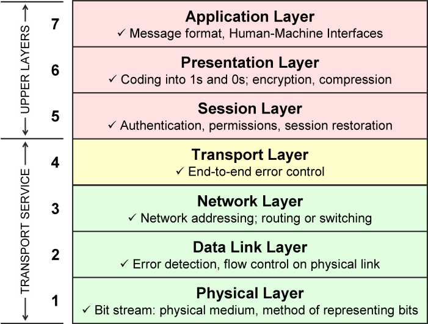
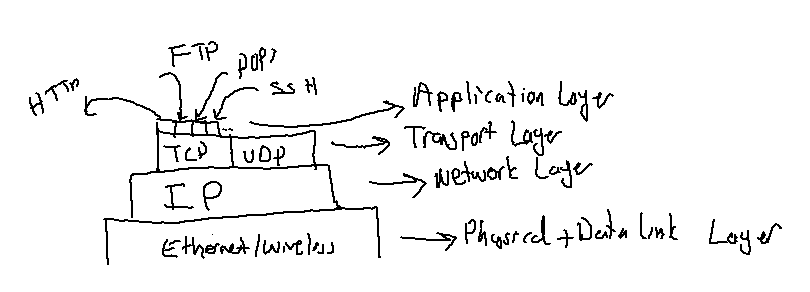
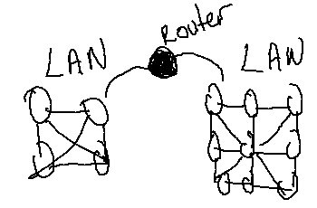
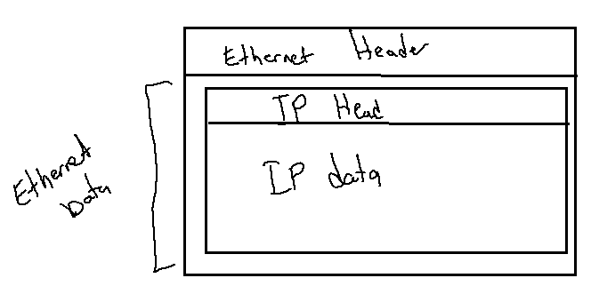
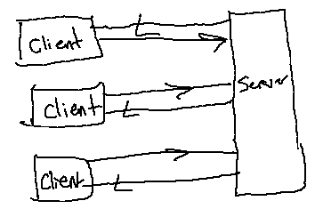
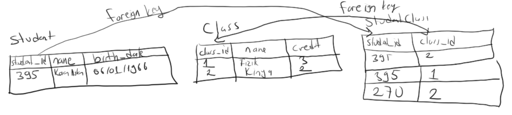
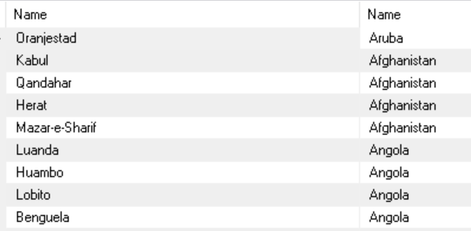
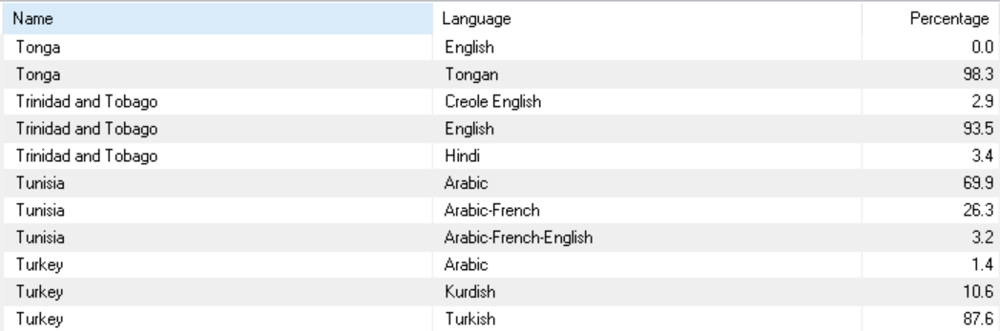
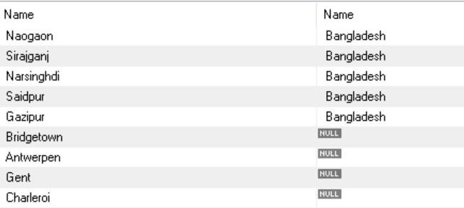
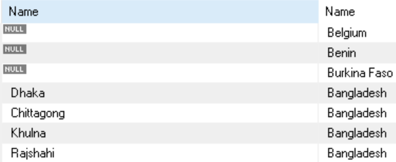

##### NodeJs Event Loop

>Bir node uygulaması için main thread çalıştığında arka planda bir **event/message loop** mekanizması bulunur. Bu mekanizma ile blokesiz (non-blocking) giriş/çıkış (input/output) işlemleri yapılabilmektedir. Bu durumda node uygulaması (aslında Javascript'in kendisi) tek bir thread olarak çalışır ve diğer asenkron işlemler event loop yardımıyla geçekleştirilir. Event loop ile Nodejs programcısı bir olaya ilişkin kodları bir callback olarak verir ve olay gerçekleştiğinde işletim sistemi ve node uygulaması yardımıyla ilgili callback fonksiyon çağrılır. Event loop node uygulaması çalışmaya başladığında yaratılır. Bu durumda bir node uygulamasında bir olay oluşması durumunda yapılacak işlemleri programcı yazar, callback olarak ve/veya yeni nesil yaklaşımda `Promise` kullanılarak asenkron bir biçimde olay gerçekleştiğinde ilgili kodlar çalıştırılır. 

##### Programın Komut Satırı Argümanları

>Program çalıştırılırken verilen yazılara **komut satırı argümanı (command line arguments)** denir. Komut satırı argümanlarının ilgili programa aktarılması işletim sistemi tarafından yapılır. Komut satırı argümanları whitespace karakter ile ayrılır. Eğer yazı bir whitespace karakter içeriyorsa işletim sistemine göre `'` veya `"` arasında yazılarak verilebilir. Şüphesiz sisteme göre bunlar dışında da yöntemler olabilmektedir.  Node'da komut satırı argümanları `process` nesnesinin `argv` dizi elemanı ile elde edilebilir. Komut satırı argümanı alan uygulamaların bazıları komut satırı argüman sayısını kontrol ederek, yanlış bir sayı durumunda programı sonlandırmayı tercih ederler. Bunun için `process` nesnesinin `exit` metodu kullanılabilir. Bu metot bir `çıkış kodu (exit code)` bilgisi alır. Çıkış kodu process sonlandıktan sonra process'in işletim sistemine ilettiği genel olarak bir tamsayı değeridir. Bazı özel uygulamalarda kullanımı söz konusu olsa da genel olarak değerin önemi yoktur. Bir convention olarak (bazen işletim sistemi de buna göre arka plan işlemleri yapabilir) sıfır başarı bir sonlanma, sıfır dışı bir değer ise başarısız bir sonlanmayı ifade eder. Bir zorunluluk olmasa tipik olarak başarısızlık durumunda exit metoduna `1(bir)` değeri geçilebilir. 

>Aşağıda komut satırı argümanının kullanımına ilişkin demo örneği inceleyiniz. Örnek `sample.js` dosyasında ise örnek çalıştırma şu şekilde yapılabilir:

```
node sample.js 10 20 30
```

```javascript
import {writeLine} from "./csd/util/console/console.js";  
  
const totalCallback = (r, v) => {  
    if (isNaN(v)) {  
        process.stderr.write("Invalid number\r\n")  
        process.exit(1)  
    }  
  
    return r + v  
}  
  
const main = () => {  
    if (process.argv.length === 2) {  
        process.stderr.write("Usage: node sample.js <number1> <number2> <number2> ...\r\n")  
        process.exit(1)  
    }  
  
    const total = process.argv  
        .filter((_, i) => i >= 2)  
        .map(arg => Number(arg))  
        .reduce(totalCallback)  
  
    writeLine(total)  
}  
  
main()
```

>Yukarıdaki örnek için geçersiz argümanların toplama dahil edilmemiş  versiyonu aşağıdaki gibidir

```javascript
import {writeLine} from "./csd/util/console/console.js";  
  
const mapToNumberCallback = str => {  
    let result = Number(str);  
  
    if (isNaN(result)) {  
        process.stderr.write(`Invalid number: ${str}\r\n`);  
        result = 0  
    }  
  
    return result  
}  
  
const main = () => {  
    if (process.argv.length === 2) {  
        process.stderr.write("Usage: node sample.js <number1> <number2> <number2> ...\r\n")  
        process.exit(1)  
    }  
  
    const total = process.argv  
        .filter((_, i) => i >= 2)  
        .map(mapToNumberCallback)  
        .reduce((r, v) => r + v)  
  
    writeLine(total)  
}  
  
main()
```

##### Dosya İşlemleri

>İkincil belleklerde (secondary memory) organize edilmiş alanlara **dosya (file)** denir. Dosyaların isimleri ve özellikleri (attribute) vardır.  Dosya işlemleri aslında işletim sistemi tarafından yapılır. İşletim sisteminin dosya işlemleri ile ilgili faaliyetlerinden oluşan  bölümüne **dosya sistemi (file system)** denir. 

>Bir dosyanın yerini belirten yazısal ifadeye **yol ifadesi (path)** denilmektedir. Windows'ta dizin (directory) geçişleri  `\` karakteri ile UNIX/Linux ve Mac OS X sistemlerinde `/` ile belirtilir. Windows sistemlerinde ayrıca bir de `sürücü (drive)` kavramı vardır. UNIX/Linux sistemlerinde ve Mac OS X sistemlerinde sürücü kavramı yoktur. Windows sistemlerinde her sürücünün ayrı bir kökü ve dizin ağacı (directory tree) vardır. Sürücünün kök dizini onun en dış dizinidir.  
  
>Yol ifadeleri **mutlak (absolute)** ve **göreli (relative)** olmak üzere ikiye ayrılmaktadır. Eğer sürücü ifadesinden sonraki (yol ifadesinde sürücü de belirtilmeyebilir) ilk karakter `\` veya `/` ise böyle yol ifadelerine mutlak, değilse göreli yol ifadeleri denilmektedir. Örneğin:  
  
>- `c:\a\b\c.dat  ---> mutlak yol ifadesi`
>- `\x\y\z.txt    ---> mutlak yol ifadesi`
>- `x\y\z.txt     ---> göreli`
>- `x.txt       ---> göreli`
>- `c:/a/b/c.dat  ---> mutlak yol ifadesi`
>-  `/x/y/z.txt"    ---> mutlak yol ifadesi`
>- `x/y/z.txt"     ---> göreli`
  
>Her process'in bir **çalışma dizini (current working directory)** vardır. Process'in çalışma dizini göreli yol ifadelerinin  çözülmesi (resolve) için orijin belirtir. Örneğin, process'imizin çalışma dizini (cwd) `c:\temp` olsun. Biz bu programda  `x\y\z.dat` biçiminde bir yol ifadesi kullanırsak toplamda `c:\temp\x\y\z.dat` dosyasını belirtmiş oluruz. Prosesin çalışma dizini istenildiği zaman değiştirilebilir. Ancak işin başında genel olarak programın çalıştırıldığı dizindir.  Örnek Windows işletim sistemi için anlatılmıştır. Benzer şekilde örneğin cwd `/tmp` dizini ise `x/y/z.dat` biçimindeki göreli yol ifadesi toplamda `/tmp/x/y/z.dat` biçiminde olacaktır.  
  
>Mutlak yol ifadeleri kök dizinden itibaren çözülür. Windows sistemlerine özgü olarak eğer yol ifadesinde sürücü belirtilmemişse prosesin çalışma dizininin bulunduğu sürücü o mutlak yol ifadesindeki sürücü olarak alınır. Örneğin prosesin çalışma dizini `d:\temp` olsun. `\a\b\c.dat` mutlak yol ifadesi d'nin kök dizininden itibaren yol belirtir yani örnekteki yol ifadesi `d:\a\b\c.dat` olarak ele alınır.

>Windows’ta dosya ve dizin isimlerinin büyük harf küçük harf duyarlılığı yoktur. Windows dosyanın ismini bizim belirttiğimiz gibi saklar. Ancak işleme sokarken büyük harf küçük harf farkını dikkate almaz. Ancak UNIX/Linux  sistemlerinde (Mac OS X dahil) dosya ve dizin isimlerinin büyük harf küçük harf duyarlılığı vardır.  
  
>Yol ifadelerinde kullanabileceğimiz iki özel dizin ismi vardır. Bunlar `.` ve `..` isimleridir. `.` o anda belirtilen dizinin aynısı, `..` ise o anda belirtilen dizinin üst dizini (parent directory) anlamına gelir. Örneğin `a\b\..\c.txt` yol ifadesi aslında `a\x.txt` ile eşdeğerdir.

>Process'in çalışma dizini `process` nesnesinin `cwd` isimli fonksiyon ile elde edilebilir. `chdir` fonksiyonu ile çalışma dizini değiştirilebilir. chdir fonksiyonu verilen çalışma dizini yoksa yoksa error fırlatır.

```javascript
import {writeLine} from "./csd/util/console/console.js";  
  
const main = () => {  
  
    if (process.argv.length !== 3) {  
        process.stderr.write("Wrong number of arguments\r\n")  
        process.exit(1)  
    }  
    try {  
        writeLine(process.cwd())  
        process.chdir(process.argv[2])  
        writeLine(process.cwd())  
    }  
    catch (e) {  
        process.stderr.write(`Directory not exists:${process.argv[2]}\r\n`)  
    }  
}  
  
main()
```

>Nodejs'de yol ifadelerine ilişkin fonksiyonlar `path` standart modülünde bulunur. Bu modüle ilişkin fonksiyonların bazıları şunlardır. 

```javascript
import {writeLine} from "./csd/util/console/console.js";  
import path from "path";  
  
const main = () => {  
    if (process.argv.length !== 3) {  
        process.stderr.write("Wrong number of arguments\r\n")  
        process.exit(1)  
    }  
  
    const p = process.argv[2]  
  
    writeLine(path.isAbsolute(p) ? "Absolute" : "Relative")  
    writeLine(`Extension:${path.extname(p)}`);  
    writeLine(`Base name:${path.basename(p)}`);  
    writeLine(`Directory name:${path.dirname(p)}`);  
}  
  
main()
```

>Nodejs'de dosya işlemlerine ilişkin fonksiyonlar `fs` isimli standart modül veya bu modül altındaki modüller içerisinde bulunur. Nodejs'de dosya işlemlerine ilişkin bir fonksiyon iki farklı biçimde bulunur. Genellikle iki biçimde aynı isimdedir. Bir fonksiyonun `fs` modülündeki versiyonu callback alır, aynı fonksiyonun `fs/promises` modülü içerisindeki versiyonu `Promise` nesnesine geri döner. Bu durumda programcı arka planda iş için ya callback verir ya da aldığı `Promise` nesnesi ile arka planı yönetir. 

>Dosya işlemlerine ilişkin fonksiyonlar genel olarak iki gruba ayrılabilir:
>- Dosyanın bütünü ile ilgili işlemler yapan fonksiyonlar. Örneğin, silme, dosya hakkında bilgi edinme vb.
>- Dosyanının verileri ile işlem yapan fonksiyonlar: Örneğin, okuma, yazma.

**Anahtar Notlar:** Her ne kadar amaçları ve kullanımları farklı olsa da bir `dizin (directory)` ve `normal dosya (regular file)` işletim sistemi açısından birer dosyadır (file). Normal dosya içerisinde veriler tutulurken, dizin içerisinde diğer dosyalar ve dizinlerin bilgileri tutulur. 

**Anahtar Notlar:** Dosya sistemine ilişkin callback alan fonksiyonların, callback'lerinin birinci parametresi genel olarak error oluştuğunda yaratılan nesneye ilişkin referanstır. 

>`fs` modülündeki `stat` fonksiyonu parametre olarak yol ifadesi ve bir callback alır. Bu callback'in ikinci parametresi `fs.Stats` türünden bir referanstır. Bu referansa ilişkin nesnenin içerisinde dosyaya ilişkin bilgiler bulunur. `fs.Stats` nesnesinin `isXXX` metotları ile ilgili bilgiler elde edilebilir. Bu bilgilerin bazıları çeşitli işletim sistemlerine özgüdür.

```javascript
import {writeLine} from "./csd/util/console/console.js";  
import fs from "fs";  
  
const main = () => {  
    if (process.argv.length !== 3) {  
        process.stderr.write("Wrong number of arguments\r\n")  
        process.exit(1)  
    }  
  
    fs.stat(process.argv[2], (e, s) => {  
        if (e) {  
            process.stderr.write(`Problem occurred:${e}`)  
            return  
        }  
  
        if (s.isFile())  
            writeLine(`Regular file -> Size:${s.size}`);  
        else if (s.isDirectory())  
            writeLine("Directory");  
        else if (s.isFIFO())  
            writeLine("Fifo");  
        else if (s.isSymbolicLink())  
            writeLine("SymbolicLink");  
        else if (s.isSocket())  
            writeLine("Socket");  
        else if (s.isCharacterDevice())  
            writeLine("Character Device");  
        else if (s.isBlockDevice())  
            writeLine("Block Device");  
        else  
            writeLine("Other")  
    })  
  
}  
  
main()
```

>Yukarıdaki örnek `CommonJS` kullanılarak aşağıdaki gibi de yapılabilir

```javascript
const {writeLine} = require("./csd/util/console/console.js")  
const fs= require("fs")  
  
const main = () => {  
    if (process.argv.length !== 3) {  
        process.stderr.write("Wrong number of arguments\r\n")  
        process.exit(1)  
    }  
  
    fs.stat(process.argv[2], (e, s) => {  
        if (e) {  
            process.stderr.write(`Problem occurred:${e}`)  
            return  
        }  
  
        if (s.isFile())  
            writeLine(`Regular file -> Size:${s.size}`);  
        else if (s.isDirectory())  
            writeLine("Directory");  
        else if (s.isFIFO())  
            writeLine("Fifo");  
        else if (s.isSymbolicLink())  
            writeLine("SymbolicLink");  
        else if (s.isSocket())  
            writeLine("Socket");  
        else if (s.isCharacterDevice())  
            writeLine("Character Device");  
        else if (s.isBlockDevice())  
            writeLine("Block Device");  
        else  
            writeLine("Other")  
    })  
}  
  
main()
```


>Yukarıdaki örnek `fs/promises` modülündeki `stat` fonksiyonu aşağıdaki biçimde yapılabilir

```javascript
import {writeLine} from "./csd/util/console/console.js";  
import fsp from "fs/promises";  
  
const showInfo = (s) => {  
    if (s.isFile())  
        writeLine(`Regular file -> Size:${s.size}`);  
    else if (s.isDirectory())  
        writeLine("Directory");  
    else if (s.isFIFO())  
        writeLine("Fifo");  
    else if (s.isSymbolicLink())  
        writeLine("SymbolicLink");  
    else if (s.isSocket())  
        writeLine("Socket");  
    else if (s.isCharacterDevice())  
        writeLine("Character Device");  
    else if (s.isBlockDevice())  
        writeLine("Block Device");  
    else  
        writeLine("Other")  
}  
  
const main = () => {  
    if (process.argv.length !== 3) {  
        process.stderr.write("Wrong number of arguments\r\n")  
        process.exit(1)  
    }  
  
    fsp.stat(process.argv[2]).then(showInfo).catch(e => process.stderr.write(`Problem occurred:${e}`))  
}  
  
main()
```

>Yukarıdaki örnek `await`operatörü ile aşağıdaki gibi yapılabilir

```javascript
import {writeLine} from "./csd/util/console/console.js";  
import fsp from "fs/promises";  
  
const showInfo = (s) => {  
    if (s.isFile())  
        writeLine(`Regular file -> Size:${s.size}`);  
    else if (s.isDirectory())  
        writeLine("Directory");  
    else if (s.isFIFO())  
        writeLine("Fifo");  
    else if (s.isSymbolicLink())  
        writeLine("SymbolicLink");  
    else if (s.isSocket())  
        writeLine("Socket");  
    else if (s.isCharacterDevice())  
        writeLine("Character Device");  
    else if (s.isBlockDevice())  
        writeLine("Block Device");  
    else  
        writeLine("Other")  
}  
  
const main = async () => {  
    if (process.argv.length !== 3) {  
        process.stderr.write("Wrong number of arguments\r\n")  
        process.exit(1)  
    }  
  
    try {  
        const s = await fsp.stat(process.argv[2])  
  
        showInfo(s)  
    }  
    catch (e) {  
        process.stderr.write(`Problem occurred:${e}\r\n`)  
    }  
}  
  
main()
```

>`mkdir`fonksiyonu ile dizin yaratılabilir. Fonksiyonun options parametresi ileride ele alınacaktır.

```javascript
import {writeLine} from "./csd/util/console/console.js";  
import fsp from "fs/promises";  
  
  
const main = async () => {  
    if (process.argv.length !== 3) {  
        process.stderr.write("Wrong number of arguments\r\n")  
        process.exit(1)  
    }  
  
    try {  
        await fsp.mkdir(process.argv[2])  
    }  
    catch (e) {  
        process.stderr.write(`Problem occurred:${e}\r\n`)  
    }  
}  
  
main()
```

>Bir dosyanın (ya da dosya olarak ele alınabilen kavramların) var olup olmadığı bilgisi `access` isimli bir fonksiyon kullanılarak elde edilebilir. access fonksiyonu erişilebilirlik anlamında sadece dosyanın var olup olmadığı durumunda kullanılmaz. Default durumda dosyanın varlığı sorgulanır. İleride ele alacağımız `options` parametresi ile dosyaya erişim olup olmadığı da sorgulanabilmektedir.

>Aşağıdaki örnekte dosyanın varlığı sorgulanmaktadır

```javascript
import {writeLine} from "./csd/util/console/console.js";  
import fsp from "fs/promises";  
  
  
const main = async () => {  
    if (process.argv.length !== 3) {  
        process.stderr.write("Wrong number of arguments\r\n")  
        process.exit(1)  
    }  
  
    try {  
        await fsp.access(process.argv[2]);  
          
        writeLine("Exists")  
    }  
    catch (e) {  
        writeLine("Not exist")  
    }  
}  
  
main()
```

>Aslında `fs` modülü içerisinde `exists` isimli bir fonksiyon da bulunur. Ancak bu fonksiyon uzun süredir `deprecated` durumdadır. Bu sebeple kullanılması tavsiye edilmez. Nodejs'nin resmi dökumanlarına göre `exists` fonksiyonu yerine `stat` ya da `access` fonksiyonu önerilmektedir. Ayrıca `fs` modülü içerisinde `senkron` olarak çalışan `existsSync` isimli fonksiyon da bulunmaktadır. Bu fonksiyon predicate bir fonksiyondur yani boolean türüne geri döner. Her ne kadar dosyanın var olup olmadığının kontrolü çok hızlı bir biçimde yapılabilse de bu fonksiyonun ana thread içerisinde kullanımı tavsiye edilmez.

>Aşağıdaki demo örnekte `existsSync` fonksiyonunun ana thread'de çağrıldığına dikkat ediniz

```javascript
import {writeLine} from "./csd/util/console/console.js";  
import fsp from "fs/promises";  
import fs from "fs";  
  
const main = async () => {  
    if (process.argv.length !== 3) {  
        process.stderr.write("Wrong number of arguments\r\n")  
        process.exit(1)  
    }  
  
    if (!fs.existsSync(process.argv[2])) {  
        try {  
            await fsp.mkdir(process.argv[2])  
        } catch (e) {  
            process.stderr.write(`Problem occurred:${e}\r\n`)  
        }  
    }  
    else  
        writeLine(`${process.argv[2]} exists`)  
}  
  
main()
```

**Anahtar Notlar:** `fs` modülünde bulunan fonksiyonların hemen hepsinin senkron olarak çalışan versiyonları da bulunur. Bu fonksiyonlarının isimlerinin sonunda `Sync` bulunur.

>Bir dizine ilişkin bilgiler `opendir` fonksiyonu ile elde edilebilir. Bu fonksiyon ile dizin girişi (directory entry) elde edilir. Bir dizin girişinde isim ve parentPath bilgisi bulunur. 

>Aşağıdaki demo örneği inceleyiniz

```javascript
import {writeErrLine, writeLine} from "./csd/util/console/console.js";  
import fsp from "fs/promises";  
  
const writeDirEntry = async (path) => {  
    try {  
        const dir = await fsp.opendir(path)  
  
        for await (const entry of dir) {  
            writeLine("------------------------")  
            for (const f in entry)  
                writeLine(`${f} -> ${entry[f]}`);  
            writeLine("------------------------")  
        }  
    }  
    catch (e) {  
        writeErrLine(`Problem occurred:${e.message}`)  
    }  
} 
  
const main = async () => {  
    if (process.argv.length !== 3) {  
        process.stderr.write("Wrong number of arguments\r\n")  
        process.exit(1)  
    }  
  
    try {  
        await fsp.access(process.argv[2])  
        await writeDirEntry(process.argv[2])  
    }  
    catch (ex) {  
        writeErrLine(`'${process.argv[2]}' not exists`)  
    }  
}  
  
main()
```

>Aşağıdaki demo örneği inceleyiniz

```javascript
import {write, writeErrLine, writeLine} from "./csd/util/console/console.js";  
import fsp from "fs/promises";  
import p from "path";  
  
const writeInfo = async (path) => {  
    try {  
        const s = await fsp.stat(path)  
  
        write(`${p.basename(path)} is `)  
        if (s.isFile())  
            writeLine(`a regular file -> Size:${s.size}`);  
        else if (s.isDirectory())  
            writeLine("a directory");  
        else if (s.isFIFO())  
            writeLine("a fifo");  
        else if (s.isSymbolicLink())  
            writeLine("a symbolicLink");  
        else if (s.isSocket())  
            writeLine("a socket");  
        else if (s.isCharacterDevice())  
            writeLine(" a character Device");  
        else if (s.isBlockDevice())  
            writeLine("slock Device");  
        else  
            writeLine("an other device")  
    }  
    catch (e) {  
        writeErrLine(`Problem occurred in stat: ${e.message}`)  
    }  
}  
  
const writeDirEntry = async (path) => {  
    try {  
        const dir = await fsp.opendir(path)  
  
        for await (const entry of dir)  
            await writeInfo(p.resolve(entry.parentPath, entry.name));  
    }  
    catch (e) {  
        writeErrLine(`Problem occurred in opendir:${e.message}`)  
    }  
}  
  
const main = async () => {  
    if (process.argv.length !== 3) {  
        process.stderr.write("Wrong number of arguments\r\n")  
        process.exit(1)  
    }  
  
    try {  
        await fsp.access(process.argv[2])  
        await writeDirEntry(process.argv[2])  
    }  
    catch (ex) {  
        writeErrLine(`'${process.argv[2]}' not exists`)  
    }  
}  
  
main()
```

>`readDir` fonksiyonu ile de dizine ilişkin bilgiler elde edilebilmektedir. Bu fonksiyon ile dosya isimleri bir dizi olarak elde edilmektedir

```javascript
import {writeErrLine, writeLine} from "./csd/util/console/console.js";  
import fsp from "fs/promises";  
  
const writeDirEntry = async (path) => {  
    try {  
        (await fsp.readdir(path)).forEach(file => writeLine(file))  
    }  
    catch (e) {  
        writeErrLine(`Problem occurred:${e.message}`)  
    }  
}  
  
const main = async () => {  
    if (process.argv.length !== 3) {  
        process.stderr.write("Wrong number of arguments\r\n")  
        process.exit(1)  
    }  
  
    try {  
        await fsp.access(process.argv[2])  
        await writeDirEntry(process.argv[2])  
    }  
    catch (ex) {  
        writeErrLine(`'${process.argv[2]}' not exists`)  
    }  
}  
  
main()
```

>Aşağıdaki demo örneği inceleyiniz

```javascript
import {write, writeErrLine, writeLine} from "./csd/util/console/console.js";  
import fsp from "fs/promises";  
import p from "path";  
  
const writeInfo = async (path) => {  
    try {  
        const s = await fsp.stat(path)  
  
        write(`${p.basename(path)} is `)  
        if (s.isFile())  
            writeLine(`a regular file -> Size:${s.size}`);  
        else if (s.isDirectory())  
            writeLine("a directory");  
        else if (s.isFIFO())  
            writeLine("a fifo");  
        else if (s.isSymbolicLink())  
            writeLine("a symbolicLink");  
        else if (s.isSocket())  
            writeLine("a socket");  
        else if (s.isCharacterDevice())  
            writeLine(" a character Device");  
        else if (s.isBlockDevice())  
            writeLine("slock Device");  
        else  
            writeLine("an other device")  
    }  
    catch (e) {  
        writeErrLine(`Problem occurred in stat: ${e.message}`)  
    }  
}  
  
const writeDirEntry = async (path) => {  
    try {  
        (await fsp.readdir(path)).forEach(async (file) => await writeInfo(p.resolve(path, file)))  
    }  
    catch (e) {  
        writeErrLine(`Problem occurred in opendir:${e.message}`)  
    }  
}  
  
const main = async () => {  
    if (process.argv.length !== 3) {  
        process.stderr.write("Wrong number of arguments\r\n")  
        process.exit(1)  
    }  
  
    try {  
        await fsp.access(process.argv[2])  
        await writeDirEntry(process.argv[2])  
    }  
    catch (ex) {  
        writeErrLine(`'${process.argv[2]}' not exists`)  
    }  
}  
  
main()
```

>`opendir` fonksiyonunun options parametresi dizinleri dolaşırken bazı seçenekler vermek için kullanılır. options bir object türünden verilebilir. Bu object'in `recursive` alan değeri true olarak verilirse dizinlerin içerisindeki dizinlerde `recursive` bir biçimde dolaşılabilir. 


>Aşağıdaki demo örneği inceleyiniz

```javascript
import {write, writeErrLine, writeLine} from "./csd/util/console/console.js";  
import fsp from "fs/promises";  
import p from "path";  
  
let totalSize = 0  
  
const setTotalSize = async (path) => {  
    try {  
        const s = await fsp.stat(path)  
  
        if (!s.isDirectory())  
            totalSize += s.size;  
    }  
    catch (e) {  
        writeErrLine(`Problem occurred in stat: ${e.message}`)  
    }  
}  
  
const walkDirectory = async (path) => {  
    try {  
        const dir = await fsp.opendir(path, { recursive: true })  
  
        for await (const entry of dir)  
            await setTotalSize(p.resolve(entry.parentPath, entry.name));  
    }  
    catch (e) {  
        writeErrLine(`Problem occurred in opendir:${e.message}`)  
    }  
}  
  
const main = async () => {  
    if (process.argv.length !== 3) {  
        process.stderr.write("Wrong number of arguments\r\n")  
        process.exit(1)  
    }  
  
    try {  
        await fsp.access(process.argv[2])  
        await walkDirectory(process.argv[2])  
  
        writeLine(`Total Size:${totalSize}`)  
    }  
    catch (ex) {  
        writeErrLine(`'${process.argv[2]}' not exists`)  
    }  
}  
  
main()
```

>Burada `totalSize` için global değişken kullanılmıştır. Örnek aşağıdaki gibi yerel değişken kullanılarak da yazılabilir

```javascript
import {write, writeErrLine, writeLine} from "./csd/util/console/console.js";  
import fsp from "fs/promises";  
import p from "path";  
  
const getSize = async (path) => {  
    try {  
        const s = await fsp.stat(path)  
  
        return s.isDirectory() ? 0 : s.size  
    }  
    catch (e) {  
        writeErrLine(`Problem occurred in stat: ${e.message}`)  
        throw e  
    }  
}  
  
const calculateTotalSize = async (path) => {  
    try {  
        const dir = await fsp.opendir(path, {"recursive": true})  
        let totalSize = 0  
  
        for await (const entry of dir)  
            totalSize += await getSize(p.resolve(entry.parentPath, entry.name))  
  
        return totalSize  
    }  
    catch (e) {  
        writeErrLine(`Problem occurred in opendir:${e.message}`)  
        throw e  
    }  
}  
  
const main = async () => {  
    if (process.argv.length !== 3) {  
        process.stderr.write("Wrong number of arguments\r\n")  
        process.exit(1)  
    }  
  
    try {  
        await fsp.access(process.argv[2])  
        const totalSize = await calculateTotalSize(process.argv[2])  
  
        writeLine(`Total Size:${totalSize}`)  
    }  
    catch (ex) {  
        writeErrLine(`'${process.argv[2]}' not exists`)  
    }  
}  
  
main()
```


>Yukarıdaki örneğin aşağıdaki yapılışını ve `DirectoryInfo` sınıfını inceleyiniz

```javascript
import fsp from "fs/promises";  
import p from "path";  
import fs from "fs";  
  
export class DirectoryInfo {  
    constructor(path) {  
        this._path = path  
        let e = null  
        fs.stat(path, (ex, s) => {if (ex) e = ex; else if (!s.isDirectory()) e = new Error(`${path} is not a directory`)})  
  
        if (e)  
            throw e  
    }  
  
    async calculateTotalSize() {  
        const dir = await fsp.opendir(this._path, { recursive: true })  
        let totalSize = 0  
  
        for await (const entry of dir) {  
            const s = await fsp.stat(p.resolve(entry.parentPath, entry.name))  
  
            if (!s.isDirectory())  
                totalSize += s.size;  
        }  
  
        return totalSize  
    }  
  
    get path() {  
        return this._path  
    }  
  
    //...  
}
```

```javascript
import fsp from "fs/promises";  
import p from "path";  
import fs from "fs";  
  
export class DirectoryInfo {  
    constructor(path) {  
        this._path = path  
        let e = null  
        fs.stat(path, (ex, s) => {if (ex) e = ex; else if (!s.isDirectory()) e = new Error(`${path} is not a directory`)})  
  
        if (e)  
            throw e  
    }  
  
    async calculateTotalSize() {  
        const dir = await fsp.opendir(this._path, { recursive: true })  
        let totalSize = 0  
  
        for await (const entry of dir) {  
            const s = await fsp.stat(p.resolve(entry.parentPath, entry.name))  
  
            if (!s.isDirectory())  
                totalSize += s.size;  
        }  
  
        return totalSize  
    }  
  
    get path() {  
        return this._path  
    }  
  
    //...  
}
```

##### EventEmitter Sınıfı

>Bu sınıf ile programcı kendi `event-driven` mimarisini yani algoritmik olarak `event-driven` çalışmayı gerçekleştirebilir. Bu sınıf `events` modülünde bulunur. Sınıfın `emit` metodu ile bir event, ismi ve verisi ile tetiklenebilir. Sınıfın `addListener` metodu ile bir event için register işlemi yapılabilir. `addListener` metodu yerine `on` metodu ile de register işlemi gerçekleştirilebilir. `once` fonksiyonu tetiklenen bir event yalnızca bir kez dinlenebilir. `removeListener` veya `off` fonksiyonu ile register edilmiş bir event unregister edilebilir. `removeAllListeners` metodu ile tüm register edilmiş event'ler unregister edilebilir. 

```javascript
import {writeLine} from "./csd/util/console/console.js";  
import {RandomIntGenerator} from "./csd/random/RandomIntGenerator.js";  
  
const main = () => {  
    const gen = new RandomIntGenerator(10, -5, 5, 1000)  
    const notPrimeCallback = v => writeLine(`${v} -> not-prime`)  
  
    gen.on("prime", v => writeLine(`${v} -> prime`))  
    gen.on("even", v => writeLine(`${v} -> even`))  
    gen.on("odd", v => writeLine(`${v} -> odd`))  
    gen.on("zero", () => writeLine("zero"))  
    gen.run()  
  
    setTimeout(() => {  
        gen.off("not-prime", notPrimeCallback)  
    }, 5000)  
}  
  
main()
```

```javascript
import {randomInt} from "../util/random/random.js";  
import {isPrime} from "../util/numeric/numeric.js";  
import * as events from "node:events";  
  
export class RandomIntGenerator {  
    constructor(count, min, max, period) {  
        this._count = count  
        this._min = min  
        this._max = max  
        this._period = period  
        this._n = 0  
        this._event = new events.EventEmitter()  
    }  
  
    on(name, action) {  
        this._event.on(name, action)  
    }  
  
    off(name, action) {  
        this._event.off(name, action)  
    }  
  
    _randomGeneratorCallback(event) {  
        const val = randomInt(this._min, this._max + 1)  
  
        ++this._n  
        if (val === 0)  
            event.emit("zero")  
  
        if (isPrime(val))  
            event.emit("prime", val)  
  
        if (val % 2 === 0)  
            event.emit("even", val)  
        else  
            event.emit("odd", val)  
  
        if (this._count === this._n)  
            clearInterval(this._interval)  
    }  
  
    run() {  
        this._interval = setInterval(() => this._randomGeneratorCallback(this._event), this._period)  
    }  
}
```

>Aşağıdaki demo örnekte `EventEmitter` sınıfından `türetme (inheritance)` yapılmıştır. Şüphesiz `ES6` sonrası için türetme böyle bir senaryoda daha uygundur

```javascript
import {writeLine} from "./csd/util/console/console.js";  
import {RandomNumberGenerator} from "./csd/random/RandomNumberGenerator.js";  
  
const main = () => {  
    const gen = new RandomNumberGenerator(10, -5, 5, 1000)  
    const notPrimeCallback = v => writeLine(`${v} -> not-prime`)  
  
    gen.on("positive", v => writeLine(`${v} -> positive`))  
    gen.on("negative", v => writeLine(`${v} -> negative`))  
    gen.on("zero", () => writeLine("zero"))  
    gen.run()  
}  
  
main()
```

```javascript
import {randomNumber} from "../util/random/random.js";  
import * as events from "node:events";  
  
export class RandomNumberGenerator extends events.EventEmitter {  
    constructor(count, min, max, period) {  
        super()  
        this._count = count  
        this._min = min  
        this._max = max  
        this._period = period  
        this._n = 0  
    }  
  
    _randomGeneratorCallback(ee) {  
        const val = randomNumber(this._min, this._max + 1)  
  
        ++this._n  
  
        if (val > 0)  
            ee.emit("positive", val)  
        else if (val < 0)  
            ee.emit("negative", val)  
        else  
            ee.emit("zero")  
  
        if (this._count === this._n)  
            clearInterval(this._interval)  
    }  
  
    run() {  
        this._interval = setInterval(() => this._randomGeneratorCallback(this), this._period)  
    }  
}
```
###### Text ve Binary Dosyalar

>Bilgisayar dünyasında içeriklerine göre dosyalar kabaca **text** ve **binary** dosyalar biçiminde ikiye ayrılmaktadır.  Aslında bu ayrım tamamen mantıksal düzeydedir. Dosyanın içerisinde ne olursa olsun dosyalar byte topluluklarından oluşurlar. Dosyaların uzantıları onların içerisinde ne olduğuna yönelik bir ipucu vermek için düşünülmüştür.  İçerisinde yalnızca yazıların bulunduğu dosyalara **text** dosyalar, içerisinde yazıların dışında başka birtakım bilgilerin de bulunduğu dosyalara **binary** dosyalar denilmektedir. Örneğin notepad’te oluşturmuş olduğumuz dosyalar  tipik text dosyalardır. Halbuki uzantısı `.exe` veya `.obj` olan dosyaların içerisinde yazı yoktur. Bunlar tipik binary dosyalardır. Uzantısı `.doc` olan veya `.docx` olan dosyalar da aslında `binary` dosyalardır. Her ne kadar bu  dosyaların içerisinde yazılar varsa da yazıların dışında başka `metadata` bilgileri de vardır.  
>
>Text ve binary modda açılan dosyalar için Windows ve Unix/Linux (Mac OS X dahil) sistemlerinde farklılıklar  bulunmaktadır. Bir dosya text modda açılmışsa ve çalışılan sistem windows ise yazma yapan herhangi bir fonksiyon  Line feed (LF) ('\n') karakterini yazdığında aslında dosyaya Carriage Return (CR)('\r') ve LF karakterlerinin ikisi  birden yazılır. Benzer şekilde text dosyadan okuma yapan fonksiyonlar çalışılan sistem Windows ise ve dosya text modda  açılmışsa CRLF karakterlerini yan yana gördüğünde yalnızca LF olarak okuma yaparlar. Bu konu ileride detaylandırılacaktır.
>
>Uzantı ne olursa olsun dosyaların içerisinde byte yığınları vardır. Biz de temelde dosyalardan byte okuyup onlara byte yazarız. Dosya içerisindeki her bir byte'ın ilk byte 0(sıfır) olmak üzere artan sırada bir pozisyon numarası vardır.  Buna dosya terminolojisinde ilgili byte’ın offset’i denilmektedir. Dosya göstericisi bir imleç gibi (kalemin ucu gibi) düşünülebilir. Dosya göstericisi o anda dosyanın neresinden itibaren okuma ya da yazma yapılacağını anlatan bir konum (offset) belirtir:  
    x x x x x x x x  
    0 1 2 3 4 5 6 7   
>
>Bu örnekte dosya göstericisinin 2 numaralı offset'i gösterdiğini düşünelim. Biz artık 2 byte'lık bir okuma yaparsak  2 ve 3 numaralı offset'teki byte'ları okuruz. Okuma ve yazma metotları okunan ya da yazılan miktar kadar dosya  göstericisini otomatik ilerletmektedir. Dosya açıldığında dosya göstericisi özel modlarda açılmamışsa başlangıçta  0(sıfır)'ıncı offset'tedir. Yazma sırasında dosya göstericisinin gösterdiği yerden itibaren eski bilgiler ezilerek  yeni bilgiler yazılır. Fakat, özel bir durum olarak dosya göstericisi dosyanın sonundaysa dosyaya yazma yapıldığında  dosya büyütülmektedir. Başka bir deyişle bu durumda dosyaya yazma işlemi ekleme (append) anlamına gelir.  
###### Dosya Göstericisinin EOF Durumu  
  
>Dosya göstericisinin dosyanın son byte'ından sonraki byte'ı göstermesi durumuna **EOF (End Of File)** durumu denir.  EOF durumundan okuma yapılamaz. Fakat dosya göstericisi EOF durumundayken dosyaya yazma yapılabilir. Bu durum dosyaya  ekleme anlamına gelir. Dosyaya ekleme yapmanın taşınabilir (portable) başka bir yolu yoktur. Dosya göstericisinin  dosyanın son byte’ından sonraki byte’ı göstermesi taşınabilir olarak mümkündür. Ancak daha ileride bir yeri taşınabilir olarak göstermesi söz konusu değildir.  
  
**Anahtar Notlar:** Bazı işletim sistemleri dosyanın sonundan daha ileriye konumlanmaya ve veri yazmaya izin verebilmektedir.  Bu duruma genel olarak `dosya delikleri (file holes)`  denir. Aşağı seviyede anlamlıdır. Her işletim sistemi  desteklemeyebileceğinden, kullanılması taşınabilir olmaz.

>`fs` ve `fs/promises` modüllerinde bulunan `writeFile` fonksiyonu ile bir veri dosyaya yazılabilir.

```javascript
import {writeErrLine, writeLine} from "./csd/util/console/console.js";  
  
import {writeFile} from "fs/promises"  
  
const main = async () => {  
    if (process.argv.length !== 4) {  
        writeErrLine("Wrong number of arguments")  
        process.exit(1)  
    }  
  
    try {  
        await writeFile(process.argv[2], process.argv[3], {flag: "a"})  
        writeLine("Data written successfully")  
    }catch (e) {  
        writeErrLine(`Error occurred:${e.message}`)  
    }  
}  
  
main()
```
>Yukarıdaki işlem aşağıdaki gibi `fs` modülündeki `writeFile` fonksiyonu ile aşağıdaki gibi yapılabilir.

```javascript
import {writeErrLine, writeLine} from "./csd/util/console/console.js";  
  
import {writeFile} from "fs"  
  
const main = () => {  
    if (process.argv.length !== 4) {  
        writeErrLine("Wrong number of arguments")  
        process.exit(1)  
    }  
  
    writeFile(process.argv[2], process.argv[3] + "\r\n", {flag: "a"}, e => {  
        if (!e)  
            writeLine("Data written successfully")  
        else  
            writeErrLine(`Error occurred:${e.message}`)  
    })   
}  
  
main()
```
>`fs/promises` modülünün `readFile` fonksiyonu ile dosyanın tüm verisi okunabilir. Bu fonksiyon dosyanın tamamını okuduğundan çok büyük dosyalar için kullanımı çok efektif değildir, hatta duruma göre çok bir dosya okunamayabilir. Bu fonksiyonun `options` parametresinde `encoding` default null değerindedir. Değerin null olması durumunda okunan bilgili `Buffer` türünden yani binary formattadır. Encoding değeri null dışı uygun bir değer verildiğinden dosyanın içeriğinde text okuma da yapılabilmektedir. `options` parametresinin `flag` değeri default olarak `r` yani salt okuma modudur. Bu durumda dosya bulunamazsa error oluşur

```javascript
import {writeErrLine, writeLine} from "./csd/util/console/console.js";  
  
import {readFile, stat} from "fs/promises"  
  
const doStat = async (stats) => {  
    if (!stats.isDirectory()) {  
        const data = await readFile(process.argv[2])  
  
        writeLine(data.toString())  
    }  
    else  
        throw new Error(`${process.argv[2]} is a directory`)  
}  
  
const main = async () => {  
    if (process.argv.length !== 3) {  
        writeErrLine("Wrong number of arguments")  
        process.exit(1)  
    }  
  
    try {  
        await doStat(await stat(process.argv[2]))  
    }  
    catch (err) {  
        writeErrLine(`Error occurred while reading file:${err.message}`)  
    }  
}  
  
main()
```

```javascript
import {writeErrLine, writeLine} from "./csd/util/console/console.js";  
  
import {readFile, stat} from "fs/promises"  
  
const doStat = async (stats) => {  
    if (!stats.isDirectory()) {  
        const data = await readFile(process.argv[2], {encoding: "utf8"})  
          
        writeLine(data)  
    }  
    else  
        throw new Error(`${process.argv[2]} is a directory`)  
}  
  
const main = async () => {  
    if (process.argv.length !== 3) {  
        writeErrLine("Wrong number of arguments")  
        process.exit(1)  
    }  
  
    try {  
        await doStat(await stat(process.argv[2]))  
    }  
    catch (err) {  
        writeErrLine(`Error occurred while reading file:${err.message}`)  
    }  
}  
  
main()
```
>Peki çok büyük bir dosya nasıl okunacaktır? Bunun en tipik yöntemlerden biri dosyayı `blok (block/chunk)` olarak okumaktır. Bu yöntemde `tampon (buffer)` kullanılır ve iteratif olarak okuma yapılır. Nodejs'de blok blok okuma yapmak için `createReadStream` fonksiyonu kullanılabilir. Bu fonksiyon ile elde edilen `stream'in` `data` isimli even'i ile her adımda veri okunabilir, `error` isimli event'i ile herhangi bir hata durumu handle edilebilir, `end` isimli eventt'i ile dosya sonuna (EOF) gelindiğinde yapılacak işlemler belirlenebilir. Fonksiyonun options parametresine ilişkin nesnenin pek çok elemanı vardır. `highWaterMark` elemanı okunacak tampon uzunluğunu belirtmek için kullanılır. Default olarak `64K` verilmiştir. Nesnenin `start` ve `end` elemanları ile okunacak byte aralığı belirlenebilir. `start` değeri default olarak sıfır, `end` değeri default olarak `Infinity` biçiminde belirlenmiştir. `Infinity` değeri dosyanın sonuna kadar okumak anlamına gelir. Okuma aralığı `[0, Number.MAX_SAFE_INTEGER]` şeklindedir. Programcı bu alan ile tampon uzunluğunu belirleyebilir. Nesnenin diğer elemanları için ilgili dökumantasyona başvurulabilir:

```javascript
import {writeErrLine, writeLine} from "./csd/util/console/console.js";  
  
import {stat} from "fs/promises"  
import {createReadStream} from "fs"  
  
const doStat = (stats, bufSize) => {  
    if (!stats.isDirectory()) {  
        const stream = createReadStream(process.argv[2], {highWaterMark: bufSize})  
  
        stream.on("data", data => {  
            writeLine(data.length)  
            //...  
        })  
  
        stream.on("error", err => writeErrLine(`Error occurred while reading:${err.message}`))  
        stream.on("end", () => writeLine("File read successfully."))  
    }  
    else  
        throw new Error(`${process.argv[2]} is a directory`)  
}  
  
const main = async () => {  
    if (process.argv.length !== 4) {  
        writeErrLine("Wrong number of arguments")  
        process.exit(1)  
    }  
  
    try {  
        const bufSize = parseInt(process.argv[3], 10)  
        doStat(await stat(process.argv[2]), bufSize)  
    }  
    catch (err) {  
        writeErrLine(`Error occurred:${err.message}`)  
    }  
}  
  
main()
```

>`fs/promises` modülündeki `copyFile` fonksiyonu ile kopyalama işlemi yapılabilir. Bu fonksiyon default olarak hedef dosya varsa `truncate/overwriten` yapar. Fonksiyonun üçüncü parametresine `fs.constants.COPYFILE_EXCL` değeri girildiğinde hedef dosya varsa fonksiyon başarısız olur. 

```javascript
import {writeErrLine, writeLine} from "./csd/util/console/console.js";  
  
import {stat, copyFile} from "fs/promises"  
import fs from "fs"  
  
const copy = async () => {  
    try {  
        await copyFile(process.argv[2], process.argv[3], fs.constants.COPYFILE_EXCL)  
        writeLine("File copied successfully")  
    }  
    catch (err) {  
        writeErrLine(`Error occurred while copying file: ${err}`)  
    }  
}  
  
const doCopy = async (stats) => {  
    if (!stats.isDirectory())  
        await copy()  
    else  
        throw new Error(`${process.argv[2]} is a directory`)  
}  
  
const main = async () => {  
    if (process.argv.length !== 4) {  
        writeErrLine("Wrong number of arguments")  
        process.exit(1)  
    }  
  
    try {  
        await doCopy(await stat(process.argv[2]))  
    }  
    catch (err) {  
        writeErrLine(`Error occurred:${err.message}`)  
    }  
}  
  
main()
```

```javascript
import {writeErrLine, writeLine} from "./csd/util/console/console.js";  
  
import {stat, copyFile} from "fs/promises"  
import fs from "fs"  
  
const copy = async () => {  
    try {  
        await copyFile(process.argv[2], process.argv[3])  
        writeLine("File copied successfully")  
    }  
    catch (err) {  
        writeErrLine(`Error occurred while copying file: ${err}`)  
    }  
}  
  
const doCopy = async (stats) => {  
    if (!stats.isDirectory())  
        await copy()  
    else  
        throw new Error(`${process.argv[2]} is a directory`)  
}  
  
const main = async () => {  
    if (process.argv.length !== 4) {  
        writeErrLine("Wrong number of arguments")  
        process.exit(1)  
    }  
  
    try {  
        await doCopy(await stat(process.argv[2]))  
    }  
    catch (err) {  
        writeErrLine(`Error occurred:${err.message}`)  
    }  
}  
  
main()
```

>Bir dosyayı açmak için `fs` veya `fs/promises` modülündeki `open` fonksiyonu kullanılabilir. Bu fonksiyon ismine `file handle` denilen bir nesnenin adresine geri döner. Bu değer ile çeşitli fonksiyonlar çağrılabilir. Örneğin `readLine` fonksiyonu ile bir dosya satır satır okunabilmektedir.

```javascript
import {writeErrLine, writeLine} from "./csd/util/console/console.js";  
  
import {stat, open} from "fs/promises"  
  
const readLines = async () => {  
    try {  
        const fh = await open(process.argv[2])  
          
        for await (const line of fh.readLines({encoding:"utf-8"}))  
            writeLine(line)  
    }  
    catch (err) {  
        writeErrLine(`Error occurred while opening file: ${err.message}`);  
    }  
}  
  
const doStat = async (stats) => {  
    if (!stats.isDirectory())  
        await readLines()  
    else  
        throw new Error(`${process.argv[2]} is a directory`)  
}  
  
const main = async () => {  
    if (process.argv.length !== 3) {  
        writeErrLine("Wrong number of arguments")  
        process.exit(1)  
    }  
  
    try {  
        await doStat(await stat(process.argv[2]))  
    }  
    catch (err) {  
        writeErrLine(`Error occurred:${err.message}`)  
    }  
}  
  
main()
```

##### Linux Dizin Yapısı

>`Linux Foundation Group` `UNIX` sistemlerindeki dizin yapısını standardize etmeye çalışmıştır. Bu standarda `File System Hierarchy Standard` denir. Buna göre bazı dizinler ve anlamları şunlardır:
>
>`/bin:` Burada kabuk (shell) komutlarına ilişkin executable dosyalar ve çeşitli utility programlar bulunur.
>
>`/sbin:` Burada sisteme ilişkin aşağı seviyeli executable dosyalar ve çeşitli utility programlar bulunur. Örneğin sistemin boot edilmesi için gereken dosyalar buradadır. Genel olarak `/sbin` içerisindeki dosyalar normal kullanıcılar için değil sistem yöneticileri yani root kullanıcısı içindir.
>
>`/boot:` Bu dizinde `boot loader` eve bazı çekirdeğe (kernel) ilişkin dosyalar bulunur. Linux dağıtımlarında `lilo`, `grub` gibi bazı popüler boot loader'lar kullanılır.
>
>`/lib:` Burada `/bin` ve `/sbin` içerisinde bulunan programların kullandığı kütüphaneler bulunur.
>
>`/dev:` Burada aygıt sürücülere (device driver) ilişkin dosyalar bulunmaktadır.
>
> `/etc:` Bu dizin "etcetera" sözcüğünün kısaltmasından oluşturulmuştur. İlk zamanlarda bu dizin diğer dizinlerde olmayacak şeyleri içeriyordu. Sonraki yıllarda burada olanlar da gittikçe belirgin olmaya başlamıştır. Bu dizinde genel olarak çeşitli konfigürasyon bilgileri tutulur. Bu nedenle etc ismi artık **editable text configuration** kısaltması olarak kullanılmaktadır
>
>`/home:` Burada kullanıcılar için ayrılan dizinler tutulur. Normal olarak her kullanıcın kullanıcı ismine ilişkin bir dizini vardır.
>
>`/mnt:` Kullanıcıların mount işlemi için kullanabilecekleri genel bir dizindir.
>
>`/root:` Bu dizin root kullanıcısı için home dizini görevindedir.
>
>`/media:` Bu dizin çıkarılabilir aygıtların (CDROM, Flash EPROM vb.) mount edildiği dizindir.
>
>`/usr:` Burada kullanıcıların yerleştirdiği ya da install ettiği tüm yazılımlara ilişkin executable dosyalar, kütüphaneler ve bazı geliştirme araçları için gereken dosyalar bulunur. `/usr/bin` dizininde genel olarak dağıtıma ilişkin utility programlar bulunur. `/usr/local` lokal makinedeki programlar için düşünülmüştür.
>
>`/var:` Bu dizin log dosyaları gibi sistemin çalışması sırasında sürekli güncellenen dosyaların tutulduğu bir dizindir. Bu dizinin de pek çok alt dizini vardır
>
>`/sys:` Aygıt sürücülerin ve çekirdeğe ilişkin bazı dosyaların bulunduğu dizindir
> 
>`/tmp:` Geçici dosyalar için bulundurulan bir dizindir. Genellikle sistem kapatılırken silinmektedir

##### Sisteme Giriş (login)

>`UNIX` sistemlerinde her kullanıcıya bir username ve bir password verilir. Bir kullanıcı username ve password ile sisteme giriş (login) yapar. Sisteme giriş yapmak genellikle 3 yoldan yapılabilir:
>
>1. **Text tabanlı bir terminal program ile:** Eğer sistemde bir Graphical User Interface (GUI) (tipik olarak Xwindow) yoksa bu yoldan giriş yapılır. Genellikle sunucu (server) sistemlere bu şekilde erişilir.
>
>2. **GUI ile:** Eğer sistemde bir GUI varsa bunlarla giriş yapılabilir.
>
>3. **Uzak bağlantı (remote) yoluyla:** Uzak bağlantı yoluyla erişim tipik olarak `ssh` ve `telnet` gibi bir protokolle text tabanlı olarak, VNC gibi protokol ile de GUI olarak yapılabilmektedir. Örneğin ssh ile bağlatı şu şekilde yapılabilir:

```
ssh oguz@192.168.1.123
```

>Burada tipik olarak `oguz` kullanıcı ismi ve `@` işaretinden sonra yazılan bilgi ise uzak makinenin adres bilgisidir.


##### UNIX/Linux Sistemlerinde Yeni Kullanıcıların ve Grupların Yaratılması:

>UNIX sistemlerinin çoğunda kullanıcılara ilişkin bilgiler text dosyalarda tutulur. Bu text dosyanın her satırı bir kullanıcıya ilişkin bilgilerden oluşur. `Linux` ve `BSD` sistemlerinde `/etc/passwd` dosyası kullanıcı bilgilerini tutan bir dosyadır. Her kullanıcının bilgisi burada tutulur. Bu dosya normal kullanıcılar için **read only** durumdadır. Yani bu dosyanın içeriğini normal kullanıcılar görüntüleyebilir ancak dosyada değişiklik yapamaz. Bir kullanıcıya ilişkin bilgiler `:` ile ayrılır ve toplam 7 tane sütun bulunur:

```
deniz:x:1001:1002:Deniz Karan,605,,,Junior:/home/deniz:/bin/bash
```

>Buradaki 7 sütunun anlamları kabaca şu şekildedir:

>1. Kullancı ismi

>2. Kullanıcının password'üne ilişkin `encrypted` bir bilgidir. Eskiden kullanıcılar şifrelenmiş parola bilgileri bu dosyada saklanırdı. Bu anlamda şifrelenmiş bilgilerin şifrelemesi tek yönlü (one way) yapıldığı için bu bilginin elde edilmesinde bir sakınca görülmemiştir. Zamanla bu bilginin de görülmesi istenmediğinden `/etc/passwd` dosyasında `x` olarak yazılmaya başlandı. Bu bilgi ayrı bir dosyada saklanır duruma geldi. Bu bilgi tipik olarak `/etc/shodow` dosyası içerisinde saklanır ve bu dosyanın içeriği normal kullanıcılar tarafından okunamaz ve değiştirilemez.

>3. Kullanıcı id'si her kullanıcı ismine karşılık verilir. İki kullanıcının id'si aynı olamaz. Tipik olarak `root` kullanıcısının id bilgisi sıfırdır.

>4. Grup id'si her gruba karşılık verilir. Kullanıcıların ait olduğu grupların bilgileri de `/etc/group` dosyasında tutulur. Her yeni kullanıcı için default olarak ayrı bir grup oluşturulur

>5. Kullanıcıya ilişkin bilgiler bulunur. Bilgiler virgül ile ayrılır. Bilgiler boş geçilebilir ancak genel olarak virgüller yine bulundurulur.

>6. Kullanıcı dizinine ilişkin yol ifadesi belirtilir

>7. Kullanıcının sisteme ilk giriş yaptığında çalıştırılacak terminal program belirtilir. Buradaki program default olarak çalıştırılır. Linux sistemlerinde default olarak `bash` (Bourne Again Shell) kullanılır.

>Öyleyse kullanıcı eklemek için tipik olarak `/etc/passwd` dosyasına uygun satırı eklemek gerekir. Tabi bu durumda kullanıcı dizini, password ve grup id gibi bilgilerin de oluşturulması gerekir. Bu işlemleri manuel olarak yapmak oldukça zahmetli olabilmektedir. Bu sebeple `adduser` isimli bir komut vardır. Ancak bu komut pek user friendly değildir. Bu sebeple daha user friendly olan `useradd` isimli ayrı bir komut vardır. User oluşturabilmek için root yetkisine sahip olmak gerekir. root yetkisine sahip olan bir user'a `sudoer` denir. sudoer olan bir user ile login olunduğunda `sudo` (super user do) isimli komut ile root şifresi de girilerek root yetkisi elde edilebilir. Eğer user sudoer değilse kesinlikle root yetkisine sahip işlemleri yapamaz.

**Anahtar Notlar:** Bazı lightweight sistemlerde kurulum sırasında root kullanıcısına ilişkin bilgiler sorulmaz. Tipik olarak `Ubuntu` ve `Mint` dağıtımları bu şekildedir. Bu sistemler kurulurken belirlenen ilk user sudoer yapılır ve parolası aynı zamanda root kullanıcısının da parolası olur.

>`useradd` için örnek bir kullanım aşağıdaki gibidir

```
sudo useradd -m bekir -s /bin/bash -d /home/bekir
```

>Burada bekir isimli bir kullanıcı yaratılmış, shell olarak /bin/bash verilmiş ve kullanıcı dizini olarak da /home/bekir olarak verilmiştir. Kullanıcı eklendikten sonra `passwd` programı ile kullanıcının şifresi de belirlenebilir. Şüphesiz `passwd` programı da `root` olarak çalıştırılmalıdır.

```
sudo passwd bekir
```

>Benzer şekilde bu sistemlerde grup da oluşturulabilir. Bunun için de `addgroup` ve daha user friendly olan `groupadd` programları kullanılabilir. Grup oluşturma ve kullanıcıların gruplara eklenmesi gibi kavramlar projeler içerisinde kullanılacaktır.

##### İşletim Sistemlerinin Dosya Sistemleri

>İçerisinde bilgilerin bulunduğu **ikincil belleklerdeki (secondary memory)** alanlara dosya (file) denir. Bu bilgiler **sektör (sector)** denilen okunabilen ve yazılabilen en küçük birimlerde tutulur. İşletim sistemleri bu organize edilmiş bilgileri dışarıya dosya kavramı olarak gösterirler. Aslında dosya mantıksal bir kavramdır. İşletim sistemlerinin bu organizasyonu yapan alt birimine **dosya sistemi (file system)** denir. Dosya sistemi Unix/Linux sistemlerinin adeta kalbi biçimindedir. Bu sistemlerde pek çok kavram dosya gibi ele alınır. Örneğin klasik dosyalar, dizin. ler (directories), borular (pipes), soketler (sockets) vb.

>Bu sistemlerde bir çeşit `polymorphism` uygulanmıştır. Örneğin bir dosyaya yazma yaptığımızda dosyanın türüne göre yazma işlemi gerçekleşir. Yani gerçek anlamda bir dosyaya yazma olmayabilir. Polymorphic yaklaşım dolayısıyla Linux sistemlerinin dosya sistemine **sanal dosya sistemi (virtual file system)** de denilmektedir.
##### Unix/Linux Sistemlerinde Dosya Erişim Hakları

>**Dosyaya erişim uygulamalar tarafından yapılır.**  Örneğin bir dosyanın içeriğini cat programı ile stdout'a göndermek istediğimizde `cat` programı dosyayı okumak için açar ve okuma işlemlerini yapar. Bu durumda cat programının bu dosyayı okumak için yetkisinin olması gerekir. İşletim sistemlerinde çalışan bir programa process denir. Unix/Linux sistemlerinde process'lere ilişkin bilgiler `ps` isimli bir komut (program) ile elde edilebilir.
>
>Örneğin `ps -ef` biçiminde bir çalıştırma ile process'lere ilişkin detay bilgiler elde edilebilir. Bu sistemlerde her process'lerin id değerleri vardır. Bu id değeri sistem genelinde tekil (unique) olarak belirlenir. Process için ayrıca çalışma zamanında değişebilen (detayları önemsiz) effective user id ve effective group id denilen id değerleri de vardır. Bunun dışında real user id ve real group id denilen id değerleri de bulunur. Bu sistemlerde bir dosyanın da bir user id'si ve bir group id'si bulunur. Dosyalar için effective veya gerçek id gibi kavramlar yoktur. Bir dosyanın erişim hakları, user ve group id vb bilgileri `ls` isimli bir program ile elde dilebilir. Örneğin `ls -l` biçiminde çalıştırıldığında bulununan directory'nin içerisindeki tüm dosyalar çeşitli bilgileri ile birlikte listelenir:

```
crw-r--r--  1 root      root     10, 235 Aug 24 14:39 autofs
drwxr-xr-x  2 root      root         420 Aug 30 13:11 block
drwxr-xr-x  2 root      root          80 Jul 26 20:01 bsg
crw-rw----  1 root      disk     10, 234 Aug 24 14:39 btrfs-control
drwxr-xr-x  3 root      root          60 Jul 26 20:01 bus
lrwxrwxrwx  1 root      root           3 Jul 26 20:01 cdrom -> sr0
drwxr-xr-x  2 root      root        3900 Aug 30 13:36 char
crw--w----  1 root      tty       5,   1 Aug 24 14:39 console
lrwxrwxrwx  1 root      root          11 Jul 26 20:01 core -> /proc/kcore
crw-------  1 root      root     10, 123 Aug 24 14:39 cpu_dma_latency
crw-------  1 root      root     10, 203 Jul 26 20:01 cuse
drwxr-xr-x  9 root      root         180 Aug 24 14:39 disk
drwxr-xr-x  2 root      root          80 Jan  1  1970 dma_heap
drwxr-xr-x  3 root      root         100 Jul 26 20:01 dri
crw-------  1 root      root     10, 125 Aug 24 14:39 ecryptfs
crw-rw----  1 root      video    29,   0 Aug 24 14:39 fb0
lrwxrwxrwx  1 root      root          13 Jul 26 20:01 fd -> /proc/self/fd
crw-rw-rw-  1 root      root      1,   7 Aug 24 14:39 full
crw-rw-rw-  1 root      root     10, 229 Aug 30 13:13 fuse
crw-------  1 root      root    237,   0 Aug 24 14:57 hidraw0
crw-------  1 root      root    237,   1 Aug 24 14:57 hidraw1
crw-------  1 root      root    237,   2 Aug 24 14:57 hidraw2

```


>Burada `3.` ve `4.` sütunlar sırasıyla dosyanın user id'si ve grup id'sini belirtir. Aslında burada id'lerin değeri doğrudan yazmaz. Her kullanıcı ismine ve grup ismine karşılık birer id değeri verildiğini anımsayınız. Dosyanın erişim hakları aslında dosya ile hangi işlemlerin yapılıp yapılmayacağını belirtir. Bu anlamda yukarıdaki birinci sütunda dosyanın türü ve erişim hakları bilgisi bulunur. En soldaki bilgi dosyanın türünü belirtir. Bu bilgi `-` ise dosya normal bir dosyadır `(regular file)`, `d` ise bir `dizin` belirtir, `p` ile bir `pipe` belirtir, `s` ise bir `soket` belirtir, `c` ise bir `chracter device` belirtir, `b` ise bir `block device` belirtir, `l` ise `symbolic link` belirtir. Burada normal dosya ve dizinler için erişim haklarını inceleyeceğiz. Birinci sütundaki dosya türünden sonra gelen 9 karakter üçerli üç gruba ayrılır. Bu üçerli gruplar `rwx` biçiminde oluşturulur. Eğer dosya için okuma hakkı varsa `r`, yazma hakkı varsa `w` ve çalıştırma (execute) hakkı varsa `x` yazılır. Hakkın olmaması durumunda `-` ile belirtilir. Buradaki ilk üçlü sahiplik `owner`, ikinci üçlü grup `group`, üçüncü üçlü ise diğerinin `others` haklarını temsil eder. Normal bir dosya için okuma hakkı dosyanın verilerini okuma hakkı anlamındadır. Örneğin `cat` process'inin bir dosyanın içeriğine erişmesi için `r` hakkına sahip olması gerekir. Dosya bir dizinse `r` hakkı o dizin içerisindeki dosya bilgilerinin elde edilmesi anlamındadır. Örneğin `ls` programının ilgili dizindeki dosya bilgilerini elde etmesi için o dizinin `ls` için `r` hakkı olması gerekir. Normal bir dosya için `w` hakkı dosyanın verileri üzerinde değişiklik yapma hakkıdır. Örneğin bir process'in bir dosyaya veri eklemesi için `w` hakkı olması gerekir. Bir dizin için `w` hakkı o dizin içerisinde olan bir dosyanın silinmesi veya yeni bir dosya eklenebilmesi hakkıdır. Normal bir dosya için `x` hakkı o dosyanın çalıştırılabilmesi (execute) hakkıdır. İşletim sistemi düzeyinde bir programın çalıştırılabilmesi için `x` hakkına sahip olması gerekir. Bir dosyaya erişirken kullanılan yol ifadesinde bulunan dizinlerin x hakkı yoksa o dizinlerden geçilemez. Örneğin yol ifadesi `/a/b/c/test.txt` biçimindeyse burada `test.txt` dosyasına erişmek için root, a, b ve c dizinlerinin x hakkına sahip olması gerekir. Aksi durumda erişilemez. Bu durumda bir dizin için r ve w hakkı olmayabilir. Ancak o dizinden geçiş yapılabilir.
>
>Bu erişimler bir process için şu şekilde bakılarak elde edilir. Bir process bir dosyaya erişmek istediğinde process'in effective user id'si ile erişmek istediği dosyanın user id'si aynı ise dosyanın sahiplik hakları söz konusu olur, değilse process'in effective group id'si erişmek istediği dosyanın group id'si ile aynı ise grup hakları söz konusu olur, değilse diğerleri için olan hakları söz konusu olur.
>
>Bir dosyanın erişim hakları tipik olarak `chmod` isimli bir program kullanılarak değiştirilebilir. Bu program kullanıcıya ait olmayan bir dosya için `root` olarak çalıştırılmalıdır. `chmod` komutu oldukça kapsamlıdır. `+w`, `+r`, `+x` seçenekleri ile ilgili erişim hakları tüm 3'erli gruplara verilebilir. Benzer şekilde `-w`, `-r`, `-x` seçeneği ile haklar silinebilir. Bu komutun önemli bir kullanımı da ilgili hakların octal sistemde değer verilerek kullanılmasıdır. Her bir 3'lü octal sistemde bir değer ile belirlenir. `chmod` komutuna sıfır ile birlikte 3 tane octal digit yazılarak erişim hakları belirlenir. Örneğin `test` isimli dosyanın erişim hakkının `rwxr-x--x` şekilde olması için `chmod` komutu şu şekilde kullanılabilir:

```
chmod 0751 test
```

>Burada pek çok sistemde octal sayısının başındaki sıfır yazılmayabilir:

```
chmod 751 test
```

**Anahtar Notlar:** Burada anlatılanların dışında pek çok detay bulunmaktadır. Nodejs programcısı açısından gerekenler genel olarak anlatılmıştır.

##### git Versiyon Kontrol Sistemi

git, özellikle yazılım geliştirmede kullanılan bir versiyon takip aracıdır. git, 2005 senesinde `Linus Torvalds` tarafından `Linux çekirdek projesi (Linux Kernel Project)` kapsamında geliştirilmiştir. İlerleyen senelerde pek çok firma ve geliştirici tarafından kullanılır duruma gelmiştir. git'in önemli iki özelliği `dağıtık (distributed)` olması ve güvenli bir biçimde yapılan işlemlerin geçmişini (history) tutabilmesidir. Dağıtık demekle, git ile çalışan bir proje bulunduğu ana bilgisayarın dışında başka bilgisayarlara da kopyalanıp aynı anda geliştirme yapılabilmektedir. Kendi lokalinde çalışan yazılımcılar aynı zamanda yaptıklarını ana bilgisayara aktarabilirler ve bütün bu yapılanların geçmişi git tarafından tutulur ve kopyalayan da kendi lokalinde bu geçmişe sahip olabilir. git üzerinde burada anlatılanların ve diğer detaylar için bir terminolojisi bulunur. git günümüzde pek çok IDE veya benzeri uygulamalar tarafında görsel olarak da desteklenmektedir.
###### git Kurulumu

git komut satırından çalışan bir uygulamadır. Tipik olarak tüm sistemler için geliştirilmiştir. Unix/Linux sistemleri ve Mac OS X sistemleri için ilgili paket yöneticisi kullanılarak kurulabilmektedir. Windows için [git download](https://git-scm.com/downloads/win) bağlantısından kurulum detayları incelenebilir.
###### Temel Kavramlar

**1. Repository:** Proje dosyalarının bulunduğu yerdir (storage space). git'de repository ikiye ayrılır:
- Local Repository: Proje dosyalarının yerel makinedeki kopyalarıdır.
- Remote Repository: Projenin ana dosyalarının bulunduğu yerdir. 
**2. Commits:** Projenin belirli bir zamandaki anlık durumudur (snapshot). Her commit işlemi unique olarak bir hash bilgisine sahiptir ve yapılan değişiklerinin belirlenebildiği bir mesaj bilgisine sahiptir. Bu sayede proje geçmişi izlenebilir.
**3: Branches:** Geliştirme aşamasında ayrı bir yolu belirtir. Default branch `main` ya da `master` olarak adlandırılır. Programcı kendisi de branch'lar oluşturabilmektedir.

**4. Merge:** Bir branch'daki değişiklikleri bir araya getirme yani entegre etme işlemidir. Bu anlamda bazı conflict durumları olabilir. Merge işlemi sırasında confilict'ler çözülür.
**5. Clone:** Bir remote repository'nin yerel bir kopyasının oluşturulması işlemidir. Bu kopya tüm branch'ları ve commit geçmişini içerir. 

**6. Pull:** Remote repository'ki güncellemeleri almak ve yerel repository'ye eklemek anlamında kullanır.
**7. Push:** Yerel değişikliklerin remote repository'ye gönderilerek diğer kişilerin de kullanımına açılmasıdır. 

Bir repository'nin lokalde kopyası aşağıdaki komut ile yapılabilir:

```
git clone https://github.com/oguzkaran/JavaApp1-Aug-2025-case-study.git
```

```
git branch
```

komutu ile o repository içerisindeki tüm branch'lar listelenir. Aktif branch'n (checkout) başında `*` karakteri bulunur.  Bir branch yaratıp o branch'a checkout yapılması için `git checkout` komutu `-b` seçeneği ile kullanılmalıdır. 

```
git checkout -b feature/tcpconnection/okrn
```

Varolan bir branch'a checkout yapılması için `-b` seçeneği kullanılmaz

```
git checkout feature/tcpconnection/okrn

```

```
git status
```

komutu ile repository'nin o anki durumu incelenebilir. Yapılmış olan bir değişiklik 

```
git add .
```

komutu ile eklenebilir. Burada `.` tüm değişiklikler anlamında isterse programcı ilgili dosyaları yazarak istediği dosyaları ekleyebilir (to be staged).

```
git rm -r --cached .
```

komutu ile git'e eklenmiş olanlar geri alınabilir (rollback/to be unstaged). `-r` seçeneği `recursive` anlamına gelir.

```
git commit -m "initial commit server.js"
```


```
git push
```

komutu ile lokalden remote repository'ye aktarım yapılabilir. Burada remote repository'nin konuşlandığı server'ın konfigürasyonu yapılması gereken bazı ek işlemler olabilir. Bu git doğrudan uygulamasına ilişkin bir konu değildir. 

```
git pull
```

komutu ilgili branch'ın son durumu lokale çekilebilir.

##### npm Paket Yöneticisi

`npm` Nodejs dünyasında (aslında Javascript ve/veya Typescript dünyasında) standart olarak kullanılan bir paket yöneticidir. Genel olarak Nodejs geliştirme ortamı ile birlikte otomatik olarak kurulur. İsterse programcı ayrı bir paket olarak da kurabilir. `npm` paket yöneticisine alternatif olarak `yarn` ya da `pnpm` de kullanılabilmektedir. `yarn`, `pnpm'e` göre daha çok kullanılmaktadır.

`npm` ile bir paketi install etmek için `install` seçeneği kullanılır. 

```bash
npm install
```

biçiminde kullanıldığında proje içerisindeki tüm gereklilikleri install eder. Eğer specific olarak bir paket yüklemek istenirse

```bash
npm install <paket ismi>
```

biçiminde kullanılır. Örneğin:

```bash
npm install mocha
```

Burada `mocha` paketi npm'in ana repsitory'sinden install edilir. Bu kullanımda install proje düzeyinde yapılır. `npm 5` sürümüne kadar, u komut aşağıdaki gibi kullanılırdı:

```bash
npm install mocha --save
```

`npm 5+` için --save seçeneği default seçenektir. 

`npm`, update seçeneği ile var olan paketlerin son sürümleri güncellenebilir:

```bash
npm update
```

Eğer bir paketin özellikle versiyonu belirtilecekse şu genel biçimde çalıştırılabilir:

```bash
npm install <paket ismi>@<versiyon>
```

Örneğin,

```bash

npm install mocha@10.0.0
```

Bir paket global düzeyde install edilmek isteniyorsa `-g` seçeneği ile çalıştırılabilir:

```bash
npm install mocha -g
```

##### Yazılımda Test Süreçleri

Yazılımda test süreçleri ürün geliştirmenin önemli bir aşamasını oluşturmaktadır. Bazı yazılımlarda, ürünün her şeyiyle doğru olması kritik öneme sahip olabilmektedir. Bazı yazılımlarda hata toleransları olabilir. Gerektiğinde düzeltilebilir.

Eskiden yazılım geliştirmede test süreçleri lüks olarak değerlendiriliyordu. Bu nedenle yalnızca büyük firmalar test bölümleri barındırıyorlardı. Ancak günümüzde yazılımda kalite (software quality) bilinci daha fazla artmış ve test süreçleri daha bilinir ve kullanılır hale gelmiştir. Geliştirilen araçların da bu konuda etkisi büyüktür.

Yazılımda test süreçleri için çeşitli stratejiler kullanılabilmektedir. Test işlemi en aşağı düzeyde programcının kendi yazdığı kodları test etmesi ile başlar. Buna **birim testi (unit testing)** denir. Programcı genel olarak, yazmış olduğu bir fonksiyonun doğru çalışıp çalışmadığını test eder (duruma göre "etmelidir"). İşte burada bir fonksiyon bir **birim (unit)** olarak düşünülür. Bir yazılımda aslında parçalar bir araya getirilir. Yani fonksiyonlar çağrılarak yazılım geliştirilir. Bu bir araya getirme işlemi sonucunda genellikle parçalar yeniden test edilir. Buna da **entegrasyon testi (integration testing)** denilmektedir. Yazılımın önemli parçalarına **modül (module)** denir. Modüller de ayrı ayrı test edilebilir. Buna da **modül testi (module testing)** denir. Nihayet ürün oluşturulur ve bir bütün olarak test edilir. Genellikle bu testlere **kabul testleri (acceptance testing)** denir. Ürün bir bütün olarak önce kurum içerisinde test bölümleri tarafından test edilir. Genellikle bu testlere **alfa testi (alpha testing)** denir. Sonra ürün seçilmiş bazı son kullanıcılara dağıtılır ve gerçek hayat testine sokulur. Buna genellikle **beta testi (beta testing)** denir.

Birim testi için pratikte şu 3 yaklaşımdan biri uygulanır:

- Hiç birim testi yapmamak: Bu durum yazılım geliştirmede tavsiye edilmese de bir takım özel sebeplerden dolayı firmalar tarafından uygulanabilmektedir. Örneğin geliştirici ekibin sayı olarak azlığı, projenin deadline'ının kısa olması, rakip firmalardan önce ürünü çıkarma kaygısı vb. durumlarda karşılaşılabilmektedir. Buradaki yaklaşım programcının hiç test yapmaması değil, programcıdan bir test beklentisi olmaması ya da özellikle test yapmasının istenmemesi gibi düşünülebilir. Şüphesiz programcı geliştirme sürecinde belirli ölçüde test yapacaktır.

- Katı katıya birim testi yapmak: Bu durumda neredeyse her birim test edilir. Örneğin bir fonksiyonun basit ya da karmaşık olmasına bakılmaksızın birim testi yapılır. Bu durumda zaman kaybı olmaması için birim testi yapan programcıların ayrı olması ideal bir durumdur. Şüphesiz herhangi bir zaman kısıtı yoksa ya da zaman çok uzunsa da uygulanabilir.

- Gereken birimler için birim testi yapmak: Aslında görünürde en ideal durum budur. Görece basit birimler test edilmez ya da detaylı olarak test edilmez. Bu durumda hangi birimlerin test edileceğinin, hangi birimlerin belirli ölçüde test edileceğinin, hangi birimlerin test edilmeyeceğinin belirlenmesi önemlidir. Bu da geliştiriciler ve yöneticiler açısından tecrübe gerektirebilir.

Birim testleri genel olarak iki şekilde yapılır: **manuel birim testleri, bazı araçlar ile otomatik olarak yapılan birim testleri**. Pratikte duruma göre ikisi de tercih edilebilse de otomatik araçlar ile yapılan testler belirli ölçüde testi yapan programcının gereksiz kodları yazmasını engellediğinden daha çok tercih edilir. Hatta bazı firmalar kendi birim testi araçlarını da yazabilirler.

Nodejs'de birimleri testleri için çok kullanılan framework'ler şunlardır: **Mocha, Jest, AVA, Jasmine.** Bu framework'ler nmp ile doğrudan install edilebilir. Birim testleri IDE'ler gibi bazı araçlarla çok daha kullanışlı hale gelirler Aslında bu araçların temel amacı birim testini yapan programcının test işlemini mümkün olduğunca otomatize etmesidir. Bu araçlar ile çoğu durumda, her zaman yazılması gereken kodlar programcıya bırakılmaz. Bu durumda programcı için önemli olan, yani odaklanması gereken, test senaryolarını belirlemek ve yazmaktır. Bu senaryolar için her zaman genel olan durumlar söylenemez. Test edilecek birimin ne olduğuna göre, nasıl test edileceğine göre vb. durumlar için değişiklik gösterebilir.

Birim test araçlarının çoğunda kullanılan genel bazı terimler vardır: **setup, teardown, input, expected, actual vb.**

**setup:** Test fonksiyonun çağrılmasından önce yapılması gereken ilk işlemlerdir.
**teardown:** Test fonksiyonunun çağrılmasından sonra yapılması gereken son işlemlerdir.
**input:** Test yapılacak birimin girdisidir.
**expected:** Test yapılacak birimin beklenen sonucudur.
**actual:** Test yapılmış birimden elde edilen sonuçtur.

Şüphesiz her birim için bu kavramların kullanılması gerekmez.

**Anahtar Notlar:** Test işlemlerinde karşılaştığımız önemli iki terim vardır: **Verification & Validation (V&V)**. Verification, yazılmış olan kodun doğru çalışmasıdır. Validation ise kodun doğru işi yapmasıdır.

###### Mocha

Mocha, aşağıdaki biçimde sistem düzeyinde install edilebilir.

```bash
npm install mocha -g
```

Birim testi için tipik olarak `assert` modülü kullanılır. assert modülü yerine `assertion`işlemleri için `chai` modülü de kullanılabilir:

```
npm install chai -g
```

##### Processler Arası Haberleşme

Anımsanacağı gibi modern sistemlerde process'lerin birbirleri ile haberleşmesi doğrudan mümkün değildir. Bu anlamda process'ler birbirlerinden izole biçimde çalışırlar. Bir process başka bir process'in bellek alanına (memory) da doğrudan erişemez. Ancak bazı durumlarda process'lerin haberleşmesi gerekebilir. İşte process'ler arası habeleşmeye işletim sistemi terminolojisinde **Inter Process Communication (IPC)** denilmektedir. IPC genel olarak iki gruba ayrılabilir:  

- Aynı Makinanın Prosesleri Arasında Haberleşme  

- Farklı Makinaların Prosesleri Arasında Haberleşme  

IPC oldukça detaylı bir konudur. Burada belirli düzeyde ele alınacaktır.  

###### Aynı Makinaların Prosesleri Arasında Haberleşme

Aynı makinadeki process'lerin arasındaki haberleşme teknikleri işletim  sistemlerinde değişiklik göstermektedir. Örneğin Unix/Linux ve MacOS X sistemlerinde borular (pipe and fifo), mesaj kuyrukları (message queues) ve paylaşılan bellek alanları (shared memory) tipik haberleşme
teknikleridir. Bunlar dışında da haberleşme teknikleri vardır. Android sistemleri her ne kadar gömülü Linux (embedded Linux) çekirdeği üzerinde geliştirilmiş olsa da Android SDK (Software Development Kit) ile geliştirilen uygulamalar bu teknikleri doğrudan kullanamazlar. Android uygulamalarında bu tekniklerin kullanılabilmesi için NDK (Native Development Kit) ile geliştirme yapılması gerekir. Peki iki Android uygulaması (process) birbiriyle nasıl haberleşecektir? Bunun için Android SDK ile sunulan bazı teknikler vardır. Örneğin, Messenger ve AIDL (Android Interface Definition Language) servisler bu anlamda kullanılmaktadır. Bunlara kısaca **Binder** ve **Remote Services** da denilmektedir. Bunlar dışında da dolaylı olarak haberleşmede kullanılabilen bazı yöntemler de bulunmaktadır.

Görüldüğü gibi işletim sistemleri değiştikçe aynı makinadeki process'lerin haberleşme teknikleri de değişebilmektedir.  

###### Farklı Makinaların Prosesleri Arasında Haberleşme  

Farklı makinalar birbirlerine ağ içerisinde bağlanmış olabilir. Biz makinada çalışan bir programın ağa bağlı başka bir makinadaki prosese bilgi göndermesini ve almasını isteyebiliriz. Böyle bir haberleşmede artık işletim sisteminin dışında başka birtakım aktörler de devreye girecektir. Örneğin kablolama sisteminde kullanılan hub\'a kadar bazı donanım birimleri işin içine girecektir. Üstelik bu tür haberleşmelerde işletim sistemleri bile birbirlerinden farklı olabilmektedir. İşte heterojen böyle ortamlarda haberleşmenin sağlıklı yürütülmesi için önceden belirlenmiş birtakım kuralların bulunması gerekir. Örneğin kablo standartları ve konnektörler nelerdir? Network kartının özellikleri nasıl olacaktır? Bilgiler nasıl paketlere ayrılıp gönderilecektir? Makinalar nasıl birbirlerinden ayrılacaktır vs. gibi. İşte tüm bu belirlemelere **protokol (protocol)**  denilmektedir.  Tıpkı fonksiyonların birbirlerini çağırarak daha yüksek seviyeli işlemleri yapar hale gelmesi gibi protokoller de üst üste yığılarak ayrı ayrı oluşturulmaktadır. Her üst protokol aşağının zaten hazır olduğu fikriyle yalnızca kendi gereksinimlerini tanımlamaktadır. Böyle katmanlı tasarımın pek çok faydası vardır. Örneğin bu sayede üst seviye protokoller detay barındırmazlar ve aşağı düzeydeki protokollerin değişmesinden fazlaca etkilenmezler. İşte farklı makinaların haberleşmesi için bu biçimde oluşturulmuş pek çok protokol ailesi vardır. Örneğin AppleTalk, NETBIOS vs. gibi.

Network altında bilgisayar haberleşmesi için protokol katmanlarının nasıl oluşturulması gerektiğine yönelik IEEE, ismine **OSI (Open System Interconnection)** denilen bir belge yayınlamıştır. Buna OSI model denilmektedir. OSI model bir protokol ailesi değildir. Protokol ailesi oluşturacaklar için bir kılavuz niteliğindedir. OSI\'nin toplam 7 katmanı vardır:





OSI'nin en aşağı katmanına **Fiziksel Katman (Physical Layer)** denilmektedir. Fiziksel katmanda iletişimin yapılacağı ortam tanımlanmaktadır. Örneğin kullanılacak kablolar, konnektörler, gerilim seviyeleri gibi. Bunun üzerinde **Veri Bağlantı Katmanı (Data Link Layer)** bulunmaktadır. Bu katmanda network kartlarına ilişkin belirlemeler, fiziksel adresleme belirlemeleri vs. bulunmaktadır. Örneğin Ethernet kartlarının protokolü olan Ethernet Protokolü bir Veri Bağlantı Katmanı Protokolüdür. **Network katmanı (Network Layer)** mantıksal adreslemenin tanımlandığı, bilginin nasıl paketlere ayrılıp gönderileceğinin tanımlandığı en önemli katmanlardan biridir. Örneğin IP protokol ailesinin IP Protokolü (Internet Protocol) OSI'ye göre Network katmanına ilişkindir. Network katmanında ayrıca `internetworking` için **rotalama (routing)** belirlemeleri de bulunmaktadır. Network üzerinde **İletim Katmanı (Transport Layer)** bulunmaktadır. Burada paketlerin numaralandırılması, mantıksal port adreslerinin tanımlanması, hata durumunda bunun telafi edilmesi gibi belirlemeler bulundurulmaktadır. Örneğin IP protokol ailesindeki TCP ve UDP protokolleri iletim katmanına ilişkin protokollerdir. **Oturum Katmanı (Session Layer)** pek çok ailede bulunmamaktadır. Burada haberleşme için gereken oturum açmaya yönelik belirlemeler bulunur. Örneğin izinler, kimlik doğulama gibi. Bunun yukarısında da **Sunum Katmanı Presentation Layer)** bulunur. Sunum katmanında gönderilip alınan bilgilerin sıkıştırılmasına, açılmasına, şifrelenmesine vs. yönelik belirlemeler bulunmaktadır. IP protokol ailesi Sunum Katmanına da sahip değildir. Nihayet en tepede **Uygulama Katmanı (Application Layer)** bulunmaktadır. Bu katman artık belli bir amacı gerçekleştirmek için oluşturulan yazılımların kullanacağı belirlemeleri içerir. Örneğin eposta için kullanılan POP3, dosya transferi için kullanılan FTP birer Uygulama Katmanı Protokolüdür.

###### Internetin Kısa Tarihi

Bilgisayarları birbirlerine bağlamak ilk kez 60'lı yıllarda insanların aklına gelmiştir. Soğuk savaş yıllarında Amerika Savunma Bakanlığına bağlı olan DARPA (Defense Advanced Research Project Agency) kurumu birkaç üniversite ile 1969 yılında **ARPANET** isimli bir proje başlattı. ARPANET ilk kez 1969 yılında uzak mesafeden dört üniversitenin birbirlerine bağlanmasıyla hayata geçirilmiş oldu. ARPANET'e daha sonra bazı devlet kurumları ve üniversiteler katılmaya başlamıştır. 70'lı yılların sonlarına doğru ARPANET Amerika'da gelişmeye başlamıştır. 1983 yılında ARPANET NCP (Network Control Protocol) protokolünü bırakarak IP ailesine ailesine geçmiştir. Ve artık ağ **Internet** ismiyle yayılmaya devam etmiştir. Internet 80'li yıllarda Avrupa'ya ve Türkiye\'ye de geldi. Ancak tabi kişisel bilgisayarlar daha yeniydi ve Internet\'e ancak üniversitelerden ve bazı devlet kurumlarından, özel sektörden bağlanılabiliyordu. 1990-91 yıllarında HTTP protokolü tasarlandı ve ilk Web sayfaları oluşturulmaya başlandı. 90'lı yılların ortalarına doğru tüm dünyada kişisel bilgisayarlarla servis sağlayıcılar sayesinde Internet'e girmek mümkün hale gelmiştir. Daha sonraları modern **modem/router** cihazlarla yüksek hızlarla evden erişimler sağlanmıştır. **Internet** ismli **internetworking** sözcüğünden gelmektedir. Internetworking yerel ağların birbirlerine **router** isimli cihazlarla bağlanmalarıyla oluşturulmaktadır. Internetworking temel bir terimdir ve IP protokol ailesinin ismi buradan gelmektedir. Bugün **Internet** denildiğinde herkesin bağlandığı ARPANET'ten evrimleşen dev ağ aklımıza gelir. (**Internet** yazarken I büyük yazılırsa veya **The Internet** yazılırsa bu ağ anlaşılır.) Şüphesiz mevcut protokoller sayesinde herkes kendi internetini kurabilir. Örneğin biz de birkaç arkadaşımızla ayrı bir Internet dünyası oluşturabiliriz. Hatta bazı ülkelerin bu biçimde kendilerine özgü Internet'leri vardır.  

###### IP Protokol Ailesi

IP açık (open) bir protokol ailesidir. Burada açık demekle hiçbir şirketin malının olmadığı bağımsız konsorsiyumlar tarafından yönetildiği anlamına gelmektedir. Ayrıca dokümanlar herkes tarafından paylaşılmakta ve isteyen kişiler önerilerde bulunabilmektedir. IP protokolü Vint Cerf ve Bob Kahn tarafından 1974 yılında önce TCP sonra IP biçiminde tasarlanmıştır. Sonra aileye diğer üyeler katılmıştır. İlk ciddi gerçekleştirimi ***BSD*** sistemlerinde yapılmıştır. 1983 yılında ARPANET'in IP ailesine geçmesiyle popülaritesi çok artmıştır.  

IP protokol ailesinin temel protokolleri dört katmandan oluşmaktadır:  



IP protokol ailesi aslında geniş bir ailedir. Ailede pek çok yardımcı protokol vardır. Yukarıdaki şekil yalnızca bir fikir vermek amacıyla oluşturulmuştur.  

Ailenin en önemli taban protokolü ***IP (Internetworking Protocol)*** protokolüdür. Zaten aileye ismini bu protokol vermiştir. IP protokolü ***paket anahtarlamalı (packet switching)*** bir protokoldür. Yani bilgiler paket denilen öbeklere ayrılarak gönderilip alınır. IP protokolünde adresleme artık fiziksel değil mantıksaldır. IP protokol ailesinde ağa bağlı her birime **host** denilmektedir. IP protokolünde her host\'un, ismine ilişkin ***IP adresi (IP address)*** denilen mantıksal bir adresi vardır. Mantıksal adres bunun donanımsal olarak belirlenmediği yazılımsal olarak atandığı anlamına gelmektedir. Fakat örneğin Ethernet protokolünün kullandığı ***MAC*** adresi fiziksel bir adrestir. Fiziksel adres bunun donanımsal olarak kartın üzerine çakılı olduğu ya da donanımın kendisinin bunu tespit edip işlem yaptığı adres demektir. Dolayısıyla mantıksal adresler dinamiktir, fiziksel adresler statiktir. Mantıksal adresler biz ağa dahil olduğumuzda bize atanmaktadır. Tabi biz de istediğimiz adresin atanması konusunda ısrarcı olabiliriz. IP protokolünün de versiyonları vardır: IPV4, IPV6. Şu anda hala ağırlıklı olarak kullanılan versiyon IPV4'tür. Ancak IPV6 yavaş yavaş daha yaygın kullanılır hale gelmiştir. IPV4te IP adresleri 4 byte uzunluktadır. Ancak IPV6'da IP adresleri 16 byte\'tır. 4 byte'lık IP adresleri şu an için artık çok yetersiz kalmaktadır. 

Bugün bilgisayarlarımızda fiziksel ve data link katmanı olarak ***Ethernet ve Wireless Protokolleri*** kullanılmaktadır. Ethernet protokolü ethernet kartına gereksinim duyar. Bu kart fiziksel olarak bilgileri bilgisayarımızdan dışarı gönderip almakta kullanılır. Ethernet protokolü de paket anahtarlamalı bir protokoldür. Yani bilgiler paket paket gönderilip alınır. Paket anahtarlama hattın etkin kullanımını sağlar. Biz Ethernet kartlarını bir hub kullanarak birbirine bağlayarak ***yerel bir ağ (Local Area Network/LAN)*** oluşturabiliriz. Bugün evlerimizdeki ağ da yerel bir ağdır. Yerel ağları birbirlerine bağlamak için **router** denilen aygıtlar kullanılır. Ethernet kartı (yani network kartı) aynı ağdaki bir bilgisayardan diğerine paket haberleşmesi için kullanılmaktadır. Ancak router farklı ağlar arasında paket haberleşmesi için kullanılır. Bugün evlerimizdeki ADSL ve benzeri modemler aynı zamanda birer router görevindedir.
  

{

  

Bizim evimizdeki yerel ağ, Internet (The Internet) isimli dev ağa router aracılığıyla tek bir host gibi bağlanmaktadır. Dolayısıyla bizim Internet için dışarıdan kullanılacak tek bir IP adresimiz vardır (Tabi tek bir router ve hattımızın bulunduğunu varsayıyoruz). Bizim evimizdeki yerel ağ ayrı bir IP ağıdır. Yani ayrı bir dünyadır. Biz istersek hiç Internet'e çıkmadan kendi yerel ağımızda tüm Internet uygulamalarını (Yani IP protokol uygulamalarını) çalıştırabiliriz. Buna genellikle **Intranet** denilmektedir. O halde bizim evimizdeki bir bilgisayarın bir yerel IP adresi vardır bir de router'ımızın Internet'ten görülen bir IP adresi vardır. Router dış dünyadan gelen paketleri yerel ağda uygun bilgisayara dağıtmaktadır. Yerel ağdaki paketleri de dış dünyaya ilişkinse dış dünyaya yollamaktadır. Biz yerel ağımızdaki bir host'tan diğerine bilgi gönderirken router devreye girmez. IP protokolünde gönderilen bir paketin başında **IP header** isimli bir başlık kısmı vardır. Burada pakete ilişkin metadata bilgileri bulunur. Örneğin paket hangi IP adresine gönderilmektedir? Checksum bilgisi nedir? Hangi IP versiyonu kullanılmaktadır? vs. Aslında tabi (böyle olmak zorunda değil ama) bilgiler neticede ethernet kartı ile gönderilip alındığı için IP paketi aslında Ethernet protokolünün ethernet paketinin data bölümünde kodlanır. Ethernet protokolünün de ayrı bir header bölümü vardır. Örneğin:

  



  
  

Ethernet protokolü ***IEEE 802.3*** numaralı standardıyla belirlenmiştir. Wireless protokolü de aynı ailedendir. O da ***IEEE 802.11*** numaralı standarttır. IP protokolü ile birden fazla paketten oluşan bilgi gönderilebilir mi? Evet fakat bunun için paketlere numara vererek bizim de adeta ayrı bir protokol oluşturmamız gerekir. Zaten TCP protokolü buna benzer bir protokoldür.  

###### TCP (Transmission Control Protocol) 

TCP protokolü güvenilir (reliable/safe) bir protokoldür. Burada güvenilir demek alışverişin yolda bozulmasının telafi edilmesi ve paketlerin düzgün aktarılması anlamına gelir. Çünkü TCP'de bir ***akış kontrolü (flow control)*** vardır. Gönderen tarafla alan taraf karşılıklı konuşarak hatalı giden paketlerin telafisini sağlayabilmektedir. TCP, ***stream tabanlı (stream oriented)*** bir protokoldür. Stream tabanlı demekle byte byte okumaya kaldığı yerden devam edebilmek anlaşılır. TCP ile daha büyük bilgiler gönderilip alınabilir. TCP bu durumda bu bilgiyi IP paketlerine böler. Onlara numara verir ve onların karşı tarafa güvenli ulaşmasını denetler. Karşı taraf gelen bilgiyi sanki borudan (pipe) okuma yapıyormuş gibi byte byte elde edebilir.  TCP ***bağlantılı (connection oriented)*** bir protokoldür. Bağlantılı protokol demek iki taraf haberleşmeden önce birbirlerine bağlanıp karşılıklı konuşma için birbirlerini tanımaları demektir. TCP tipik olarak ***client-server*** tarzda bir çalışmayı akla getirmektedir. Client-server haberleşmede bir taraf client bir taraf server olur. Client taraf server tarafa bağlanır, haberleşme bundan sonra yapılır.
###### UDP (User Datagram Protocol) 

UDP güvenilir olmayan ***datagram tabanlı*** bir haberleşme sunar. Yani UDP'de bilgiler IP'deki gibi bağımsız paketler halinde gönderilip alınır. UDP'de bir paket ya alınır ya alınmaz. Byte byte okuma mümkün değildir. Paketin alındığına dair bir geri bildirim yapılmaz. Tabi bu özelliğinden dolayı UDP daha hızlıdır. UDP özellikle periyodik veri gönderimlerinde, televizyon yayını gibi işlemlerde tercih edilmektedir. UDP yerel ağlarda ***broadcast*** yapılabilmesini de sağlar.  UDP ***bağlantısızdır (connectionless)***. 

TCP ve UDP arasındaki farklar aşağıdaki tablo ile özetlenebilir:

| TCP            | UDP              |
| -------------- | ---------------- |
| Bağlantılı     | Bağlantısız      |
| Stream Tabanlı | Datagram Tabanlı |
| Güvenilir      | Güvenilir değil  |
| Yavaş          | Hızlı            |

Port numarası aynı host\'taki uygulamaları birbirlerinden ayırmak için düşünülmüştür. Adeta şirketlerdeki içsel (internal) telefon numaralarına benzetilebilir. TCP ve UDP protokollerinde bilgi göndermek için yalnızca gönderilecek host'un IP'sinin bilinmesi yeterli değildir. Aynı zamanda oradaki uygulamanın hangi port ile ilgilendiğinin de bilinmesi gerekir. Genellikle gösterimde ip adresi ve port numarası aralarına `:`karakteri getirilerek **ip:port** biçiminde belirtilmektedir. IPv4'te toplam 65536 port numarası vardır (yani port numarası için iki byte yer ayrılır). IPV6'da ise port numaraları 4 byte uzunluğundadır. IPV4'te ilk 1024 port numarası Internet'in kendi uygulama protokolleri için ayrılmıştır. Bunlara **well known** portlar da denilmektedir. Örneğin FTP 21, SSH 22, Telnet 23, HTTP 80 numaralı portları kullanmaktadır. Biz kendi uygulamalarımız için port numarası belirleyeceksek ilk 1024 portu kullanmamalıyız.

##### Client-Server Çalışma Modeli

Yukarıda da belirtildiği gibi TCP tipik olarak ***client-server*** bir çalışmayı akla getirmektedir. Client-Server modelde ismine ***client*** ve ***server*** denilen iki ayrı program vardır. Asıl işi server program yapar. Client yalnızca ***istekte (request)*** bulunur. Server işi yapar ve ***sonuçları (response)*** client'a gönderir. Yazılışına göre bir server `aynı anda` birden fazla client'a hizmet verebilmektedir.  

**Anahtar Notlar:** Server bir client' a hizmet verirken aynı anda başka bir client hizmet alamıyorsa bu tarz server'lara **single-client server** veya **iterative server** denilmektedir. Tersine bir client'ın hizmeti devam ederken başka bir client da hizmet alabiliyorsa bu tarz server'lara **multi-client server** veya **concurrent server** denilmektedir.

  


  

Client-Server modelde önce client server\'a bağlanır. Bu kavrama genel olarak ***"el sıkışma (hand shaking)"*** denir. Haberleşme ondan sonra başlar. Client-Server uygulamalar her ne kadar TCP'yi çağrıştırıyorsa da aslında bu bir haberleşme mimarisidir. Yani aslında client-server çalışma için IP ailesinin kullanılması gerekmez. Bu çalışma örneğin aynı makinadaki prosesler arasında ***borularla (pipes)*** ya da ***mesaj kuyruklarıyla (message queues)*** da sağlanabilir.
###### Client-Server çalışmanın şu avantajları vardır:

1) Server programın çalıştığı makine güçlü olabilir. Biz de onun gücünden yararlanmak istiyor olabiliriz. Örneğin uzun zaman alan bir işlemi bir mobil cihazdan yapmak yerine mobil cihazı client olarak kullanıp asıl işi server\'a yaptırmak uygun olabilir.  

2) Server program kaynak paylaşımı sağlayabilir. Örneğin yazıcı tek bir bilgisayara bağlıdır. Başka bilgisayardaki *print* programları client gibi çalışarak yazıcının bağlı olduğu makinadaki server programa isteği iletir. Server da print işlemini client için yapar. Ya da örneğin server'a bir veritabanı bağlıdır. Client ondan istekte bulunur. Örneğin banka ATM'lerinde veritabanı, ATM makinasının içerisinde değildir. ATM'deki program client program gibi davranmaktadır. 

3) Server program client'lar arasında iş birliği sağlayabilir. Onlar arasındaki iletişime aracılık edebilir. Örneğin bir chat programında client'lar birbirini tanımamaktadır. Herkes yalnızca server'ı tanır. Her client server'a bağlanır. Server, client'lar arasındaki haberleşmeye aracılık eder.

4) Client-Server çalışma dağıtık (distributed) uygulamalarda da karşımıza çıkabilmektedir. Yani bir işin belirli parçalarını başka bilgisayarlarda yapıp sonra onu birleştirmek isteyebiliriz.  

XXXXXXXXXXXXXXXXXX
###### Soket Kavramı

Farklı makinadaki processler ararasındaki haberleşmede kullanılacak

protokollerin işletim sistemi tarafından desteklenmesi gerekir. Bugün

işletim sistemleri bazı yaygın protokolleri destekler durumdadır.

Windows, Mac OS X, Linux gibi işletim sistemleri IP protokol ailesini

uzun süredir desteklemektedir. İşletim sistemlerinde bir protokol ailesi

kullanılarak uygulama programlarının yazılabilmesi için bir kütüphanenin

de bulunması gerekir. İşte bu kütüphaneye "***soket kütüphanesi (socket

library)"*** denir. Windows, Mac OS X, Linux gibi sistemler soket

kütüphanesini birbirine çok benzer bir biçimde desteklemektedir. Bu

soket kütüphanesi aslında C programlama dilinden kullanılmak üzere

tasarlanmıştır. Ancak pek çok ortamda buradan hareketle benzer

kütüphaneler de oluşturulmuştur. Java ve Go gibi daha yüksek seviyeli

ortamlarda soket işlemleri için işletim sisteminden bağımsız olarak kod

yazılabilmesini sağlayan sınıflar ve yapılar bulunmaktadır.

  

Soket kütüphanesi yalnızca IP ailesi için tasarlanmış bir kütüphane

değildir. Soket fonksiyonları pek çok protokol ailesinin ortak

fonksiyonlarıdır. Yani, diğer protokolleri de kapsayan genel bir

arayüzdür. Bu nedenle fonksiyonların parametrik yapıları biraz daha

karmaşık olma eğilimindedir.

  

Soket kütüphanesi ilk kez 1983 yılında BSD sistemlerinde

gerçekleştirilmiştir. Daha sonra başka sistemlere uygulanmıştır.

Microsoft\'un soket arayüzü BSD soketlerinden alınmıştır. Buna

***Winsock*** kütüphanesi denilmektedir. Windows\'ta iki grup soket

API\'si vardır. Bunlardan birincisi tamamen BSD uyumlu API\'lerdir.

(Burada fonksiyon isimleri BSD\'deki ile aynıdır.) İkinci olarak başı

WSA ile başlayan Windows\'a özgü soket API\'leridir. Biz Windows\'ta da

BSD uyumlu soket fonksiyonlarını kullanırsak UNIX/Linux uyumunu da

sağlamış oluruz. Daha yüksek seviyeli programlama ortamlarında bu

işlemler daha taşınbilir olarak yapılabilmektedir.

  

TCP ile gerliştirilen bir server uygulamanın tipik organizasyonu

şöyledir:

  

Socket açılır -\> IP ve port işnd edilir. Listen ile dinlemeye geçilir

-\> Accept ile client'ın socket'i elde edilir -\> Send receive -\>

socket kapatılır.

  

TCP ile gerliştirilen bir client ugulamanın tipikl organizasyonu

şöyledir:

  

Socket açılır -\> connect -\> sennd receive -\> socket kapatılır.

##### Veritabanı Kavramı

Bilgilerin saklanması ve geri alınması için organize edilmiş dosyalara ***veritabanı (database)*** denilmektedir. Veritabanları tek bir dosya olarak organize edilebildiği gibi bir grup dosya biçiminde de organize edilebilir. Genellikle bu organizasyon istenen bilgilerin hızlı bir biçimde elde edilmesi amacıyla gerçekleştirilmektedir. Günümüzde uygulamaların pek çoğu küçük ya da büyük birtakım veritabanlarını kullanmaktadır.

Veritabanlarının organizasyonu için birtakım ***modeller (paradigms)*** kullanılmaktadır. Günümüzde çok tercih edilenlerden biri ***ilişkisel (relational)*** veritabanı modelidir. Ancak farklı uygulamalarda farklı modellerin çeşitli dezavantajları vardır. Örneğin ***büyük veri analizi (big data analytics)*** gibi konularda kullanılabilen ***NoSQL (Not Only SQL)*** de bir veritabanı modelidir.
###### Veritabanı Yönetim Sistemleri (Database Management Systems - DBMS)

Veritabanı işlemleri ticari uygulamalarda uygulamanın performansı üzerinde en etkili olan öğelerdendir. Bu nedenle geliştiriciler veritabanı işlemlerini mümkün olduğunca hızlı yapan araçlar kullanmak isterler. Eskiden veritabanı işlemleri kütüphaneler kullanılarak yapılıyordu. Yani bu konuda uzmanlaşmış kişilerin ya da şirketlerin yazmış olduğu kütüphanelerdeki fonksiyonlarla veritabanlarına kayıt eklenip, sorgulamalar yapılıyordu. Ancak bu kütüphanelerin oldukça aşağı
seviyeli bir yapısı vardı. Bunlarla çalışma genel olarak zordu. İşte ilk kez 70'li yılların sonlarına doğru ***Veritabanı Yönetim Sistemi (VTYS)*** ismi altında veritabanı işlemlerini yapan özel uygulamalar (yazılımlar) geliştirildi. Bu yazılımlar veritabanı işlemlerinden sorumlu oldular.

Bir yazılıma VTYS denebilmesi için onun bazı özelliklere sahip olması gerekmektedir. Bunlardan bazıları şunlardır:

1\) Aşağı Seviyeli Dosya Formatlarıyla Kullanıcının İlişkisinin Kesilmiş Olması: VTYS'lerde kullanıcıların, bilgilerin hangi dosyalarda ve nasıl organize edildiğini bilmelerine gerek kalmamaktadır. Yani adeta veritabanı kullanıcıya bir kara kutu biçiminde gösterilmektedir. Kullanıcı yalnızca ne yapacağını VTYS'ye iletir. İşlemleri VTYS yapar.

2\) VTYS'ler yüksek seviyeli dekleratif dillerle kullanıcı isteklerini yerine getirmektedir. Bu dillerden en yaygın olanı ***SQL (Structured Query Language)***'dir. SQL, asıl sorgulama işlemlerini yapan dil değildir. SQL kullanıcının VTYS'ye isteğini anlatmak
için kullanılan bir dildir. VTYS bu isteği alır, motor kısmındaki genel olarak C/C++ ile yazılmış kodlar yoluyla sonuçları elde eder ve kullanıcıya verir.

3\) VTYS'ler genel olarak ***client-server*** çalışma modeline sahiptir. Yani birden fazla kullanıcı VTYS'ye istekte bulunabilir. VTYS bu istekleri karşılar. Yani biz bir VTYS'yi bilgisayarımıza kurduğumuzda aynı zamanda bir server da kurmuş oluruz.

4\) VTYS'lerde belli düzeylerde güvenlik ve güvenilirlik (security and reliability/safety) mekanizması oluşturulmuştur. Yani bilgiler bu sistemlerde kolayca çalınmazlar ve bozulmazlar.

5\) VTYS'lerin çoğu yardımcı birtakım araçlar içermektedir. Örneğin backup-restore programları, yönetici programlar, kütüphaneler vs.

Peki günümüzde en çok tercih edilen VTYS'ler nelerdir? Oracle firmasının
***Oracle*** isimli ürünü büyük veritabanları için kurumların en çok tercih ettiği ücretli VTYS'lerden biridir. Microsoft'un ***SQL Server*** isimli ürünü doğrudan Oracle ile rakip durumdadır. Pek çok kurum Sql Server'ı tercih etmektedir. Bunun dışında ücretli başka VTYS'ler de vardır. Ancak ücretsiz ve açık kaynak kodlu da pek çok VTYS geliştirilmiştir. ***MySql*** açık kaynak kodlu bir projedir. Ancak bazı haklarını daha sonra Oracle satın almıştır. Büyük ölçüde açık kaynak
kodlu olarak devam etmektedir. ***PostgreSQL*** diğer bir bedava, açık kaynak kodlu ve güçlü bir VTYS'dir. Son dönemlerde gittikçe popülaritesi artmaktadır.

Bir grup VTYS, aslında VTYS'lerin pek çok özelliğini barındırmasa da SQL kullanımına izin vermektedir. Bunların kurulum sorunları yoktur. Bunlar adeta bir veritabanı kütüphanesi gibi genel olarak tek bir kütüphane dosyasından oluşmuşlardır. Özellikle gömülü sistemlerde tercih
edilmelerinden dolayı bunlara ***Gömülü VTYS (Embedded DBMS)*** de denilmektedir. Bunların en yaygın olanı şu günlerde ***SQLite***'tır. SQLite hem Windows, hem Linux, hem MAC OS X hem de mobil işletim sistemlerinde aynı biçimde kullanılabilmektedir. Örneğin Android sistemlerinde pek çok bilgi SQLite ile saklanmaktadır. Örneğin, arama bilgileri, contact list bilgileri vb. SQLite dışında da gömülü VTYS'ler bulunmaktadır.
###### İlişkisel Veritabanları (Relational Databases)

İlişkisel veritabanları genel olarak tablolardan (tables), tablolar da sütunlardan (fields) ve satırlardan (records) oluşmaktadır.


Tablolarda yinelenmeme garantisi verilen sütunlara **birincil anahtar (primary key)** denilmektedir. Veritabanı içerisindeki her tablonun bir tane birincil anahtara sahip olması tavsiye edilir. Birincil anahtar olmayan ancak tekrarlamama garantisi verilen alanlar da olabilmektedir
(unique). İlişkisel veritabanlarında bilgiler birden fazla tabloda bulunuyor olabilir. Böylece bilgi elde edilirken birden fazla tablodan alınabilir. Örneğin: 


İdeal olarak veritabanı tabloları tekrar bilgisi içermemelidir. Örneğin Bir öğrencinin adı ve soyadı birden fazla tabloda gereksiz bir biçimde bulundurulmamalıdır. Tabii tablolar arasında geçiş yapmak için ortak bir anahtara gereksinim duyulur. Bunun için oluşturulan sütunlara (alanlara)
**yabancı anahtar (foreign key)** denilmektedir. Yukarıdaki veritabanında öğrencinin numarası onun hangi dersleri aldığı bilgisini elde etmek için kullanılmaktadır. Benzer biçimde derslerin id numaraları da o derslerin diğer bilgilerine erişmekte kullanılmaktadır. İşte büyük veritabanlarında böyle binlerce tablo bulunabilmektedir. Uygun bilginin elde edilmesi bir sürü tablo gezinerek yapılabilmektedir. Tabloların tekrarı engelleyecek biçimde düzenlenmesine veritabanı terrminolojisinde **normalizasyon (normalization)** denilmektedir. Veritabanı tablolarını tasarlamakta kullanılan yazılımsal araçlar da vardır. Bu araçlar yalnızca veritabanı tasarlamakta kullanılmaz.

##### Temel SQL Bilgisi

SQL büyük harf küçük harf duyarlılığı olan bir dil değildir. Dolayısıyla SQL komutlarının büyük harf ya da küçük harfli yazılmaları sorun oluşturmaz. Bazı programcılar bir yazım stili olarak SQL komutlarını büyük harflerle belirtmektedir. Ayrıca SQL komutları genel olarak `;` ile sonlandırılmaktadır. Ancak pek çok VTYS'de,  komutlar `;` ile sonlandırılmasa bile bir sorun oluşturmamaktadır.

###### Veritabanın Yaratılması

Şüphesiz ilk iş bir veritabanının sıfırdan yaratılmasıdır. Bu işleme bir kez gereksinim duyulacağı için VTYS'lerin yönetim ekranından yapılabilir. SQL'de veritabanı yaratmak için CREATE DATABASE komutu kullanılmaktadır. Komutun genel biçimi şöyledir:

```sql
CREATE DATABASE <isim>;
```

Örneğin:

```sql
CREATE DATABASE shoppingsdb;
```

###### Veritabanı Tablolarının Yaratılması

Veritabanı yaratıldıktan sonra sıra tabloların yaratılmasına gelir. Yine tabloları biz bazı **Graphical User Interface (GUI)** araçlarla ya da doğrudan SQL cümleleriyle yaratabiliriz. Tabloların yaratımı sırasında tabloların isimleri, onların sütunlarının isimleri ve türleri tek tek belirtilir. Sütun türleri SQL standartlarında belirtilmiştir. Ancak farklı VTYS'ler kendine özgü türler de kullanmaktadır. Tipik sütun türleri (alanlara ilişkin türler) şunlardır:

  -------------- ---------------------------------------------------------
  CHARACTER(n)   En fazla n karakterlik yazıların tutulacağı alan için
                 kullanılır. Genellikle VTYS yazı n karakterden küçük olsa
                 bile n karakterlik yeri ayırmaktadır.

  VARCHAR(n)     En fazla n karakterli yazıların tutulabileceği alan için
                 kullanılır Ancak n'den az karakterli yazılar için n
                 karakterlik yer ayrılmaz.

  SMALLINT       Bu tür genellikle 2 byte uzunluğunda olan tamsayıları
                 belirtmektedir. Ancak VTYS'den VTYS'ye değişebilir.

  INTEGER        Bu tür genellikle 4 byte uzunluğunda olan tamsayıları
                 belirtmektedir. Ancak VTYS'den VTYS'ye değişebilir.

  BIGINT         Bu tür genellikle 8 byte uzunluğunda olan tamsayıları
                 belirtmektedir. Ancak VTYS'den VTYS'ye değişebilir.

  FLOAT          Genellikle 8 byte'lık gerçek sayı türünü turmak için
                 kullanılmaktadır.

  REAL           Genellikle 4 byte'lık gerçek sayı türünü turmak için
                 kullanılmaktadır.

  DOUBLE         Genellikle 8 byte'lık gerçek sayı türünü turmak için
                 kullanılmaktadır.

  DATE           Tarih bilgisi tutmak için kullanılır

  TIME           Zaman bilgisi tutmak için kullanılır

  BLOB           En fazla 2 byte uzunluğunda (65526) binary alan.

  TINYBLOB       En fazla 1 byte uzunluğunda (256) binary alan

  MEDIUMBLOB     En fazla 3 byte uzunluğunda (16777216) binary alan.

  LONGBLOB       En fazla 4 byte uzunluğunda (4294967296) binary alan.

  TINYTEXT       En fazla 1 karakter uzunluğunda (256) text alan

  MEDIUMTEXT     En fazla 3 byte uzunluğunda (16777216) text alan.

  TEXT           En fazla 2 byte uzunluğunda (65526) text alan.
  -------------- ---------------------------------------------------------

Pek çok VTYS'de yukarıdaki türlerden başka pek çok tür de bulunur.
Örneğin MySQL'de işaretsiz tamsayı türleri de vardır. Bazı gömülü VTYS'lerde bazı türler bulunmaz. Örneğin SQLite'da tarih-zamana ilişkin türler doğrudan yoktur. Tarih-zaman bilgileri çeşitli türlerle tutulmaktadır. Ancak SQLite'da tarih-zaman işlemlerine ilişkin fonksiyonlar bulundurulmuştur.

Tablo yaratmak için CREATE TABLE Sql komutu kullanılır. Komutun yalın
genel biçimi şöyledir:

```sql

CREATE TABLE \<*table_name\>*\(

*\<column_name1\> \<data_type\>*(*size*),

*\<column_name2\> \<data_type\>*(*size*),

\<*column_name3\> \<data_type\>*(*size*),\
\....

);
```

Komutun ayrıntıları için Sql kaynaklarına başvurulabilir. Örneğin:

```sql
CREATE TABLE products (
	code char(11) primary key,
	name varchar(300) not null,
	stock int default(0),
	cost money check(cost < 0::money) not null,
	unit_price money check(cost < 0::money) not null
);


CREATE TABLE customers (
	customer_id serial primary key,
	citizen_id char(11) not null unique,
	first_name varchar(100) not null,
	middle_name varchar(100),
	last_name varchar(100) not null,
	birth_date date not null,
	register_date timestamp default(current_timestamp) not null 
);


CREATE TABLE orders (
	order_id bigserial primary key,
	customer_id int references customers(customer_id) not null,
	product_code char(11) references products(code) not null,
	quantity int not null,
	unit_price money not null,
	date_time timestamp default(current_timestamp) not null
);

```

Şüphesiz bazı VTYS'ye göre komutun sentaksı değişiklik gösterebilmektedir.

XXXXXXXXXXXXXXXXX

**Veritabanı üzerinde temel işlemler**

Konu (domain) ne olursa olsun veriler üzerinde şu işlemler yapılabilir:

1\. Create: Ekleme

2\. Read: Sorgulama

3\. Update: Güncelleme

4\. Delete: Silme

Bu işlemler için ***CRUD*** kısaltması yaygın olarak kullanılmaktadır.

**Tabloya Kayıt Ekleme İşlemi**

Tabloya kayıt eklemek için ***INSERT INTO*** Sql komutu kullanılır.
Komutun genel biçimi şöyledir:

INSERT INTO \<*table_name\>* (*column1*,*column2*,*column3*,\...)VALUES
(*value1*,*value2*,*value3*,\...);

Bir çok VTYS' de kayıt eklerken yazısal sütunlar ile tarih ve zaman
sütunları tek tırnak içerisine alınmalıdır. Bunun dışında sayısal sütun
bilgileri doğrudan yazılır. Örneğin:

INSERT INTO student_info(student_name, student_bdate) VALUES (\'John
Lennon\', \'1940/10/09\');

Insert işlemi sırasında biz bazı sütunları belirtmeyebiliriz. Ancak
belirtmediğimiz sütunlar için default değer tanımlamasının yapılmış
olması gerekir. Bazı sütunlar ***"Auto Increment"*** olabilmektedir. Bu
durumda VTYS kayıt ekleme sırasında önceki değerin bir fazlasını bu
sütuna değer olarak verir. Bazı sütünlar boş geçilebilir (nullable)
olabilir. Bu durumda insert işleminde bu sütunlar belirtilmezse null
değerini alırlar. Tablo yaratırken bazı alanlar için default değerler de
CREATE TABLE cümlesinde belirtilebilmektedir. Boş geçilemeyen (not null)
ve default değer almayan alanlara insert cümlesinde ekleme yapılmalıdır.

**WHERE Cümleciği**

WHERE cümleciği (where clause) Sql'de bir komut değildir. Bazı
komutların içerisinde kullanılan bir kalıptır. Örneğin DELETE FROM
komutunun, SELECT komutunun WHERE cümleciği kısımları vardır. WHERE
cümleciği koşul belirtmektedir. Koşul belirtilirken sütun isimleri ve
temel karşılaştırma operatörleri kullanılabilir. Örneğin:

WHERE student_id \> 1250

Koşullarda mantıksal AND, OR ve NOT operatörleri kullanılabilir.
Örneğin:

WHERE student_name = 'Kaan Aslan' AND student_id \> 2450

LIKE opereratörü yazısal bir sütunun belli bir kalıba uygunluk koşulu
için kullanılır. % joker karakteri "bundan sonra çeşitli karakterler
gelebilir" anlamındadır.

Örneğin:

WHERE student_name LIKE \'S%\'

Burada ismi S ile başlayan öğrenciler için koşul verilmiştir.

**Kayıt Silme İşlemi**

Belli koşulları sağlayan kayıtların silinmesi ***DELETE FROM***
komutuyla yapılmaktadır. Komutun genel biçimi şöyledir:

DELETE FROM \<tablo ismi\> \[WHERE cümleciği\]

Örneğin:

DELETE FROM student_info WHERE student_name = 'Ali Serçe'

Bu komutla ismi Ali Serçe olan tüm kayıtlar silinmektedir. Örneğin:

DELETE FROM student_info WHERE student_id \> 100

Burada id'si 100'den büyük tüm kayıtlar silinmektedir.

DELETE FROM student_info WHERE student_name LIKE 'A%e'

**Koşulu Sağlayan Kayıtların Elde Edilmesi**

Koşulu sağlayan kayıtların elde edilmesi için ***SELECT*** komutu
kullanılmaktadır. SELECT komutunun genel biçimi oldukça ayrıntılıdır.
Pek çok cümlecik (örneğin WHERE cümleciği) komut içerisinde
bulundurulabilmektedir.

SELECT komutun tipik kullanımı şöyledir:

SELECT \<sütun listesi\> FROM \<tablo ismi\> \[WHERE cümleciği\]

Sütun listesi yerine '\*' karakteri getirilirse tüm sütunlar anlaşılır.
WHERE cümleciği kullanılmazsa tüm kayıtlar anlaşılır. Örneğin,

SELECT Code FROM country WHERE Name LIKE \'T%\'

Bu komutla ilk harfi T ile başlayan tüm ülkelerin ülke kodları elde
edilecektir.

SELECT komutunda VTYS'nin hazır bazı fonksiyonları kullanılabilmektedir.
Her VTYS'nin birtakım hazır fonksiyonları vardır. Ancak bu konuda bir
standart bulunmamaktadır. Örneğin PostgreSQL'de DATE_PART isimli
fonksiyon bir tarihin çeşitli bileşenlerini ayrıştırıp verebilmektedir.
Biz de bu sayede aşağıdaki gibi bir SELECT komutu oluşturabiliriz:

SELECT \* FROM student_info WHERE DATE_PART('day', student_bdate) =
date_part('day', current_date)

Burada doğum tarihinden gün bilgisi elde edilmiş ve o gün doğan
öğrencilerin tüm bilgileri elde edilmiştir.

VTYS'lerin fonksiyon listelerine onların dokümanlarından erişilebilir.
Ancak bu fonksiyonların standart olmadığını yani her VTYS
fonksiyonlarının birbirlerinden farklılık gösterebildiğini anımsatalım.

SELECT ile birden fazla tablodan bilgi alınabilir. Bu işleme genel
olarak ***"join (birleştirme)"*** işlemi denilmektedir. Join işleminin
INNER, LEFT, RIGHT ve FULL biçiminde türevleri vardır. Ancak bu join
türevleri tüm VTYS'ler tarafından tam olarak desteklenmeyebilmektedir.
Join işlemi denildiğinde default olarak INNER JOIN anlaşılmaktadır.

Join işlemi kartezyen çarpım işlemi biçiminde ele alınarak mantıksal
olarak açıklanabilir. Bilindiği gibi iki kümenin kartezyen çarpımı
sıralı ikililerden oluşmaktadır. Bu sıralı ikililerin ilk terimleri
soldaki kümeden, ikinci terimleri sağdaki kümeden oluşturulur:

A X B = {(a, b) \| a € A ve b € B}

İşte biz iki tabloyu bu biçimde kartezyen çarpım işlemine sokarsak iki
tablonun eleman sayılarının çarpımı kadar kayıt elde etmiş oluruz. Sonra
bu kayıtlardan WHERE cümlesi ile belirtilen koşulu sağlayanlar seçilirse
bu işleme INNER JOIN denilmektedir. INNER JOIN sentaksı şöyledir:

SELECT *\<sütun listesi\>* FROM *table1* INNER JOIN *table2* ON
*\<koşul\>*

Sütun ve koşul kısımlarında her iki tablonun sütunları
bulundurulabileceğinden dolayı bir çakışma söz konusu olabilir. Çakışma
durumunda sütun isimleri tablo isimleriyle araya '.' karakteri konularak
niteliklendirilebilir. Aslında SQL kullanıcıları çakışma olmasa da
sütunları hep tablo isimleriyle niteliklendirmektedir. Örneğin

SELECT city.Name, country.Name FROM city INNER JOIN country ON
city.CountryCode = country.Code

Burada biz sonuç olarak city tablosundaki isimleri ile country
tablosoundaki isimleri beraber görüntülemek istemekteyiz. Ancak bu iki
tablonun kartezyen çarpımındaki tüm satırlar için bu işlemler
yapılmayacak. Yalnızca ON kısmında belirtilen koşulların sağlandığı
satırlar elde edilecek. Bu işlemin sonucunda da biz tüm şehirlerin hangi
ülkeye ait olduğuna ilişkin bir liste elde ederiz.

{width="4.159722222222222in"
height="2.0416666666666665in"}

Örneğin:

SELECT country.Name, countrylanguage.Language,
countrylanguage.Percentage FROM country INNER JOIN countrylanguage ON
country.Code = countrylanguage.CountryCode

{width="4.978472222222222in"
height="1.648611111111111in"}

INNER JOIN işlemi için alternatif bir sentaks daha vardır. Bu sentaks
doğrudan birden fazla tablonun isminin geçtiği SELECT cümlesi
sentaksıdır. Örneğin:

SELECT city.Name, country.Name FROM city INNER JOIN country ON
city.CountryCode = country.Code

INER JOIN işleminin eşdeğeri şöyle de yazılabilir:

SELECT city.Name, country.Name FROM city, country WHERE city.CountryCode
= country.Code

Örneğin:

SELECT country.Name, countrylanguage.Language,
countrylanguage.Percentage FROM country INNER JOIN countrylanguage ON
country.Code = countrylanguage.CountryCode

INNER JOIN işleminin de eşdeğeri şöyle yazılabilir:

SELECT country.Name, countrylanguage.Language,
countrylanguage.Percentage FROM country, countrylanguage WHERE
country.Code = countrylanguage.CountryCode

LEFT JOIN işleminde sol taraftaki tablonun tüm satırları ve ON koşulunu
sağlayan satırlar alınır. Sol taraftaki tablonun ON koşulunu sağlamayan
satırlarının sağ taraf sütunları boş (NULL) biçimdedir. Örneğin:

SELECT city.Name, country.Name FROM city LEFT JOIN country ON
city.CountryCode = country.Code AND country.Population \> 50000000

{width="4.534722222222222in"
height="2.0347222222222223in"}

RIGHT JOIN ise LEFT JOIN işleminin tersidir. Yani sağ taraftaki tablonun
tüm satırları ve ON koşulunu sağlayan satırlar alınır. Sağ taraftaki
tablonun ON koşulunu sağlamayan satırlarının sol taraf sütunları boş
(NULL) biçimdedir. Örneğin:

SELECT city.Name, country.Name FROM city RIGHT JOIN country ON
city.CountryCode = country.Code AND country.Population \> 50000000

{width="3.9097222222222223in"
height="1.5972222222222223in"}

FULL JOIN pek çok VTYS tarafından desteklenmemektedir. Bu işlemde sol
taraftaki ve sağ taraftaki tabloların bütün satırları ile koşulu
sağlayan satırlar elde edilir. Ancak koşulu sağlamayan satırların diğer
tablo karşılıkları boş (NULL) olarak elde edilir.

Aslında SQL burada anlatılanlardan daha ayrıntılı bir dildir. Ancak
kursumuzda bu kadar bilgi yeterli görülmüştür. Fakat ne olursa olsun ne
kadar çok SQL bilinirse o kadar etkin işlemler yapılabilmektedir.
