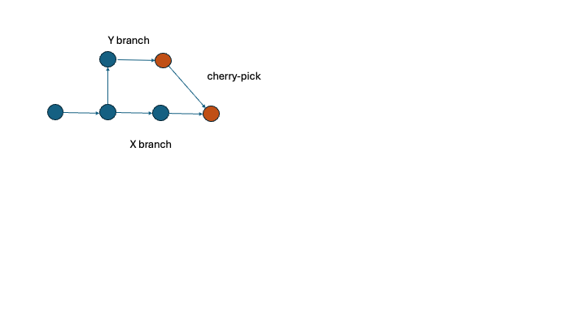

##### git Versiyon Kontrol Sistemi

##### Temel Kavramlar

>**1. Repository:** Proje dosyalarının bulunduğu yerdir (storage space). git'de repository ikiye ayrılır:
>- Local Repository: Proje dosyalarının yerel makinedeki kopyalarıdır.
>- Remote Repository: Projenin ana dosyalarının bulunduğu yerdir. 
>**2. Commits:** Projenin belirli bir zamandaki anlık durumudur (snapshot). Her commit işlemi unique olarak bir hash bilgisine sahiptir ve yapılan değişiklerinin belirlenebildiği bir mesaj bilgisine sahiptir. Bu sayede proje geçmişi izlenebilir.
>**3: Branches:** Geliştirme aşamasında ayrı bir yolu belirtir. Default branch main ya da master olarak adlandırılır. Programcı kendisi de branch'lar oluşturabilmektedir.
>**4. Merge:** Bir branch'daki değişiklikleri bir araya getirme yani entegre etme işlemidir. Bu anlamda bazı conflict durumları olabilir. Merge işlemi sırasında confilict'ler çözülür.
>**5. Clone:** Bir remote repository'nin yerel bir kopyasının oluşturulması işlemidir. Bu kopya tüm branch'ları ve commit geçmişini içerir. 
>**6. Pull:** Remote repository'ki güncellemeleri almak ve yerel repository'ye eklemek anlamında kullanır.
>**7. Push:** Yerel değişikliklerin remote repository'ye gönderilerek diğer kişilerin de kullanımına açılmasıdır. 

>Aşağıdaki örnek komutları inceleyiniz

##### Cherry Pick

>Bu işlem ile bir branch içerisindeki seçilen bir commit ilgili branch'a eklenebilir. Cherry-pick işleminin tipik durumu şu şekilde çizilebilir. 

Burada kırmızı ile renklendirilmiş Y branch'ına yapılmış commit X branch'ına eklenmiştir. Böylelikle herhangi branch'daki bir commit işlemi diğer branch ile birleştirilebilir. 

##### git Merge Stratejileri

>git merge işlemi için çeşitli stratejiler bulunmaktadır:
>- **Fast-forward merge:** En basit merge işlemidir. Eğer hedef (target) branch  üzerinde yeni bir commit yoksa, git doğrudan branch'ı ana (main/master) branch'a ekler. Yani artık hedef branch, ana branch'ın alt kümesi durumuna gelir. Bu işlemde herhangi bir merge commit oluşturulmaz. Hedef branch'ın HEAD'i ileriye (yani main branch'a) taşınır.
>**Komut:**
>git checkout main
>git merge feature-branch
>
>**Avantaj:** Temiz bir commit geçmişi olur.
>**Dezavantaj:** Hangi değişikliğin, hangi branch'da yapıldığının takibi zordur.
>
>- **3-way merge:** En yaygın kullanılan stratejidir. İki dalda da yeni commit'ler varsa, git bu stratejiyi kullanarak merge işlemini yapar. Bu durumda conflict oluşabilir. Bu conflict'in çözümü geliştiriciye bırakılır. 3 nokta şunlardır: common ancestor, source branch, target branch.
>- **Komut:**
>git checkout main
>git merge feature-branch
>**Avantaj:** Daha karmaşık durumlar yönetilebilir.
>**Dezavantaj:** Geçmişi karmaşık hale getirebilir.
>
>- **Squash merge:** Birleştirilecek branch'ın tüm commitleri tek bir commit'e sıkıştırılarak target branch'a eklenir. Genellikle küçük commit'leri tek bir düzenli commit'e indirgemek için kullanılır.
>- **Komut:**
>git checkout main
>git merge --squash feature-branch
>git commit -m "Merged with feature branch"
>**Avantaj:** Daha temiz ve düzenli bir commit geçmişi oluşur.
>**Dezavantaj:** Hangi commit'in kim tarafından yapıldığı kaybolur. 
>
>- **Rebase merge:** Bir branch'ın değişikliklerini hedef branch'ın en son hali üzerine taşır. Commit geçmişini değiştirerek daha temiz bir geçmiş oluşturur. 
>- **Komut:**
>git checkout feature-branch
>git rebase main
>**Avantaj:** Daha düzenli ve doğrusal (linear) bir commit geçmişi oluşur.
>**Dezavantaj:** Eğer branch üzerinde birden fazla kişi çalışıyorsa, commit hash'leri değişeceği için çakışmalara neden olabilir.
> 
>- **Octopus merge:** Birden fazla branch'ı tek seferde birleştirmek için kullanılır. Genellikle büyük projelerde (large scale), çok fazla branch'ı (feature-branch) aynı anda aynı branch'a eklemek için kullanılır.
>- **Komut:**
>git checkout main
>git merge feature-branch1 feature-branch2 feature-branch3 ...
>**Avantaj:** Büyük projelerde yönetimi kolaylaştırır.
>**Dezavantaj:** Conflict'leri yönetmek zor olabilmektedir.
>
>- **Ours merge:** Bu strateji hedef branch'ın değişikliklerini kabul eder, kaynak branch'ın değişikliklerini reddeder. Yani, hedef branch üzerinde yapılmış olan değişiklikler korunur. Bu starteji genellikle geçici branch'lar üzerinde yapılan değişiklikleri ana branch'a aktarmak için kullanılır.
> **Komut:**
>git checkout main
>git merge -s ours feature-branch
>
>- **Theirs merge:** Bu strateji kaynak branch'ın değişikliklerini kabul eder, hedef branch'ın değişikliklerini reddeder. Yani, kaynak branch üzerinde yapılmış olan değişiklikler korunur. Bu strateji genellikle ana branch üzerindeki değişiklikleri geçici branch'lar üzerine aktarmak için kullanılır.
 **Komut:**
>git checkout main
>git merge -s theirs feature-branch

>Hangi stratejinin uygun olduğu, projenin yapısına ve ekibin çalışmasına bağlı olarak seçilir. 

##### git stash

>Bu işlem çalışma dizininde (working directory) ve indeksteki (staged area) değişiklikleri geçici olarak saklanmasını sağlar. Böylelikle değişiklikleri kaybetmeden başka işlere ve başka branch'lar üzerinde çalışılabilir. 

>Basit olarak stash'a etmek için git stash komutu kullanılabilir. Bu işlem aslında bir stack gibi çalışır. Dolayısıyla stash'e son eklenen aslında en başta olur. Bu durumda git stash pop yapılarak en son stash'e atılan değişiklikler hem branch'a yansıtılır hem de silinir. Silmeden bir stash'in uygulanabilmesi için apply switch'i kullanılabilir. Stash'e atılan değişikler `stash@{n}` biçiminde isimlendirilir. Bu durumda örneğin son eklenen stash silinmeden değişiklerin yansıtılması için `git stash apply stash@{0}` komutu kullanılır. Burada n son atılan değişiklik sıfır olma üzere sırasıyla değer alır. git stash list komutu ile stash listesi elde edilebilir. Herhangi bir stash'in silinmesi için drop switch'i kullanılır: `git stash drop stash@{2}`. git stash clear ile tüm stash'ler temizlenir. Silme yapan komutlar değişiklikleri yansıtmazlar. `git stash show` ile hangi dosyalarda değişiklik olduğu gözlemlenebilir. `git stash show -p` ile daha detaylı farklar da (diff) gözlemlenebilir. 

